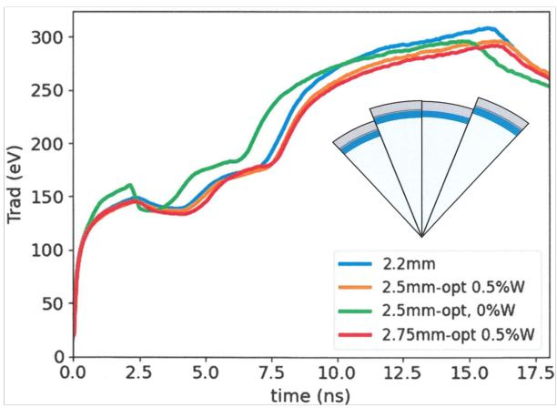

# 面向商用聚变能的 10 MJ 激光间接驱动靶设计

> C. R. Weber、A. L. Kritcher 等及 Inertia Collaboration，arXiv:2609.19752，正文日期 2026-09-18；作者注明拟投稿 *Physics of Plasmas*。以下按论文顺序解释；图来自本次 MinerU 转换并已逐张查看。本文把 NIF 已有点火实验作为标定基础，但 `10 MJ` 靶、`265–427 MJ` 产额和电站功率全部来自作者的辐射流体/LPI/系统设计计算，不是新实验。

## 一句话结论

作者提出把 NIF 的 HDC—低温 DT—黑腔间接驱动架构放大到 `10 MJ` 激光、约 `1.1 PW` 峰值功率和 `2.25–2.75 mm` 胶囊内半径，以更大燃料质量而不是更高收敛比换取 `265–427 MJ` 模拟聚变产额、`G≈26–43` 和 `2–4×` NIF 的模型点火裕量；HYDRA/LASNEX 灵敏度扫描显示基线设计能容忍一组制造与低模扰动，但反应堆级 `10 Hz`、高效率驱动器、靶注入、腔室清空、氚闭环和成本并未被实验验证。

## 1. 从 NIF 点火外推时，作者选择放大“燃料量”

热斑温度的简化能量平衡写成

$$
c_{DT}\frac{dT}{dt}=f_\alpha Q_\alpha-f_BQ_B-Q_e-\frac{p}{m}\frac{dV}{dt},
$$

其中 alpha 自加热要超过制动辐射、电子热传导和膨胀损失。作者采用的关键阈值是热斑 $\rho R_{hs}\sim0.3\,g/cm^2$、温度约 `4–5 keV`，使 `3.5 MeV` alpha 能量在热斑内沉积并触发传播燃烧。

高增益阶段的粗略标度为

$$
Y\sim f_bM_f,
\qquad
f_b\sim\frac{\rho R_{tot}}{\rho R_{tot}+6},
\qquad
Y\sim E_d^{4/3}.
$$

这里 $Y$ 是聚变产额，$f_b$ 是燃烧分数，$M_f$ 是压缩 DT 质量，$E_d$ 是驱动能。$E_d^{4/3}$ 只是一阶 Meyer–ter–Vehn 标度；实际不透明度、反射冲击和黑腔动力学不能严格自相似，所以最终结果来自 LASNEX/HYDRA 设计计算。

## 2. 基线靶与 NIF 的主要差别

- 激光波长仍约 `351 nm`，但总能量 `10 MJ`、峰值功率约 `1.1 PW`。
- 黑腔从镀金贫铀改为铅，作者估计同功率峰值 X 射线通量降低约 `6.5%`，由更高总功率补偿。
- 黑腔填充 `0.3 mg/cc` He；作者引用既有经验认为可实现约 `98%` 激光耦合。
- 保留 HDC 烧蚀层、低温 DT 冰层和中心 DT 气体；快速形成的多晶冰替代 NIF 的高质量单晶冰。
- 胶囊内半径从 NIF 约 `1.05 mm` 放大到 `2.25–2.75 mm`；DT 质量从 `0.209 mg` 到 `1.92–3.27 mg`。
- 设计使用约 `1000–4000` 条可独立控制光束，并在 foot/peak 阶段改变 inner-cone fraction，必要时用 CBET 调 P2/P4 对称性。

基线 `2.25 mm` 设计的模拟量包括：`265 MJ` 产额、`G=26`、`1.92 mg` DT、`346 km/s` 内爆速度、`3.31 g/cm²` 总面密度、`41.1%` 燃烧分数和约 `3.8×` NIF 的 no-alpha $EP^2$ 裕量。更大设计把产额推到 `296–427 MJ`、增益 `30–43`，但沿用的对称控制与更长 coast time 仍需实验标定。

## 3. 为什么更大靶被认为更“稳健”

作者的思路是让工作点远离点火陡崖：固定尺寸的缺陷相对于更厚的燃料/烧蚀层更小，更高 $\rho R$ 和更强 alpha 自加热可在部分扰动后恢复传播燃烧。它不是说所有误差都会消失，而是让一组已建模误差主要消耗裕量，而不是立刻越过点火阈值。

作者把 mode-1 与靶偏心、跟踪误差、光束不平衡和燃料不均匀联系起来。模型估算中，目标 repoint 后 `20 cm` 的整体偏移对应 `<0.2%` mode-1，未校正 `±200 μm` 指向误差对应约 `1.5%`；这些换算依赖引用的低模模型和控制策略。

对多晶 DT 冰，作者使用放大的 `12×` 沟槽、初始约 `8 μm` 深扰动；在该对照中 NIF 尺度只保留约 `30%` 性能，而 Inertia 靶仍接近一维产额。HDC 空洞扫描中，大靶多数算例没有把混合物送入热斑；综合低模和高模后，作者称约 `700 ng` 注入混合仍可保留高产额。所有这些都是选定扰动模型下的数值灵敏度，不是批量制造靶的统计良率。

图 9 的“集成”指基线中已同时包含若干低模、粗糙度、支撑膜和 fill-hole-like jet，再逐项改变一个扰动。它没有覆盖真实制造缺陷之间的全部相关性、随机分布、靶飞行变形、腔室残余气体或连续 10 Hz shot history。

## 4. LPI 与对称控制的边界

在黑腔放大后，SRS、SBS、热电子、CBET 和逆制动吸收都可能变化。作者保持壁面和 LEH 强度接近 NIF，并用更多束线把单束强度降到 NIF 的约 `1/5–1/20`；pF3D 集成计算显示基线后向散射处于作者认为可接受的范围。

这仍不是实验闭环。更长等离子体路径、更大 f-number、千束级相干/统计耦合、波长调谐和损伤/可靠性都要在缩比设施及最终驱动器上验证。论文也明确把 beam propagation 与 LPI benchmark 列为后续实验任务。

## 5. 条件化电站功率账本

作者假设 `10 MJ × 10 Hz` 驱动器、`12%` 激光墙插效率、blanket multiplication `1.2`、热电转换 `45%` 和 `50 MWe` 辅机负荷：

- `G=17`：`170 MJ/shot`，净电约 `35 MWe`；
- `G=26`：`265 MJ/shot`，毛电约 `1431 MWe`，激光回用约 `833 MWe`，净电约 `548 MWe`；
- `G=43`：`427 MJ/shot`，净电约 `1423 MWe`。

这些是算术一致的系统情景，不包含完整资本成本、停机率、靶成本、低温氚处理、腔室清空、第一壁寿命、束线损耗和监管边界，因此不能写成已证明的商用经济性。

## 6. 证据边界与可复现性

- **实验锚点：** NIF 已有点火、燃烧等离子体和增益数据；它们证明间接驱动的部分物理基础。
- **作者设计/模拟：** 10 MJ 靶的全部产额、增益、mode-1/粗糙度/混合鲁棒性、pF3D LPI 与电站输出。
- **尚未同行评审：** 当前版本是拟投稿 *Physics of Plasmas* 的 arXiv 预印本。
- **利益与工程语境：** 多位作者来自 Inertia Enterprises，论文目标是公司提出的商业架构；这不否定计算，但要求独立 benchmark、输入公开和实验验证。
- **本轮未完成：** 没有运行 HYDRA、LASNEX、pF3D 或系统成本模型，也没有核对全部输入 deck、网格收敛、EOS/opacity/alpha transport 和不确定度传播。

## 7. 最值得做的后续验证

1. 在可达到的缩比平台上单独验证 Pb 黑腔光谱、LPI、CBET 和大 inner-cone fraction 对称控制。
2. 公布基线 HYDRA/LASNEX/pF3D 输入与交叉代码比较，并对 opacity、EOS、mix、alpha transport 和分辨率做全局灵敏度。
3. 用真实批量多晶冰/HDC 空洞统计驱动随机 ensemble，而不是少量放大缺陷。
4. 分阶段验证高效率 DPSSL、10 Hz 靶注入/跟踪、腔室清空、氚库存和第一壁寿命，再谈净电与成本。

## 8. 复习用速记

这篇论文的创新是“用更大的 10 MJ 驱动器买点火裕量”，尽量沿用 NIF 已验证架构，而不是追求更高收敛或全新靶物理。它给出了严肃的靶级模拟和扰动扫描，但从 NIF 单发点火到 `10 Hz` 商用电站之间仍有完整的驱动器、靶工厂、腔室、氚与寿命验证链没有闭合。
