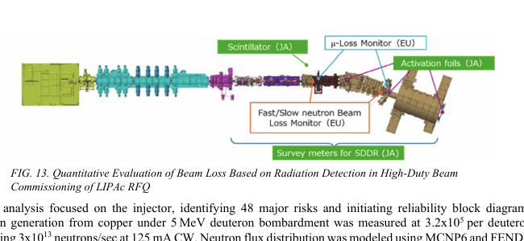

# IFMIF/EVEDA 工程验证进展与聚变中子源展望

> K. Hasegawa 等，*Nuclear Fusion* **66** (2026)，116020，DOI: `10.1088/1741-4326/aea171`，2026-09-18 online published，CC BY 4.0。IOP 排版版被 Radware 阻断；本地全文是 QST 机构库公开的 IAEA-CN-316/2956 作者/会议稿，标题、作者和核心内容与正式论文元数据对应，但不是 IOP version of record。MinerU 对该文件两次失败，本笔记使用 `pdftotext -layout` 与 PDF 页面渲染 fallback；所列图已逐张查看。

## 一句话结论

IFMIF/EVEDA 已完成大量“关键部件能否工作”的工程验证：LIPAc 在 `5 MeV` 达到约 `119–125 mA` 的脉冲束流，RFQ 透射约 `90%`；锂回路、杂质控制、远距离表面诊断、材料腐蚀和束损失辐射监测均有试验进展。但目标 `125 mA, 9 MeV, CW` 与约 `1.125 MW` 束流仍未被端到端实现，RFQ 耦合器热/真空问题把高占空比运行限制在远低于 CW，SRF 直线加速器和 Phase C/D 仍属后续 commissioning。

## 1. IFMIF 与 LIPAc 要验证什么

IFMIF 概念用两束 `40 MeV, 125 mA, CW` 氘束打液态锂靶，通过 D–Li stripping 产生面向聚变材料辐照的高通量宽谱中子。EVEDA 把风险拆成加速器、液态锂靶和试验模块三条验证线。

LIPAc 是 IFMIF 前端原型：`100 keV` 注入器 → RFQ 加速到 `5 MeV` → MEBT → SRF 再加速到 `9 MeV` → HEBT → `1.125 MW` beam dump。指标还要求常规束损低于 `1 W/m`。

## 2. 已达到的束流里程碑

- Phase A 注入器达到约 `140 mA, 100 keV`，为 RFQ 提供所需束流。
- 2019 年 Phase B 报告在 `5 MeV` 达到 `125 mA`、`0.1%` duty 的氘束，并未见非预期显著束损。
- Phase B+ 加装 MEBT extension、HEBT 与高功率束流终端；最终配置为 `3.5 ms × 25 Hz = 8.75% duty`，HEBT 束流约 `119 mA`，RFQ 透射约 `90%`。

束损失起初出现在 MEL/HEBT 若干位置。加入四极铁 fringe field 和实测 GtoI 校准后，模拟束斑增大并更接近实测，重新配置束流光学后损失得到改善。这里证据链是“束损信号 + 校准磁场模型 + 束斑测量”的工程闭环，不只是未验证的模拟。

## 3. 为什么还没有达到 CW

RFQ 用 8 条 RF 链和 8 个耦合器馈电。2022 年发现真空侧 O-ring 熔化和漏气，可能与 RF 耗散或 multipacting 相关。后续把现有结构推到约 `27% duty` 的调试状态时再次出现热积累和真空问题；在带束阶段尝试 `10% duty` 又因反射功率随时间变化、各链不平衡而触发 interlock。

工程方案包括强化冷却和制造 brazed-window 新耦合器。SRF cryomodule 已完成组装、运输并进入安装整合，但论文展望仍把 `5→9 MeV`、CW 与高可用率验证放在 Phase C/D。因而不能把“部件组装完成”写成“LIPAc 已交付 9 MeV CW”。

## 4. 液态锂回路、表面诊断与安全

日本回路包含冷阱、氢/氮捕获、plugging gauge 和电磁泵；欧洲回路更接近 1:1 工程尺度。论文还报告：

- ELTL 材料的侵蚀/腐蚀分析已完成，焊缝空穴断裂提示氮杂质控制的重要性；
- Li 蒸气/氚替代体系用 FTIR 做稳定化反应验证；
- 锂火在试验条件下可用氩气抑制和熄灭；
- 氢、氮杂质监测及约 `267 °C` plugging-temperature 读数与冷阱条件相符。

这些是回路部件、诊断和安全技术的分项验证，不等于高功率 D–Li 靶在全中子源条件下完成寿命认证。

## 5. 束损失辐射监测与一个指数疑点

作者稿文本层写道，`5 MeV` 氘束打铜的中子产额“`3.2×10^5` per deuteron”，并紧接着投影 `125 mA CW → 3×10¹³ n/s`。两者不可能同时成立：

$$
\frac{0.125\ \mathrm{C/s}}{e}\approx7.8\times10^{17}\ \mathrm{D/s},
$$

若总源强是 `3×10¹³ n/s`，则每个氘核约为 `3.8×10⁻⁵ n/D`。因此前一处很可能丢失负号，应是约 `10⁻⁵` 量级；本笔记只记录这一内部一致性判断，未取得 IOP VOR 或独立实验表来确认确切系数。中子空间分布由 MCNP6/FENDL-3.2 建模，不能把投影值当作已经在 `125 mA CW` 下测得的源强。

## 6. 证据边界与可复现性

- **直接工程/束流验证：** 5 MeV 高流脉冲束、束斑/束损诊断、RFQ 条件化、锂回路与诊断台测试。
- **模型支持：** fringe-field 束流光学、MCNP6/FENDL 中子场、活化与材料响应计算。
- **尚未完成：** `9 MeV, 125 mA, CW` 端到端运行、1.125 MW 长时束流、完整 D–Li 中子源与材料辐照资格验证。
- **版本边界：** 正式出版元数据来自 Crossref/IOP；本地可读全文是 QST 作者/会议稿，不是期刊 VOR。
- **数值疑点：** `3.2×10^5 n/D` 与后续源强不相容，疑似漏写负号，不应原样用于设计。
- **本轮未完成：** 没有运行束流动力学、MCNP6、热工、锂 MHD 或 RAMI 模型，也没有重分析原始探测器数据。

## 7. 复习用速记

IFMIF/EVEDA 的真正进展是“把高流 RFQ、SRF、束损监测、液态锂和材料试验中的工程风险逐项显性化并验证”；真正的未完成项是“把它们在 9 MeV、125 mA、CW 和高可用率下连成一台长期工作的原型”。
