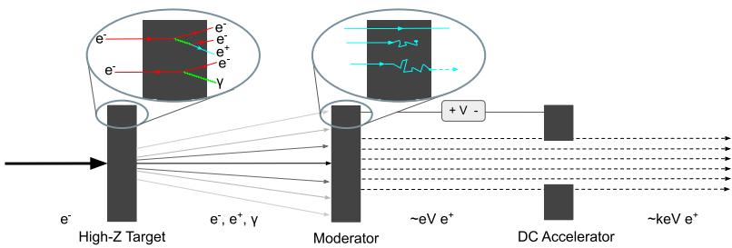
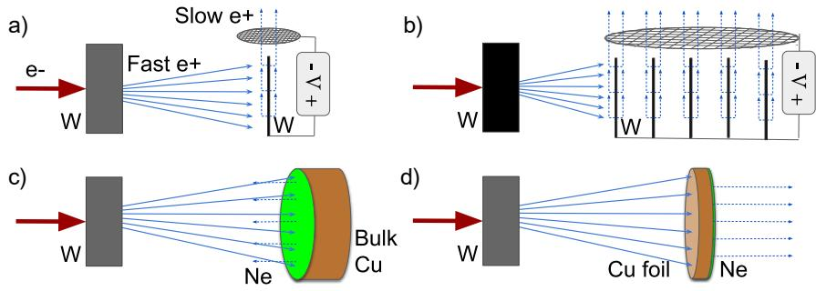
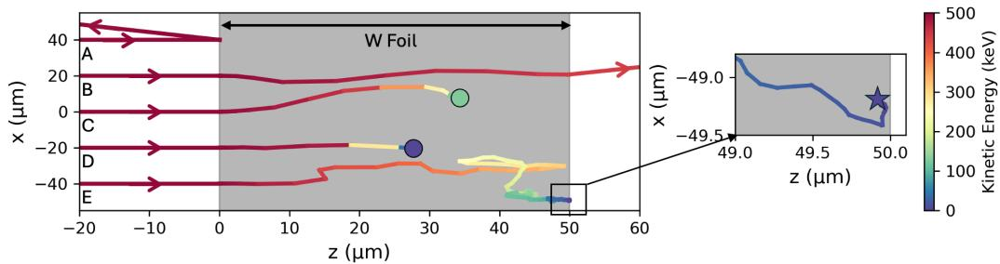
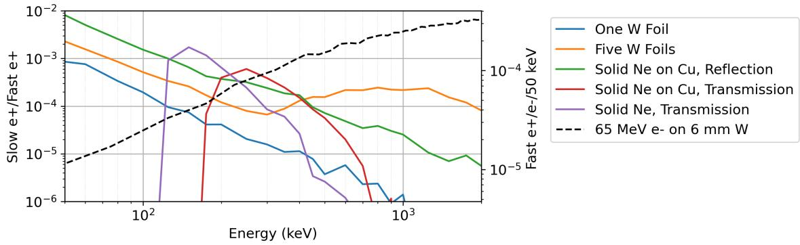

# 高强度慢正电子源的慢化器建模

> Sophie Crisp、Ryland Goldman、Spencer Gessner，arXiv:2609.22036，2026-09-18 提交、2026-09-21 进入官方新论文列表；论文源自 LEEPP2026 workshop。以下按论文顺序整理；图由本轮 MinerU 转换提取并逐张查看。全部效率来自 G4beamline/Geant4-Penelope 与扩散模型，没有新实验数据。

## 一句话结论

慢化器不存在脱离入射能谱的“统一最优材料”：低于约 `300 keV` 时，较长扩散长度使固态 Ne 的模拟慢化效率比 W 高约一个数量级；MeV 区域，多层 W 通过增加散射与可逃逸表面而优于 Ne。紧邻慢化器的 W 靶还能让初次反射正电子再次返回，在低能区把效率提高约 `2–4` 倍。若希望把靶与低温慢化器解耦，作者建议联合使用减速腔和低温慢化器，而不是只替换材料。

## 1. 从高能电子到慢正电子束

**图像描述：** 入射电子打到高 Z 转换靶，产生宽能谱、大散角的电子—正电子—光子簇射；慢化器吸收一部分正电子，使其散射、热化并从表面以近单能、较小角散度重新发射；直流电场再把它们加速到 `keV` 量级用于实验或二次慢化。

**物理含义：** “产生正电子”和“得到可用的慢正电子束”是两个不同效率环节。高能正电子产额大并不保证慢束亮度高，因为只有在表面附近停住且成功扩散/再发射的粒子才进入慢束。

**与激光束流应用的关系：** 本文驱动器是 `65 MeV` 电子 linac 而非激光等离子体电子束；它给出的慢化器设计可作为激光驱动正电子源的后端参考，但入射能谱、发散、脉冲热负荷和重复频率都必须重新建模。

## 2. Monte Carlo 与扩散—再发射模型

作者用 G4beamline（Geant4）及 Penelope 电磁物理模型追踪正电子。当动能降到 `50 eV` 时记为“停止”；停止位置距可发射表面的深度为 `z`，到达表面的扩散概率设为

$$
P_{\mathrm{diff}}(z)=\exp\!\left(-\frac{z}{L_+}\right).
$$

最终慢化概率还要乘材料表面再发射分支比：

$$
P_{\mathrm{slow}}(z)=B_R\exp\!\left(-\frac{z}{L_+}\right).
$$

**变量说明：** `L_+` 为正电子扩散长度，单位为长度；作者对多晶 W 取 `55 nm`，对固态 Ne 取 `1 μm`；`B_R` 是到达表面后以慢正电子形式再发射的概率，W 约取 `0.3`。

**推导与直觉：** 扩散过程中存在近似常率损失时，生存概率随传播距离指数衰减；因此停止点越靠近表面、扩散长度越大，慢化概率越高。Ne 的 `1 μm` 并非本工作独立测量，而是为了匹配放射源低温慢化器效率，在文献给出的 `0.5–1 μm` 范围内选取。

**图像描述：** 横轴为箔深 `z`、纵轴为横向位置 `x`，单位均为 `μm`；颜色从高能红色过渡到低能蓝色。A 为反射、B 为透射、C 在仍较高能时湮灭，D/E 在箔内热化；E 停在距表面约一个扩散长度内，因而有较大再发射概率。

**物理含义：** 总停止率不等于慢正电子效率。深处停止的粒子会在扩散中损失，过薄材料又使大量高能粒子透射；慢化器厚度和可逃逸表面数必须共同优化。

## 3. 四种慢化器几何

**图像描述：** (a) 单个 `50 μm` W 箔；(b) 五个 `50 μm` W 箔，第一片距 W 靶 `2 cm`、片间距 `5 mm`；(c) `150 μm` 固态 Ne 覆在块体 Cu 上，从入射侧反射提取；(d) `150 μm` Ne 覆在 `25 μm` Cu 箔上，从背面透射提取。

**几何权衡：** 多层 W 增加高能正电子散射和“靠近某个表面停止”的机会；反射式 Ne 效率较高但束流抽取磁光学更复杂；透射式 Ne 易于下游收集和控制束斑，却受到 Cu 基底吸收。低温 Ne 必须与热靶空间解耦，否则辐射热和缺陷会降低效率甚至熔化慢化层。

## 4. 能谱决定材料优势

**图像描述：** 横轴为入射正电子能量（`keV`、对数坐标）；左纵轴为每个快正电子得到慢正电子的效率（`10⁻⁶–10⁻²`、对数坐标）；彩色实线比较五种材料/几何，黑色虚线由右轴给出 `65 MeV e⁻` 打 `6 mm W` 后每 `50 keV` 的快正电子谱。

**定量趋势：** `300 keV` 以下，反射式固态 Ne 的效率最高，低能端可接近 `10⁻²`；透射 Ne 在约 `250 keV` 达到约 `6×10⁻⁴`，理想化移除 Cu 基底时峰值约 `2×10⁻³`。单层 W 随能量升高迅速下降。五层 W 在 MeV 区仍维持约 `10⁻⁴` 量级，并优于 Ne；而叠加的 linac 产物谱随能量上升，说明实际多数正电子位于多层 W 更有利的区域。

**靶回返效应：** 在低于约 `200 keV`、粒子很难穿过第一片 W 时，单片与五片构形的主要差异来自是否保留后方 W 靶代理。后者让初次反射粒子返回慢化器，使效率提高约 `2–4` 倍。这一现象也说明若把低温慢化器移远，不能忽略失去“靶回返”的代价。

**与论证的关系：** 图 4 同时展示单能效率与真实驱动谱，避免只用某个峰值效率选择材料。系统优化必须对快正电子能谱积分，并进一步乘接受度、输运和热负荷限制。

## 5. 证据边界与后续验证

- **直接证据层级：** workshop 预印本中的 Geant4-Penelope 轨迹与经验扩散模型；不是慢正电子束流实验。
- **模型输入依赖：** `50 eV` 停止阈值、W/Ne 扩散长度、再发射分支比、材料纯度和表面状态都会影响绝对效率。
- **没有闭合的环节：** 未共同计算高 Z 靶产额、热沉积、辐射损伤、减速腔接受度、磁输运、最终亮度和重复运行稳定性；图 4 也不是完整 start-to-end 系统效率。
- **不能升级的结论：** 不能把低能 Ne 的单能优势写成 Ne 对 linac 或激光源普遍最优，也不能把模拟效率写成已测慢正电子通量。
- **对激光加速的迁移边界：** 激光电子束的短脉冲、高峰值热负荷、大散角和可能不同能谱会改变靶—慢化器耦合；应把实测/可信电子与快正电子相空间作为输入重新运行 Geant4 和热—结构模型。
- **本轮未完成：** 没有运行 G4beamline/Geant4、扩散模型、热分析或束流光学，只对全文、图、公式和作者报告值做结构化核对。

## 6. 复习用速记

慢化器选择的核心变量是快正电子能谱：低能偏向长扩散长度的固态 Ne，MeV 区偏向提供更多散射和逃逸表面的多层 W。真正系统升级还需要“减速 + 低温慢化 + 热隔离 + 束流接受度”联合设计。
