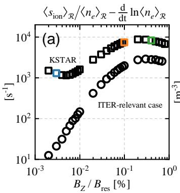
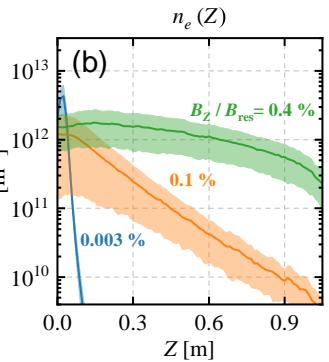
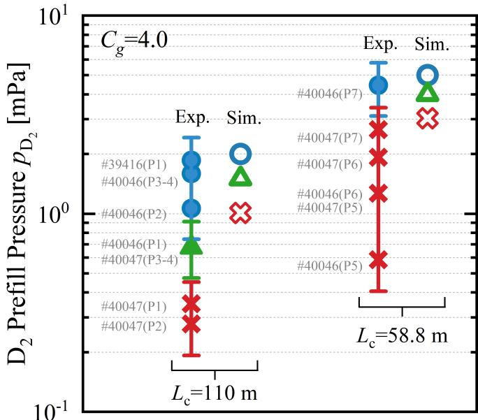
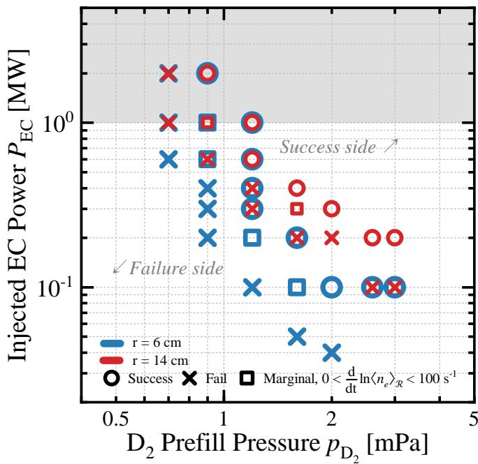

# 托卡马克微波气体击穿中的电离雪崩机制

> Jinwoo Gwak 等，arXiv:2609.21429，2026-09-18 提交、2026-09-21 进入官方新论文列表。以下按正文顺序整理；图由本轮 MinerU 转换提取并逐张查看。论文包含 KSTAR 的受控非感应击穿实验，但 ITER 结论来自经 KSTAR 边界检验后的 BREAK Monte Carlo 外推。

## 一句话结论

作者把非线性电子回旋波—粒子能量交换、电子—中性粒子碰撞、电离与开磁力线导引中心输运放入三维 Monte Carlo 代码 BREAK，指出平行随机运动投影到竖直方向后形成 Brownian 扩散并控制粒子损失。KSTAR 两种连接长度下的击穿边界与模拟在预充气压力上相符到约两倍以内；据此作者预测在 `D₂≈2 mPa`、残余极向场约 `30 G` 时，`1 MW` EC 功率足以触发 ITER 级“气体击穿”，但尚未证明后续 burn-through、闭合磁面形成或电流爬升。

## 1. 为什么不能直接套 Townsend 模型

传统 Townsend 雪崩用电场加速电子并把电离源与边界损失分开。这里的电子由局域 X2 电子回旋波非线性加热，同时在开磁力线中经历曲率/梯度漂移、平行碰撞随机游走和边界损失；不同电子具有不同能量—碰撞—轨道历史，形成非 Maxwell 分布。因此仅用平均温度或单一电离系数会漏掉热电子继续吸收 EC 能量的贡献。

模拟中的局部净增长率可以写成

$$
\gamma_{\mathrm{net}}
=\frac{\langle s_{\mathrm{ion}}\rangle_{\mathcal R}}
{\langle n_e\rangle_{\mathcal R}}
-\Gamma_{\mathrm{loss}},
$$

其中 `s_ion` 是直接和解离电子碰撞电离产生率密度，`n_e` 是电子密度，`𝓡` 是冷电子可发生非线性 X2 作用的区域，`Γ_loss` 为粒子损失率。作者把持续满足 `d ln⟨n_e⟩/dt > 100 s⁻¹` 定义为成功击穿；这个阈值对应约 `0.23 s` 内放大 `10¹⁰` 倍，是人为但明确的工程时间尺度判据。

只保留冷电子能量增益会把电离源低估约两倍到一个数量级以上；把冷电子表达式错误套给所有电子又会高估至少约两倍。因而“热电子继续吸收”是源项预测的关键，而不是可忽略修正。

## 2. 平行 Brownian 运动如何形成竖直损失

沿磁力线坐标 `s`，平行随机运动的扩散系数近似为

$$
D_s\sim\frac{\langle v_\parallel^2\rangle\tau_{\mathrm{coll}}}{2}.
$$

残余竖直场把平行位移投影为竖直位移：

$$
\Delta Z\simeq\frac{B_Z}{B_{\mathrm{res}}}\Delta s,
\qquad
D_Z\sim D_s\left(\frac{B_Z}{B_{\mathrm{res}}}\right)^2.
$$

若竖直密度标长也随磁力线倾角缩放，则扩散通量约随 `B_Z/B_res` 线性增长。场很小时，曲率和梯度漂移主导单向对流；中等场进入纯扩散区；当平行标长接近连接长度 `L_c` 时，边界约束随机游走，损失率反而下降，形成非单调曲线。

**图像描述：** 横轴是 `B_Z/B_res`（百分比、对数坐标），纵轴为电离源率减去净增长率得到的损失率（`s⁻¹`）。方块为 KSTAR，圆点为 ITER 相关参数。两者在约 `10⁻²–10⁻¹%` 附近上升，随后在更高场比例进入连接长度受限区。

**物理含义：** 损失并非“残余场越小越好”或单调随场增大；漂移、自由 Brownian 扩散与边界受限扩散之间的转换决定击穿窗口。

**图像描述：** 横轴 `Z` 为米，纵轴 `n_e` 为 `m⁻³`、对数坐标。`0.003%` 的蓝线快速离开高密区，`0.1%` 的橙线随高度明显衰减，`0.4%` 的绿线在更大竖直范围维持较高密度；阴影表示径向变化。

**与论证的关系：** 图 3b 直接展示了连接长度受限时密度剖面变宽，支持图 3a 高场端损失率下降的解释；它仍是模拟剖面，不是 KSTAR 密度诊断。

## 3. KSTAR 边界验证

实验在零环电压下使用 `105 GHz` X2、`0.6 MW`、每脉冲 `0.5 s` 的 EC 波，并扫描 `D₂` 预充气压力。两组极向场构形对应 `L_c=110 m` 和 `58.8 m`。只要任一环向或极向通道的原始 `Dα` 信号超过噪声底，就判定发生击穿。

**图像描述：** 纵轴为推断的腔内 `D₂` 压力（`mPa`、对数坐标），左、右分别对应 `110 m` 与 `58.8 m`。实心圆和叉号表示实验成功/失败，空心圆和叉号表示模拟成功/失败，三角形标记边界或多次通过条件。红色竖条体现压力计约 `±30%` 准确度。

**定量趋势：** 较短 `L_c` 的成功边界移向更高压力。作者用 MolFlow+ 把管道压力乘以 `C_g=4` 换算为腔内压力；模拟与实验边界在压力上相符到约两倍以内。一个单程失败点在加入第二次波束通过后转为成功，说明多程效应足以解释一部分偏差。

**边界：** `Dα` 越过噪声底只标记初始气体击穿，不代表已完成烧穿、闭合磁面形成或可维持等离子体电流。压力换算、单程波吸收和成功阈值均带模型依赖。

## 4. ITER 相关外推

**图像描述：** 横轴为 `D₂` 预充气压力（`mPa`），纵轴为注入 EC 功率（`MW`），均为对数刻度；蓝色对应 `6 cm` 波束半径，红色对应 `14 cm`。圆、叉和方块分别表示成功、失败和边缘增长。`1 MW` 以上的灰区超过单台 ITER gyrotron 的名义输出。

**可见趋势：** 成功区位于图的右上侧；在 `≈2 mPa` 附近，`1 MW` 及以下已有成功点。作者报告该点的电离源率高于 `6×10³ s⁻¹`，超过约 `4.9×10³ s⁻¹` 的粒子损失率。

**物理含义与限制：** 图 5 是通过 KSTAR 边界检验后的模型预测，不是 ITER 实验。作者用 `B_pol≈30 G`、几何折减因子和代理竖直场构造有效连接长度；真正 ITER 场零构形、多程传播、壁条件和后续全局加热仍需完整计算与装置验证。

## 5. 证据边界与可复现性

- **直接实验：** KSTAR 零环电压下的 EC 脉冲、气压扫描和 `Dα` 成功/失败分类。
- **模型机制：** 非线性共振能量增益、电子—中性碰撞、电离和导引中心输运由 BREAK Monte Carlo 耦合；自生静电场、Coulomb 碰撞和明显中性耗尽在低密度初期被忽略。
- **实验—模型关系：** 两个 `L_c` 环境下的边界在压力上相符到约两倍，属于阈值级验证，不是全相空间分布的逐点复现。
- **外推边界：** `1 MW, 2 mPa` 只支持初始气体击穿可行性，不支持 ITER 完成 burn-through、建立等离子体电流或避免全部启动失效模式。
- **仍需验证：** 多程 EC 传播、真实三维场零构形、自洽电磁场与后击穿流体/动理学耦合，以及独立装置的压力—连接长度二维扫描。
- **本轮未完成：** 没有运行 BREAK、FIST99 或 MolFlow+，也没有重分析 KSTAR 原始 `Dα`、压力计和可见光数据。

## 6. 复习用速记

这篇论文把微波击穿分成“非 Maxwell 电离源”和“开磁力线 Brownian 输运损失”两部分，并用 KSTAR 阈值验证后外推 ITER。最应保留的边界是：作者预测的是低密度初始气体击穿，而不是完整托卡马克启动。
