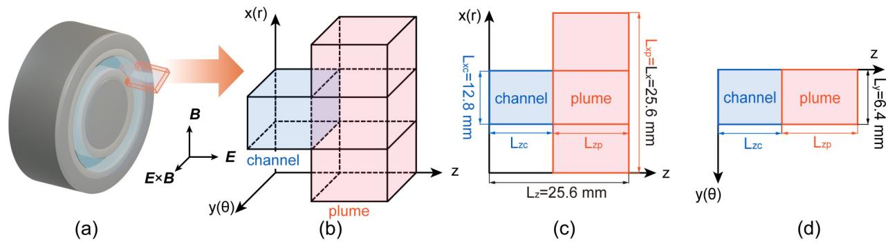
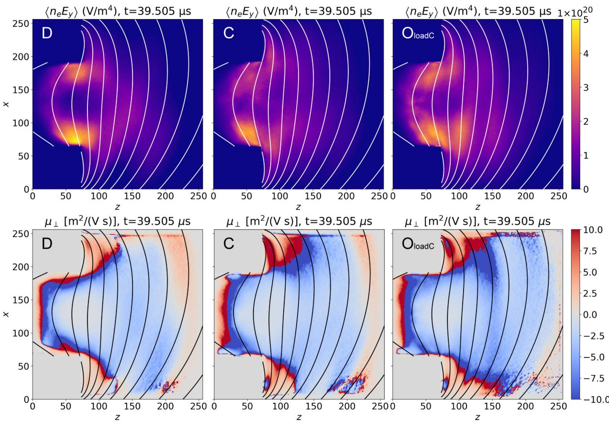
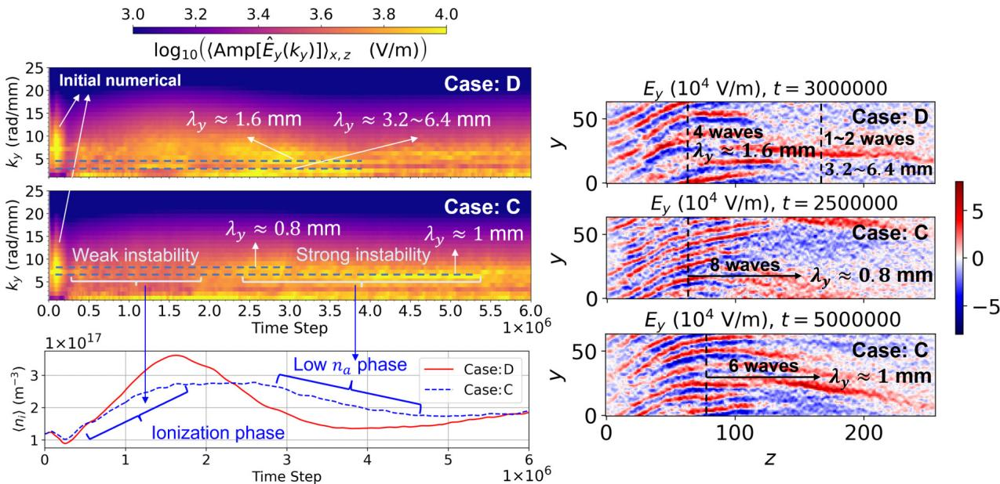

# Hall 推进器近壁异常电子输运的三维 PIC 路径

> Zhe Liu、Zhongping Zhao、Yinjian Zhao，*Physical Review E* **114** (2026)，035211，DOI: `10.1103/p8v6-66mq`，2026-09-21 正式发表。以下按论文论证顺序整理。全文来自 APS 正式 PDF；图由本轮 MinerU 转换提取并逐张查看。本文全部物理结果来自作者的 3D PIC/MCC 数值链，没有新的推进器实验。

## 一句话结论

作者在含真实磁场、介质壁充电、二次电子发射、电子碰撞电离、连续中性气体演化和开放羽流边界的 3D PIC 中发现：电子漂移不稳定性（electron drift instability, EDI）驱动的净跨磁场输运不是均匀铺满通道，而是在下游通道—出口附近形成两条持续的近壁通道。这个空间拓扑跨导体壁、陶瓷壁和开放羽流边界仍然存在；但绝对迁移率、局域峰值、高波数谱和晚期网格收敛尚未解决。

## 1. 问题与计算域

Hall 推进器中，轴向电场加速离子，电子则必须横跨径向磁场补充电离、闭合电流并中和羽流。经典电子—中性碰撞给出的跨场迁移率通常不足，因此 EDI 被长期视为“异常输运”来源；本文进一步追问净输运究竟在通道的什么位置通过。

**图像描述：** 图 1(a) 是环形推进器示意；(b) 把局部环形扇区展开成笛卡尔坐标，其中 `x`、`y`、`z` 分别对应径向、方位向和轴向；(c)(d) 给出通道与近羽流域。基线盒尺寸为 `25.6 mm × 6.4 mm × 25.6 mm`，方位向采用周期边界。图中还明确了 `E`、`B` 与 `E×B` 的相对方向。

**物理含义：** 这个局部扇区保留 EDI 必需的方位向自由度和径向壁面，但忽略完整环形曲率。因而它比轴对称模型更适合解析三维波—输运关联，却仍不是整机几何的逐件复制。

**与论证的关系：** 后文所谓“近壁通道”是这个局部 `x-z` 截面上的时间与方位平均结构；它不能自动等价为真实推进器中已测得的整周电流路径。

作者用开源 AlgoPlasma（原 PMSL）运行七组层级案例：全 Dirichlet 导体边界 `D`、双时间步 `D_2Δt`、半网格间距 `D_finer`、含介质陶瓷壁与二次电子发射的 `C`、开放羽流边界 `O`、从 `C` 状态加载的 `O_loadC`，以及更大羽流域 `O_bigger`。基线网格为 `256 × 64 × 256`，网格间距 `0.1 mm`；单个长期案例约使用 128–192 个 MPI rank，论文列出的整个计算活动约 `1.12×10^6 core-hours`。

## 2. 从三维涨落提取净异常输运

瞬时 EDI 场快速变号，单帧主要看到条纹波结构。作者因此用方位向电场与电子密度的相关项提取净轴向电流，并在方位角和准稳态时间窗上平均：

$$
J_{e,z}^{\mathrm{EDI}}
=e\left\langle
\frac{n_e E_y B_r}{B_r^2+B_z^2}
\right\rangle_{y,t}.
$$

**变量说明：** `n_e` 为电子数密度，`E_y` 为方位向电场，`B_r` 与 `B_z` 是径向和轴向磁场分量，`e` 为元电荷；角括号表示对方位向与时间采样平均。单位为 `A/m²`。

**推导思路：** 磁化电子的电漂移含 `E×B/B²`；取其中沿轴向的分量并乘以电荷密度 `-e n_e`，即可得到由 `n_e-E_y` 相关贡献控制的轴向电流。若密度与方位向电场完全不相关，快速正负波动会在平均中抵消；非零平均正是净 EDI 输运的标志。

**物理直觉：** 这不是给 PIC 额外加入经验迁移率，而是从 PIC 已解析的密度和电场涨落中“读出”持续的跨场输运足迹。

**图像描述：** 横轴 `z`、纵轴 `x` 均以网格索引表示。上排是 `t=39.505 μs` 附近、用 200 帧得到的 `⟨n_eE_y⟩`，颜色范围最高约 `5×10²⁰ V/m⁴`；下排是有效垂直迁移率 `μ⊥`，色标为 `-10` 至 `+10 m²/(V·s)`。三列依次为导体壁 `D`、陶瓷壁 `C`、开放羽流并从 `C` 加载的 `O_loadC`，叠加曲线为磁力线。

**可见结构与定量趋势：** 三种边界条件的上排都在通道内壁和外壁附近出现两条亮带，并与出口附近相连；边界处理改变亮带强度和向羽流延伸的距离，却没有把双近壁拓扑移到通道核心。下排迁移率的符号随作者约定表示电子相对阳极的方向，局域红蓝尖峰不应直接当作整机平均效率。

**物理含义与边界：** 这幅图支持“近壁定位”这一质性结论，但颜色幅值仍受网格、时间步、粒子统计和边界闭合影响。它不是实验层析图，也不是实测迁移率地图。

## 3. EDI 的时空谱与近壁电流份额

**图像描述：** 左侧两幅是 `D` 与 `C` 案例中方位向电场的单边波数谱，横轴为时间步、纵轴为 `k_y`（`rad/mm`），颜色为对数电场谱幅；下方叠加两案例的平均离子密度。右侧是在不同时刻的 `E_y` 方位—轴向切片。

**可见趋势：** 导体壁案例早期约有 `λ_y≈1.6 mm`，晚期转到 `3.2–6.4 mm`；陶瓷壁案例从较弱不稳定阶段进入约 `0.8–1 mm` 的较短波长强不稳定。谱随慢密度呼吸演化，说明“局部准稳态窗口”比要求全局密度完全静止更实用。

**与论证的关系：** 不同边界显著改变 EDI 谱，却仍在图 8 留下相似的近壁净输运路径。这是作者把“拓扑较稳健”与“局部幅值和频谱敏感”区分开的主要证据。

在 `z=5.8–6.5 mm` 的下游带内，作者比较直接 PIC 迁移率与 EDI 相关迁移率。`D` 案例在内壁、通道主体和外壁的两者分别约为 `(3.89, 5.93)`、`(0.72, 0.36)` 和 `(4.68, 4.98) m²/(V·s)`。EDI 相关电流占带符号的通道平均总电流比例在 `D`、`C`、`O_loadC` 中分别为 `0.895`、`0.843`、`0.796`；对应零时滞 Pearson 系数为 `0.878`、`0.875`、`0.854`。这些是作者模拟的内部一致性诊断，不是实验测得的绝对迁移率。

## 4. 壁面机制与数值可信度

作者进一步检查 `37.505–40.000 μs` 的 500 帧：在两侧壁和七个轴向位置上，壁法向电场始终保持经典鞘层方向，没有出现反转；近壁平均电势也没有形成局域势阱。因而在本文模型内，近壁通道可在没有二次电子发射的 `D` 案例中存在，二次电子发射会调制强度，但不是该通道存在的必要条件。

数值敏感性必须保留：

- 双倍时间步会把 EDI 谱偏向更短波长，虽仍保留平均近壁路径。
- 半网格间距案例只运行到约 `2.48 μs`，能验证通道的早期出现位置，却不能证明 `40 μs` 晚期结构已经网格收敛。
- 周期盒能量预算检测到基线分辨率的数值加热，匹配每格粒子数的细网格能明显减弱该误差。
- 扩大羽流域主要改变下游电势松弛和输运痕迹延伸；绝对幅值、局部尖峰、高波数含量和微观鞘层仍未定量收敛。
- 论文数据未在发表时公开，只能向作者申请；这限制了本地复现。

## 5. 证据边界与后续验证

- **直接证据层级：** 正式期刊论文中的作者 3D PIC/MCC、连续中性气体模型和数值敏感性分析。
- **没有的证据：** 没有 Hall 推进器的同位置电子电流、波谱、壁电势与羽流诊断用于一一对照。
- **可保留结论：** 三种边界闭合下，平均输运的近壁空间拓扑一致；EDI 相关项解释模拟中大部分带平均电流。
- **不能升级的结论：** 不能把模拟色图写成实验观测，也不能把基线网格的绝对迁移率当作已收敛工程预测。
- **最关键后续：** 长时间、匹配每格粒子数的全装置细网格；公开输入与检查点；以及为模拟诊断共同设计、可直接测量壁法向电场、方位波谱和轴向电流剖面的推进器实验。
- **本轮未完成：** 没有运行 AlgoPlasma/PMSL、MCC 或中性气体求解器，只校验了全文、公式、图和作者报告值。

## 6. 复习用速记

本文真正的新意不是“EDI 会产生异常输运”，而是“在一套边界较完整的 3D PIC 中，EDI 的净输运足迹集中为下游近壁双通道”。这个拓扑对边界处理较稳健，绝对幅值和晚期收敛则仍是开放问题。
