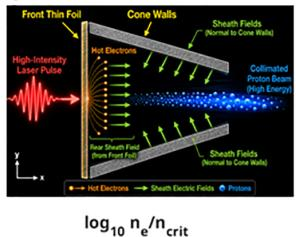
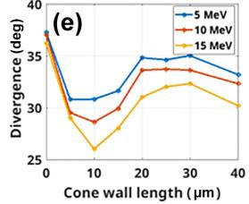
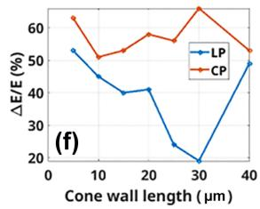
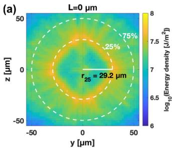
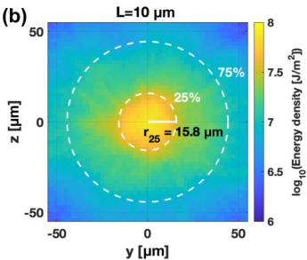

# 锥形导引靶对激光质子束相空间的定时控制

> S. Chintalwad、David J. Stark，*Physical Review E* **114** (2026)，035212，DOI: `10.1103/d45l-hsgg`，2026-09-22 正式发表。以下按论文的“靶构型—二维扫描—机制标度—三维检查”顺序整理。全文来自 APS 正式 PDF；图由 MinerU 提取并逐张核对。本文全部新结果来自作者 EPOCH PIC，不含新的质子束实验。

## 一句话结论

作者把薄 CH 箔后的空心收敛锥视为一个会随时间坍缩的动态电磁透镜：约 `10 μm` 的锥长使质子到达锥尖与壁面坍缩近同步，因而获得更好的横向聚焦；更长的 `25–30 μm` 锥让高能质子进入反向纵场，能谱更窄却损失准直。二维扫描中最佳相对能散较平面箔降低约 `63%`，三维弹道外推中 `10 μm` 锥把 25% 能量包络半径从 `29.2 μm` 降到 `15.8 μm`，约降低 `46%`。

## 1. 问题、构型与模拟口径

激光驱动质子源天然具有短脉冲、小源尺寸和高峰值流，但 TNSA 常伴随宽能谱和大发散角；RPA 又对靶厚、偏振和横向不稳定性敏感。本文不把锥靶仅当作静态几何准直器，而是追问：锥壁被热电子鞘场拉向轴线的坍缩时刻，能否与质子束穿越锥体的时间匹配，从而同时控制纵向能散和横向发散？

**图像描述：** 激光从左侧照射前端薄箔；热电子穿过薄箔并沿锥壁形成回流，壁面法向鞘场把质子压向轴线。示意图表达的是作者的机制解释，不是实验照片。

**与论证的关系：** 线偏振增强的 `J×B` 加热产生热电子；锥壁附近的方位磁场先约束这些电子，电子再维持鞘场和锥壁坍缩。磁场对质子的直接偏折并非作者给出的主要聚焦项。

二维和三维模拟均用全相对论 EPOCH。基准参数为：

- 激光波长 `0.8 μm`，峰值强度 `1×10²¹ W/cm²`，时间 FWHM `70 fs`，`1/e²` 强度腰斑 `w₀=3 μm`；主扫描用线偏振，并以等周期平均强度的圆偏振作对照。
- 靶为完全电离 CH；前箔与锥壁电子密度均为 `38 n_c`，前箔厚 `0.4 μm`，锥壁厚 `1 μm`；锥入口内/外径 `16/18 μm`，锥尖直径 `5.6 μm`。
- 二维锥长扫描 `0–40 μm`，网格 `7.5 nm × 12.5 nm`，电子/离子每格 `20/10` 个宏粒子，演化 `1.5 ps`。
- 三维只扫描 `0、10、15、25 μm` 等代表长度，网格 `20 nm × 40 nm × 40 nm`，电子/离子每格均为 `10` 个宏粒子，演化 `1.3 ps`。

前箔先经历 RPA 辅助的集体加速，随后热电子鞘场接管，形成作者所称的混合 RPA–TNSA 阶段。平面箔本身已经给出准峰状谱；锥体的作用是后续压缩和输运，而不是凭空产生能谱峰。

## 2. 锥长带来的能散—发散权衡

质子截止能约为 `70–80 MeV`，主要粒子集中在 `20–30 MeV`。作者用峰值能量以上 `10 MeV` 的主峰 FWHM 定义相对能散 `ΔE/E`，并把包含 80% 束流能量的轴向夹角定义为发散角。

**可见趋势：** 三条能量曲线都在约 `L=10 μm` 附近达到最小发散；锥再变长，发散重新增大。故“更长的机械通道”并不自动意味着更强准直，关键是聚焦鞘场是否仍在质子通过时存在。

**可见趋势：** 线偏振的 `ΔE/E` 从短锥的约 `50%` 降到 `L≈30 μm` 时约 `19%`，随后回升；圆偏振始终更宽且对锥长不敏感。作者据此把能谱压缩归因于线偏振热电子所驱动的强瞬态鞘场，而不是纯几何筛选。

**物理边界：** 最窄谱和最小发散并不出现在同一锥长。`10 μm` 更适合聚焦，`25–30 μm` 更适合能谱压缩；应用设计必须先决定可接受的能散、通量和焦斑权重。

## 3. 锥坍缩与质子飞行时间的标度

作者先用一维辐射压动量转移估计质子速度：

$$
\beta=\frac{(1+\mathcal E)^2-1}{(1+\mathcal E)^2+1},
\qquad
\mathcal E=\frac{\eta F}{\sigma c^2},
$$

其中 `σ` 是前箔面密度，`η≈1.7` 是线偏振下采用的动量转移因子，Gaussian 脉冲注量为

$$
F=I_0\tau_{\mathrm{FWHM}}\sqrt{\frac{\pi}{4\ln 2}}.
$$

若把质子从峰值强度到达之后近似为匀速，则穿越长度 `L` 的时间为

$$
t_{\mathrm{tip}}\approx\frac{L}{\beta c}.
$$

另一方面，作者用带经验系数 `α=0.25` 的 ponderomotive 温度估计热电子：

$$
T_e=\alpha m_ec^2\left(\sqrt{1+\frac{a_0^2}{2}}-1\right),
$$

第 `i` 种离子的声速和半个锥尖宽度的坍缩时间分别为

$$
c_{s,i}=\sqrt{\frac{Z_iT_e}{m_i}},
\qquad
t_{\mathrm{collapse}}\approx\frac{w}{2c_{s,i}}.
$$

令两个时间相等，得到匹配锥长

$$
L_{\mathrm{match}}\approx\frac{w\beta c}{2c_{s,i}}
\propto
w\beta Z_i^{-1/2}\left(\frac{m_i}{m_e}\right)^{1/2}a_0^{-1/2}.
$$

**物理直觉：** 轻离子先向轴线坍缩，碳离子稍晚；当前参数下氢、碳分别给出约 `7 μm` 和 `10 μm`。这解释了为何 `10 μm` 附近聚焦最好。若 `L>L_match`，锥壁在质子离开前已经坍缩，早期聚焦窗消失，但高能质子会比低能质子更多地采样负 `E_x`，产生“削高补低”式谱压缩。

**适用限制：** 这是匀速质子、单一有效电子温度和声速坍缩的量级估计，不是从 PIC 场逐粒子严格推导的闭式最优解；不同脉冲、预等离子体、材料和锥尖尺寸都需要重新扫描。

## 4. 三维检查与弹道焦斑

三维模拟保留了 `10 μm` 锥的较高转换效率和聚焦优势，也在 `25 μm` 锥中重现更强的负 `E_x` 与谱压缩。作者随后把离开计算域的质子按其出射动量无相互作用地弹道传播 `200 μm`，比较下游能量面密度。

**坐标与量：** 横纵轴是下游平面的 `y,z`（`μm`），色标为对数能量面密度；白色虚线给出包含 25% 和 75% 总束流能量的半径。

**定量比较：** 平面箔 `r₂₅=29.2 μm`，`10 μm` 锥为 `15.8 μm`，对应约 `46%` 缩小。这个结果来自出射相空间的无相互作用传播，不包含真实传输线中的空间电荷、背景等离子体、磁元件、材料和散射。

## 5. 证据边界与可复现性

- **直接证据层级：** 正式期刊论文中的作者二维/三维 EPOCH PIC、参数扫描、简化时间标度和弹道后处理。
- **没有的证据：** 没有锥靶实验、在线质子谱/发散诊断、靶制造误差扫描或下游介质输运；本文也没有完成“激光—束流—转换靶/剂量/核反应”的应用闭环。
- **二维到三维：** 三维重现了质性机制和焦斑趋势，但只覆盖少数锥长，前箔厚度也没有在三维重新优化，不能把二维全参数最优直接当成三维工程最优。
- **数值边界：** 论文没有给出系统的网格、每格粒子数、盒宽或随机种子收敛；数据在发表时未公开，只能向作者索取。
- **可保留结论：** 锥长通过“质子到达—锥壁坍缩”的相对定时控制能散与发散之间的权衡。
- **不能升级的结论：** `63%` 与 `46%` 是当前作者模拟相对所选平面箔基线的改善，不是实验测得的绝对束流品质，也不是质子治疗、快点火或同位素生产的已验证效率。
- **本轮未完成：** 没有本地运行 EPOCH、重建出射粒子相空间或重复弹道传播；这里只校验了正式全文、公式、图中数值和作者报告的边界。

## 6. 复习用速记

这篇工作的关键不是“锥体能聚焦”，而是把锥壁当作一个有寿命的等离子体透镜：`t_tip≈t_collapse` 时横向聚焦最好，`t_tip>t_collapse` 时高能端被反向纵场优先减速、能谱更窄。最优能散与最优焦斑因此天然不同。
