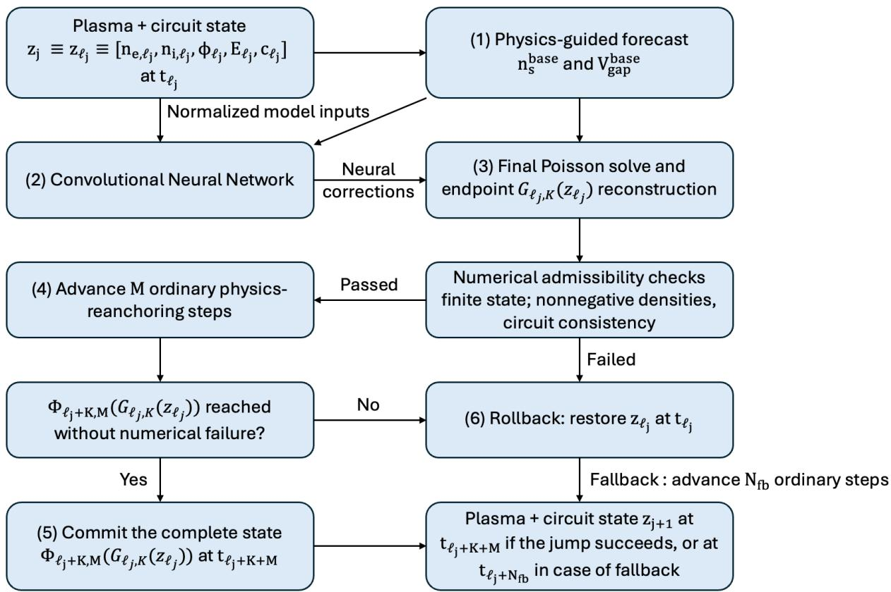
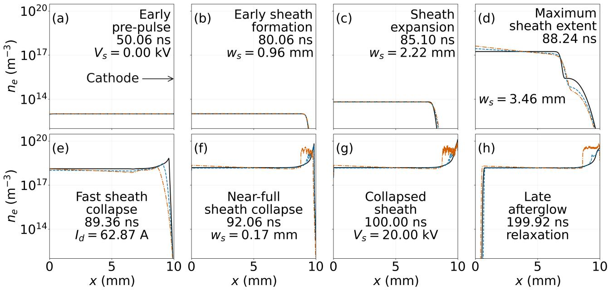
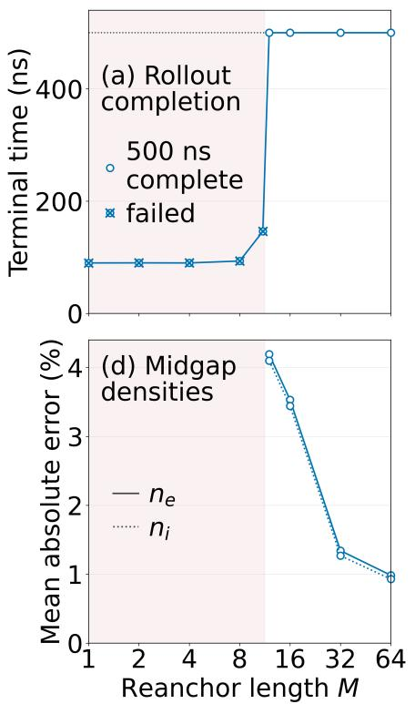
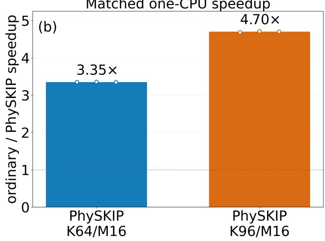

# 用物理引导时间跳跃加速等离子体流体模拟

> Asif Iqbal、Peng Zhang，arXiv:2609.23358，2026-09-20 提交、2026-09-22 列入官方新论文批次。以下依据官方 arXiv PDF 整理；图由 MinerU 提取后逐张核对。PhySKIP 是面向一维漂移—扩散—Poisson 放电求解器的预印本方法，不是 PIC 代码，也没有给出端到端 PIC 加速。

## 一句话结论

PhySKIP 用仅 `7,123` 个参数的 CNN 预测低成本物理步进之后的状态修正，再由 Poisson/外电路求解器恢复电势与电场，并通过周期性重锚、物理检查和失败回滚控制误差。作者在 `500 ns`、约 `5×10⁵` 个时间步的一维氮气放电上报告最高 `4.70×` CPU 加速；基准 `K=64, M=16` 为 `3.35–3.37×`，但这些数字排除了模型加载和诊断输出，且全部候选跳跃都被接受，不能升级为一般等离子体或 PIC 仿真的普适速度提升。

## 1. 方法针对什么瓶颈

显式等离子体求解器常被电子时间尺度约束，宏观演化却慢得多。直接用神经网络滚动预测容易累积误差并破坏 Poisson 约束；完全替换物理求解器又难以保证外推稳定。PhySKIP 采取混合路线：物理求解器仍负责短步进和约束重建，网络只负责跨过一段昂贵的中间演化。

每个循环可概括为：

1. 用原始物理求解器走 `K` 个细时间步，形成网络输入窗口。
2. CNN 提议将带电粒子密度等状态直接跳到更晚时刻。
3. 由 Poisson 方程和外电路关系重新计算电势、电场和电压，避免让网络独立预测受约束量。
4. 检查非负性、有限值、全局电荷/电路残差及相对变化；失败时回滚并缩短或放弃跳跃。
5. 每 `M` 个跳跃周期重新用全物理步进锚定，限制长期漂移。

这里的 `K` 是每次网络输入所覆盖的物理窗口，`M` 控制重锚频率。加速来自省掉部分细时间步，而不是单个物理步被神经网络加速。

## 2. 基准模型与训练口径

作者把方法接入 PASCHEN-1D 的氮气漂移—扩散—Poisson/外电路模型：

- 平行板间距 `10 mm`，气压 `60 Torr`，初始电子/离子密度 `10¹³ m⁻³`。
- 施加约 `20 kV`、中心在 `100 ns` 的 Gaussian 脉冲；模拟终点 `500 ns`。
- 参考网格 `1000` 点，细时间步约 `1 ps`，完整轨迹约 `5×10⁵` 步。
- CNN 只有 `7,123` 个可训练参数，输入为连续物理帧，输出归一化的密度修正；电势和电场不作为自由网络输出。
- 七个算例用于训练，另有开发算例。`N2-W16.5` 被用于训练后比较和检查点选择，因此不是严格盲测；`N2-NOM` 不在训练/开发集中，之后用于独立条件测试。

损失函数组合状态误差与导数/演化误差，但稳定性主要仍来自部署时的重锚和守卫机制，不能仅凭离线验证损失判断长时可靠。

## 3. 场与密度是否保持物理形态

**坐标与量：** 横轴为极板间位置，纵轴为时间，色标给出电子密度。参考解和混合解均表现出放电增长、空间电荷层发展与后脉冲衰减。

**可见趋势：** 主体波前和高密度区位置能够跟随参考解，误差主要在强梯度、峰值和后期累积区出现。图像相似并不等于逐点守恒；作者因此另用平均密度、电压和完成率评价。

**迁移边界：** 一维放电的状态维数、边界和化学集合固定。把同一网络迁移到多维、动理学尾部、强非局域电子或不同反应网络，需要重新定义输入、约束和验收量。

## 4. 稳定性由重锚频率控制

作者在有限 `500 ns` 区间扫描 `K`、`M`。当 `K=64` 时，`M<12` 的若干运行在终点前失败；`M≥12` 才稳定完成。

代表性结果为：

- `K=64, M=16`：平均电子密度误差约 `3.53%`，电压误差约 `0.672%`。
- `K=64, M=32`：误差降至约 `1.34%` 和 `0.252%`，但速度仅约 `2.41×`。
- `K=64, M=64`：电压误差约 `0.119%`，速度约 `1.78×`。

这里出现一个容易误读的权衡：在作者定义中，参数变化既影响累计跳跃也影响重新锚定成本；更低的终点误差不等于更高加速。论文报告的是有限时间窗内的经验稳定域，不是无限时间稳定性证明。

验收和回滚是重要的安全阀，但本文基准中所有网络提议都通过验收，因此没有用高拒绝率场景测量最坏情况下的额外成本，也没有展示连续失败时的吞吐退化。

## 5. 速度收益与计时口径

作者在一颗 Intel Core i7-14700KF 的单个逻辑 CPU 上重复三次：

- 完整物理基线约 `156 s`。
- `K=64, M=16` 约 `46.5 s`，对应 `3.35–3.37×`。
- `K=96, M=16` 约 `33.3 s`，最高 `4.70×`。

**计时边界：** 计时不含模型加载和诊断输出；硬件、线程、编译器和求解器实现都影响数值。最高加速点也不是最低误差点，论文没有报告 GPU、分布式并行或与其他时间粗化/多速率算法的等成本比较。

**不应外推：** 这是漂移—扩散流体模型的 wall-clock 结果。PIC 的粒子推进、沉积、场求解、通信与噪声性质不同，论文只把 PIC 列为潜在延伸，没有实现或测得 PIC 加速。

## 6. 网格与工况迁移

作者在 `500/1000/1500` 点网格上不重训部署，结果仍保持有用精度，说明卷积网络对数组长度有一定适应性。但固定卷积核在不同网格上对应不同物理长度，因此这不是严格的网格无关性，也没有覆盖更大倍率、非均匀网格或二维几何。

对未进入训练/开发集的 `N2-NOM` 工况，方法仍能完成并保持合理误差，是比训练内回放更强的证据；不过训练分布仍只围绕同一设备、气体和模型族，不能视为跨化学/跨装置泛化。

## 7. 证据边界与复现状态

- **直接证据：** 作者 PASCHEN-1D 基准、离线训练、混合部署、参数扫描和单 CPU 计时。
- **机器学习角色：** CNN 是受约束的状态跳跃器；Poisson、电路和守卫仍由显式物理逻辑承担。它不是纯数据驱动替代求解器。
- **验证边界：** 开发集参与了检查点选择，`N2-W16.5` 不是盲测；独立 `N2-NOM` 更有说服力但仍在相同模型族内。
- **稳定性边界：** `500 ns` 完成率和回滚机制不是长期数学稳定性证明，也没有覆盖高拒绝率、参数突变或异常化学状态。
- **复现性：** 论文列出模型规模、算法和主要算例，权重/完整设置需向作者请求；本轮未获得公开训练代码和 checkpoint。
- **本轮未完成：** 没有本地运行 PASCHEN-1D、训练 CNN 或重测 `156 s→33.3 s`；这里只核对官方全文、图、参数和计时定义。

## 8. 复习用速记

PhySKIP 的可取之处不是“网络学会全部等离子体物理”，而是把网络限制在时间跳跃提议中，让 Poisson/电路重建、周期重锚和失败回滚形成物理护栏。可信结论是当前一维氮气流体基准获得约 `1.8–4.7×` 的精度—速度权衡；对 PIC、多维和长时强非线性系统的收益仍待实现和验证。
