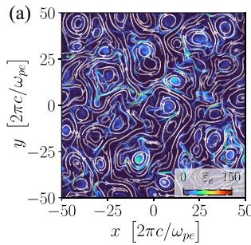
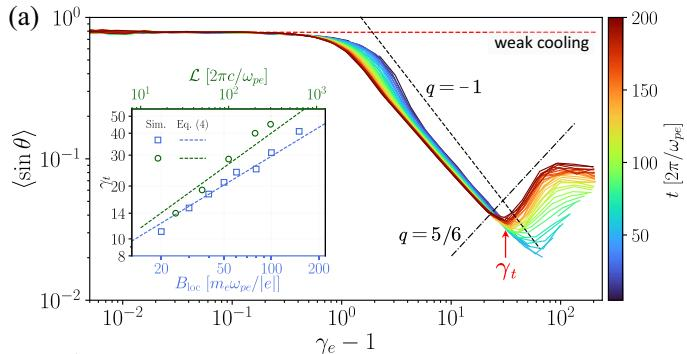
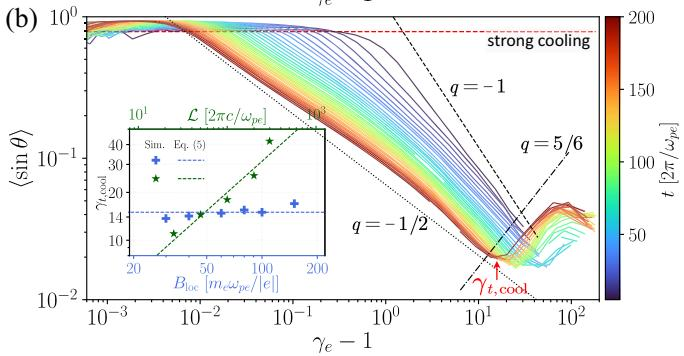
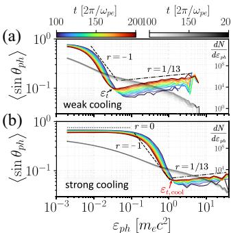
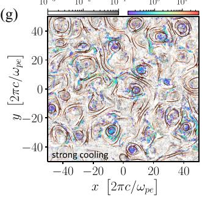

# 辐射相对论 Alfvén 湍流中的粒子与光子各向异性

> Peng Liu、Xiaochun Wei、Zheng Gong，*Physical Review D* **114** (2026)，063021，DOI: `10.1103/f9xt-jpd1`，2026-09-22 正式发表。以下依据 APS 正式 PDF 整理；图由 MinerU 提取后逐张核对。本文结果来自作者二维辐射 PIC，不是天体观测或实验室实验。

## 一句话结论

弱激发的相对论 Alfvén 湍流会把不同能量的电子/正电子加速到不同俯仰角，而同步辐射冷却会重塑这一关系并把它映射到光子方向分布。作者在二维 pair-plasma EPOCH 模拟中得到分段幂律：弱冷却低能粒子约为 `sinθ∝γ⁻¹`，强冷却低能粒子约为 `sinθ∝(γ−1)⁻¹ᐟ²`；这些标度及其拐点依赖磁场、系统尺度和冷却强度，不能直接当作任意天体源的普适辐射模板。

## 1. 物理问题与数值设置

许多高磁化天体等离子体既有相对论湍流，也有显著同步辐射损失。常见的各向同性电子分布假设会丢掉一个关键耦合：粒子能量决定其回旋半径和漂移机制，进而决定相对局域磁场的俯仰角；辐射损失又最强地作用于垂直动量。

作者用 EPOCH 研究二维、衰减、弱激发 Alfvén 湍流（WEAT）：

- 初始电子—正电子温度 `Θ₀=kT₀/(m_ec²)=0.3`；计算域为 `L=100 λₑ₀` 的正方形。
- 网格间距 `Δx=Δy=λₑ₀/40`，背景磁场垂直模拟平面，初始扰动 `δB_rms/B₀=0.1`。
- 基准湍流磁化参数 `σ_{δB}=50`，并扫描系统尺度、磁场和冷却强度。
- 辐射反作用以同步辐射/量子参数处于经典区的阻尼项加入；模拟跟踪粒子相空间和辐射光子的能量—角度分布。

**图像描述：** 高能粒子不是均匀填充计算域，而是沿电流片、磁结构和间歇性耗散区成簇出现。颜色编码对应粒子能量，背景显示湍流结构。

**论证作用：** 后续的俯仰角幂律不是均匀随机加热的平凡结果，而与粒子在间歇结构中的加速和随后沿磁场输运有关。

## 2. 弱冷却：低能漂移与高能曲率漂移

作者按粒子 Lorentz 因子分箱，计算相对局域磁场的平均俯仰角。弱冷却时可见两个区间。

- 在较低能区，平行电场加速使 `p_∥` 增长快于 `p_⊥`，作者得到近似 `sinθ∝γ⁻¹`。
- 在高能区，粒子的有限回旋半径和场线曲率漂移更重要；结合临界平衡与 Kolmogorov 型级联标度，作者给出 `sinθ∝γ^{5/6}` 的上升支。
- 两段之间的拐点不是固定能量。弱冷却时它随背景磁场和系统尺度移动，因为粒子何时开始有效采样曲率取决于回旋尺度与湍流尺度的相对关系。

这意味着“能量越高越沿磁场”只适用于低能分支；更高能粒子反而可获得更大的垂直速度分量。

## 3. 强冷却：垂直动量被选择性耗散

同步辐射功率随垂直动量和磁场增强，因此强冷却首先压低大俯仰角粒子。作者在低能区得到另一条标度：

$$
\sin\theta\propto(\gamma-1)^{-1/2}.
$$

**图像描述：** 强冷却曲线相对弱冷却整体向小俯仰角移动，低能端呈更陡的下降关系；不同参数组仍保留可辨认的转折。

**物理解释：** 辐射反作用并非只把能谱整体向低能移动，而是各向异性地消耗 `p_⊥`。在强冷却极限，转折主要由系统尺度控制，对背景磁场的额外依赖减弱。

**限制：** 这里的“强/弱”是作者数值参数下冷却时间与湍流演化时间的相对关系，不应脱离参数表直接映射为某个具体天体源。

## 4. 从粒子各向异性到光子方向分布

相对论同步辐射沿粒子瞬时速度方向成束，因此粒子 `θ(γ)` 会转换为光子能量 `ε` 的俯仰角关系。作者结合特征同步光子能量与粒子标度得到：

- 弱冷却低能光子：`sinθ_γ∝ε⁻¹`；高能端在修正后的曲率漂移分析中约为 `sinθ_γ∝ε^{1/13}`。
- 强冷却低能光子：`sinθ_γ∝ε⁻¹ᐟ³`。

**可见趋势：** 数值曲线呈分段而非单一幂律；强冷却使低能光子更加沿局域磁场定向。拟合区间有限，指数是该模型中的渐近解释，不是对整段光谱的精确经验公式。

**图像描述：** 光子方向场在二维平面上围绕磁结构形成涡旋状纹理，说明空间位置、局域磁场与辐射方向相互关联。

**观测含义：** 只用各向同性单区模型平均掉这些结构，可能低估随视线、能段和时间变化的辐射各向异性；但本文没有为任何具体望远镜计算光变、偏振或响应卷积。

## 5. 证据边界与复现状态

- **直接证据：** 作者二维 EPOCH 辐射 PIC 中的粒子相空间、光子方向分布、参数扫描和与解析标度的对照。
- **模型范围：** 电子—正电子 pair plasma、二维、衰减、弱扰动 Alfvén 湍流；不等于三维强驱动、电子—离子或含对产生级联的系统。
- **标度假设：** 高能分支使用临界平衡和 Kolmogorov 型谱等近似。若湍流谱、间歇性或磁几何变化，指数也可能变化。
- **观测边界：** 没有直接天体观测或实验室辐射测量对照，也没有探测器响应和视线积分；“可能解释辐射各向异性”仍是机制外推。
- **数据边界：** 论文标明数据可向作者索取，没有随文开放完整粒子/光子数据和复现实例。
- **本轮未完成：** 没有本地运行 EPOCH、重建俯仰角统计或验证拟合指数；这里只核对正式全文、主要参数、图像和作者报告的关系。

## 6. 复习用速记

核心链条是“加速机制选择 `p_∥/p_⊥` → 辐射反作用优先耗散 `p_⊥` → 粒子俯仰角随能量分段变化 → 同步光子继承能量依赖的方向性”。值得保留的是机制与参数依赖，而不是脱离二维 pair-plasma 设置孤立引用某个指数。
