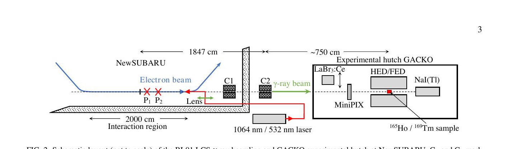
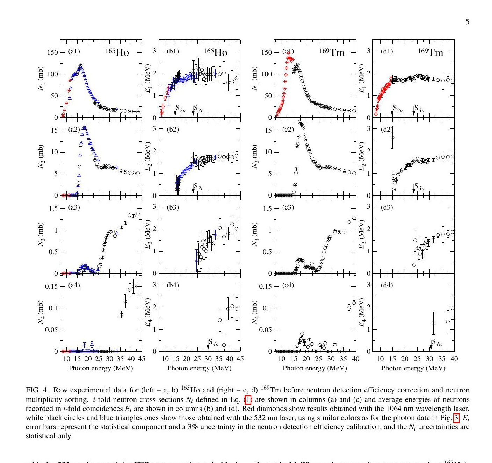
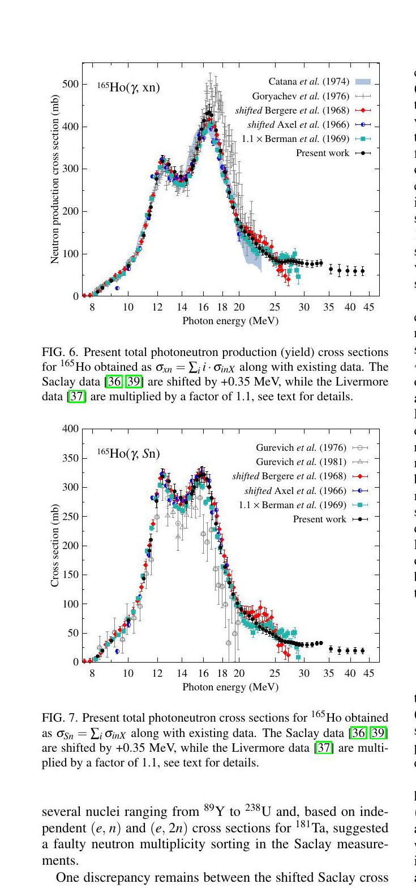
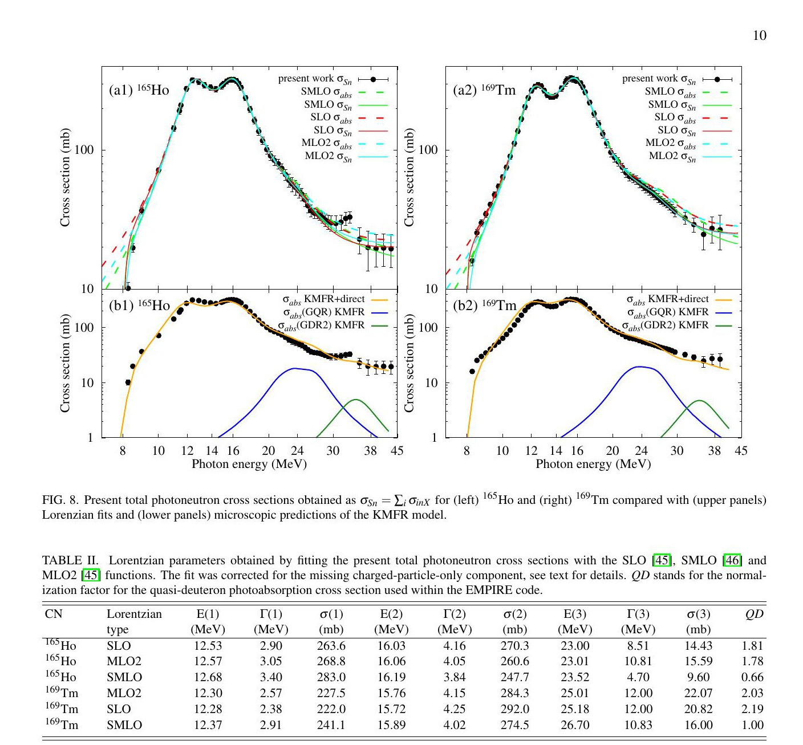
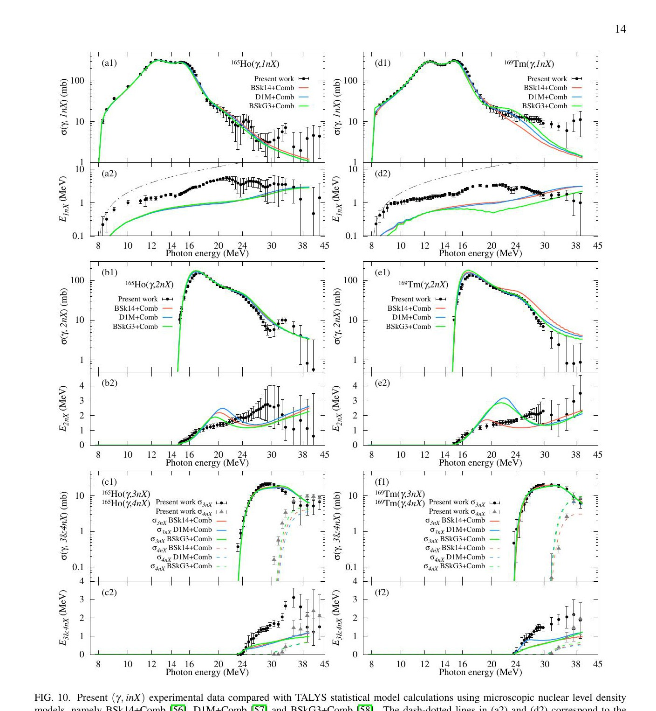

# Ho-165 与 Tm-169 巨偶极共振区的光中子反应

> I. Gheorghe 等，arXiv:2609.25984，2026-09-22 提交、2026-09-23 进入官方新论文列表。全文来自官方 arXiv PDF。MinerU 两次远程解析失败，以下基于本地文本、页面渲染和逐图核对。本文是 NewSUBARU 激光康普顿伽马束光核实验加统计模型解释，不是激光等离子体电子束打转换靶实验。

## 一句话结论

作者用 `8–43 MeV` 准单色激光康普顿散射（LCS）伽马束、`³He` 慢化计数阵列和中子多重性分选，首次系统给出 `¹⁶⁹Tm` 的 `(γ,1nX)` 至 `(γ,4nX)` 截面与平均中子能，并更新 `¹⁶⁵Ho` 数据。新 Ho 数据提示旧 Saclay 结果需整体移能约 `+0.35 MeV` 且可能把部分 `2n` 事件错分为 `1n`；与 Livermore 总强度仍有约 `10%` 归一化差异。`20–25 MeV` 结构与巨四极共振解释相容，但模型对平均中子能仍有系统偏差。

## 1. 光源、靶与中子探测

- `1064/532 nm` 激光与储存环相对论电子产生 LCS 伽马束；最大光子能量覆盖 `8–43 MeV`。
- `¹⁶⁵Ho` 使用 58 个束能点，`¹⁶⁹Tm` 使用 65 个；电子束能量校准精度为 `10⁻⁵`，伽马束斑约 `4 mm`。
- 两种靶均为 `99.9%` 化学纯度、直径 `20 mm` 的金属盘；随能量使用单盘或双盘堆叠，厚度约 `4–8 mm`。
- 伽马脉冲宽 `40–60 ns`。低于双中子阈值时以 `20 kHz`、约 `10⁵ γ/s` 做计数；高于阈值时降到 `1 kHz`、约 `10⁴ γ/s` 以做多重性分选。
- 低能段的高效率阵列效率约 `60–80%`；高能段的平坦效率阵列平均效率 `37.3%`，在 `10 keV–5 MeV` 中子能区变化约 `5%`。

LCS 能谱并非理想单色。作者用 LaBr₃ 监视器响应重建入射谱，并把靶内电磁相互作用产生的低能光子尾纳入折叠；这对厚靶和高能点尤为重要。

## 2. 从 coincidence 到分反应道截面

图 4 左、右分别是 `¹⁶⁵Ho` 与 `¹⁶⁹Tm`；横轴为入射光子能量，列中依次给出 `1–4` 折叠中子计数截面和平均中子能。换用不同激光波长及 HED/FED 阵列时出现的跳变主要来自束谱和探测效率改变，不能直接解释为核反应结构。

分析分三步：

1. 统计 1–4 折叠 coincidence 计数与平均能量；
2. 用多重触发模型把探测事件映射到发射的 `(γ,in)` 道；
3. 迭代展开 LCS 非单色束谱和靶内改谱。

只用中子探测器，因此无法区分纯中子道和伴随质子/α 的道。作者按 IAEA 记号报告

$$
\sigma_{inX}=\sigma(\gamma,in)+\sigma(\gamma,inp)+\sigma(\gamma,in\alpha)+\cdots.
$$

误差由计数统计、入射通量 `3%`、中子效率 `3%`、靶厚 `0.25–0.5%` 及非单色展开共同传播。高能端截面降低且更高多重性道开启，平均中子能误差随之增大。

## 3. 分反应道结果与旧数据冲突

对 `¹⁶⁹Tm`，除一个未正式发表的 `13 MeV` 单点外，此前没有完整光中子数据。作者测得大致峰值：

- `(γ,1nX)` 约 `300 mb`；
- `(γ,2nX)` 约 `150 mb`；
- `(γ,3nX)` 约 `20 mb`；
- `(γ,4nX)` 约 `10 mb`。

`¹⁶⁹Tm` 的 `1nX` 平均中子能最大约 `3.4 MeV`，低于 `¹⁶⁵Ho` 的约 `5.4 MeV`。截面在 GDR 双峰之后下降，`20–25 MeV` 附近仍保留较宽结构。

对 `¹⁶⁵Ho`：

- Saclay 总强度与本工作大体相容，但把其能轴整体平移 `+0.35 MeV` 后峰位才匹配；`1n/2n` 分量差异指向旧多重性分选可能把部分 `2n` 事件归入 `1n`。
- Livermore 的总中子产额乘 `1.1` 后与本工作和移能后的 Saclay 更一致，即仍有约 `10%` 的统一强度差。
- `20–25 MeV` 的 Saclay 额外强度可能受老式正电子湮没在飞束线的高本底影响，作者没有据此做强物理解释。

这些修正用于诊断旧数据系统学，不意味着可以任意校准新实验；新结果自身也依赖束谱重建、多重性分选和展开。

## 4. GDR/GQR 与核反应模型

作者用 SLO、SMLO 和 MLO2 描述 GDR，并用 EMPIRE 估算未被中子探测器看到的“只发射带电粒子”贡献；在 `8–44 MeV` 的能量积分中，该缺失分量约为 `3%`。`20–25 MeV` 的高能结构与 KMFR 巨四极共振（GQR）预测相容，但 `¹⁶⁹Tm` 拟合宽度约 `12 MeV`、约为 `¹⁶⁵Ho` 的 `1.4` 倍，作者也指出这可能受拟合不确定度影响。

由两个 GDR 峰的质心能量配合流体模型，作者得到基态本征电四极矩：

$$
Q_0(^{165}\mathrm{Ho})=+7.00(34)\ \mathrm{b},
\qquad
Q_0(^{169}\mathrm{Tm})=+7.38(28)\ \mathrm{b}.
$$

EMPIRE 中，截面总体由 `GSM+MLO2` 组合描述较好，平均中子能更接近 `EGSM+SLO`；没有一个单一势能/能级密度组合同时最优描述所有观测量。TALYS 的微观能级密度能较好追踪多数截面形状，但平均中子能普遍偏低；`¹⁶⁵Ho` 的高多重性道和 `¹⁶⁹Tm(γ,2nX)` 仍有明显模型差异。

## 5. 对激光核应用的价值与边界

- **直接实验：** LCS 伽马束下的 Ho/Tm 多重性分辨光中子截面和平均中子能；补充材料提供数值结果。
- **与本库主线的连接：** 这些数据可用于验证转换靶伽马谱到光核/中子产额的输运计算、核数据和探测器响应，尤其适合作为 GDR 区 benchmark。
- **不能升级的结论：** 光源来自储存环电子—激光康普顿散射，不是激光等离子体电子束打高 Z 转换靶；本文没有测量 LPA 源项、厚转换靶产额、剂量或屏蔽。
- **模型依赖量：** GDR/GQR 参数、四极矩与 EMPIRE/TALYS 归因依赖 Lorentzian、能级密度、光子强度函数和未见反应道修正。
- **实验系统学：** 非单色束谱、厚靶改谱、HED/FED 切换和多重性分选是主要证据链的一部分，不能只引用最终截面而忽略展开。
- **本轮未完成：** 没有运行 EMPIRE/TALYS、复算束谱展开或读取补充数据表；这里只核验正式 PDF、图中趋势和作者报告的数值。

## 6. 复习用速记

本工作提供的是可靠的“伽马入射—分道光中子截面—平均中子能”核数据链。对激光驱动应用最有用之处是校核核反应与探测模型，而不是证明某个 LPA 转换靶已经实现相同中子产额。
