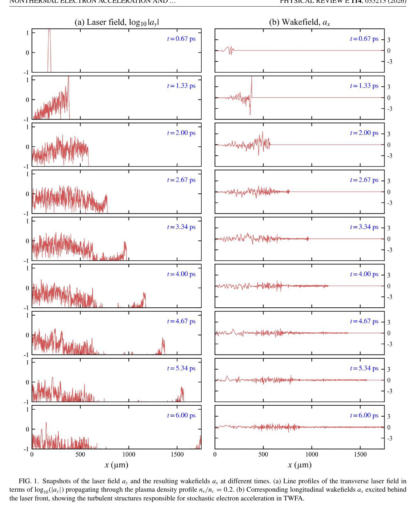

# 湍流尾场中的非热电子加速与分数输运

> Yao-Li Liu、Yasuhiro Kuramitsu，*Physical Review E* **114** (2026)，035213，DOI: `10.1103/nc7w-yr34`，2026-09-23 正式发表。全文来自 APS 正式 PDF。MinerU 两次远程解析均失败，以下基于本地 `pdftotext -layout`、页面渲染和逐图核对；本文全部新结果是作者的一维 EPOCH PIC 与统计建模，不含新的激光尾场实验。

## 一句话结论

作者把湍流尾场中的电子按最终能量分为 Brownian-like、间歇 Lévy-like 和弹道加速三类，并直接从粒子轨迹构造能量跳跃的转移概率密度（TPD）。中能电子的 TPD 在大跳跃区近似呈 Lorentzian `|Δγ|⁻²` 重尾，对应分数阶指数 `α=1`；无漂移的分数 Fokker–Planck 方程给出 `f(γ)∝γ⁻²`。这是一维长粒子跟踪中的统计解释，不是二维/三维收敛、实验观测或一般性的宇宙线谱起源证明。

## 1. 模拟问题与口径

作者使用 EPOCH 做 `1D-3V` PIC：

- 激光波长 `810 nm`、`a₀=40`、脉宽 `30 fs`，沿 `x` 方向传播；参数参考 J-KAREN-P，但本文并未使用该装置的新实验数据。
- 电子—质子等离子体平台密度 `n₀=0.2 n_c`，超高斯指数 `10`、半径 `800 μm`；临界密度取 `1.7×10²¹ cm⁻³`。
- 盒长 `2073.6 μm`、`81920` 个网格，`Δx=25.3 nm`；电子和质子均使用每格 `512` 个宏粒子，总演化时间 `6.00 ps`。
- 采用一维的理由是完整追踪全部粒子并构造 TPD；代价是压制横向湍流、丝化、模耦合和跨场输运。

**图像描述：** 左列横轴为 `x (μm)`，纵轴为 `log₁₀|a_y|`；右列为归一化纵向尾场 `a_x`。`a_y≈40` 的脉冲进入 `0.2 n_c` 等离子体后迅速衰减，尾后形成随时空破碎的纵场结构。

**论证作用：** 图 1 只建立“激光衰减—湍流尾场出现”的模拟环境；它没有直接证明后续 TPD 必然服从 Lévy 过程。

## 2. 能谱与三类粒子轨迹

在 `t≥0.667 ps` 后，能谱逐渐出现非热尾；`t=6 ps` 时约在 `200<γ<2000` 区间接近 `f(γ)∝γ⁻²`，`γ>2000` 则形成高能凸起，`γ<200` 偏离单一幂律。作者据最终能量选择三组轨迹：

- 低能：`γ<30`，大量小幅正负涨落，表现为 Brownian-like 随机运动；
- 中能：`200<γ<600`，大多数跳跃较小，但偶发大幅增能，形成间歇过程；
- 高能：`γ>2500`，早期被相位俘获后近单调增能，随后形成准单能凸起。

**边界：** 低能和中能不是由一个严格能量阈值分开的两相；作者明确把它们看成 Gaussian 与 Lorentzian 贡献比例连续变化。高能弹道组才是动力学上更清晰的独立分支。

## 3. 转移概率密度如何随取样间隔变化

对每条粒子轨迹，作者定义

$$
\Delta\gamma=\gamma(t+\Delta t)-\gamma(t),
$$

并对不同 `Δt` 统计 TPD。图 4 使用 `1–3000 fs` 的取样间隔，定量拟合集中在 `3、30、300 fs`。

**可见趋势：** 低能组的中心宽度在 `Δt≳10 fs` 后变化不大，但重尾继续扩张；中能组在 `Δt≈1000 fs` 后趋于饱和；高能组随 `Δt` 增大出现明显正负不对称和多峰，说明定向加速记忆不能再用对称无记忆分布概括。

作者比较 Gaussian、Lorentzian、Gaussian+Lorentzian 和 `κ` 分布：

$$
F_G(\Delta\gamma)=a_G\exp\!\left[-\frac{(\Delta\gamma-x_G)^2}{2\sigma_G^2}\right],
\qquad
F_L(\Delta\gamma)=a_L\frac{\sigma_L^2}{(\Delta\gamma-x_L)^2+\sigma_L^2}.
$$

低能 TPD 需要窄 Gaussian 核与逐渐展宽的 Lorentzian 尾；中能 TPD 的非 Gaussian 重尾在较长 `Δt` 下最突出；高能 TPD 在 `300 fs` 已显著不对称，所有对称模型的拟合质量都下降。`κ` 分布能描述重尾，但作者把它作为表型比较；真正的动力学主张来自 TPD 的 Lorentzian 型跳跃，而不是仅由 `κ` 拟合推出。

## 4. 从 Lorentzian 跳跃到 `γ⁻²`

作者用对称 Riesz 分数导数写出无漂移模型：

$$
\frac{\partial f}{\partial t}
=D\frac{\partial^\alpha f}{\partial|\gamma|^\alpha}.
$$

当 `α=1` 时，点源初值解为 Lorentzian：

$$
f^{L}(\gamma,t)=\frac{1}{\pi Dt}
\left[1+\left(\frac{\gamma}{Dt}\right)^2\right]^{-1},
$$

因此在 `γ≫Dt` 时有 `f^L∝γ⁻²`。

中能组在 `|Δγ|≈10²–10³` 的范围最接近 `|Δγ|⁻²`；低能组衰减更快，高能组只在有限范围近似该斜率并带有额外结构。故解析解解释的是中能随机跳跃的理想化渐近行为，不能直接覆盖弹道高能凸起。

## 5. 证据边界与可复现性

- **直接证据层级：** 正式期刊论文中的作者 `1D-3V` EPOCH、全粒子轨迹、TPD 拟合与简化 FFPE 解析解。
- **没有的证据：** 没有本文的新实验、二维/三维同参数重跑、探测器响应或宇宙线观测拟合。
- **几何限制：** 一维模型刻意压制横向湍流、丝化、模耦合和粒子横向逃逸；这些效应可能改变跳跃统计、谱宽和高能截止。
- **模型限制：** 解析 FFPE 没有显式漂移、损失、能量依赖扩散或有限边界；由 `α=1` 得到的 `γ⁻²` 是理想化渐近解，不等于作者从 PIC 唯一反演出完整输运方程。
- **统计限制：** 高能组保留定向加速记忆，TPD 不是单一对称 Markov 核；低/中能边界也非锐利。
- **数据与复现：** 论文数据未公开，只说明可向作者申请；本轮没有运行 EPOCH 或重做粒子跟踪与拟合。

## 6. 复习用速记

这篇论文的核心不是再次看到 `γ⁻²`，而是用粒子能量跳跃把中能重尾与 `α=1` 的分数扩散联系起来。应同时保留两个限定：该联系来自一维作者 PIC；高能准单能分支是有记忆的弹道加速，不服从同一随机模型。
