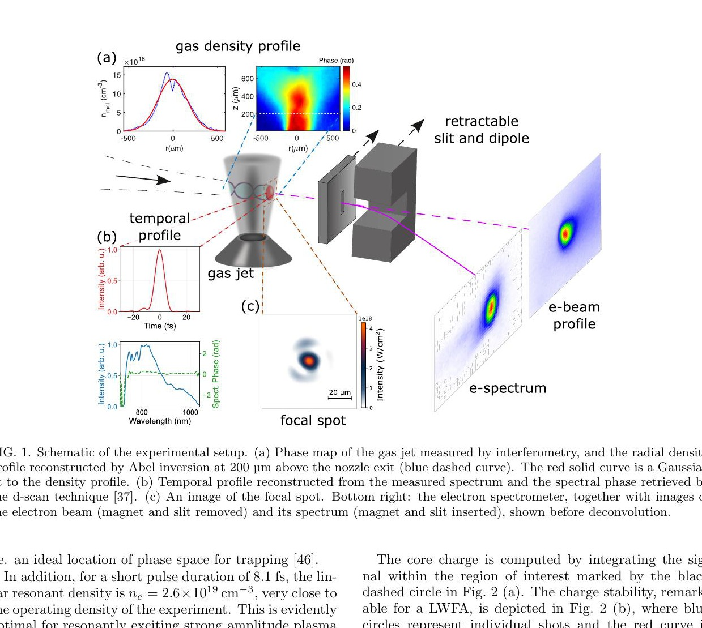
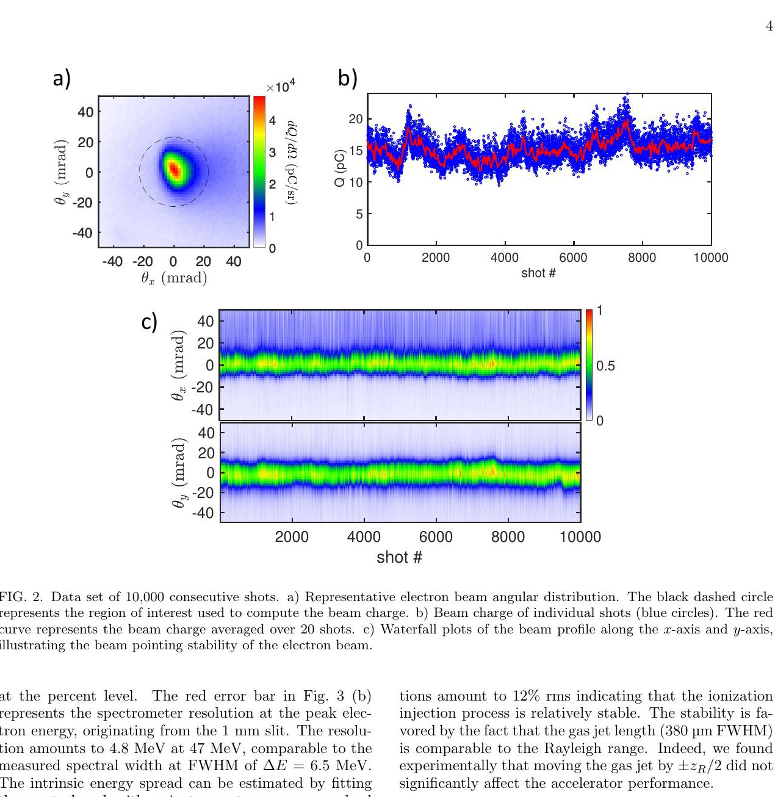
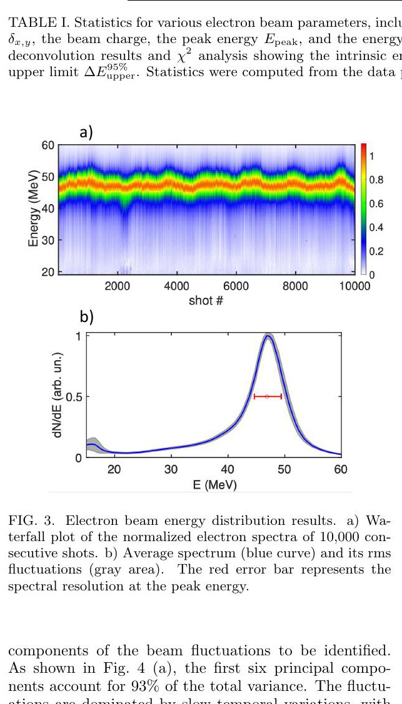
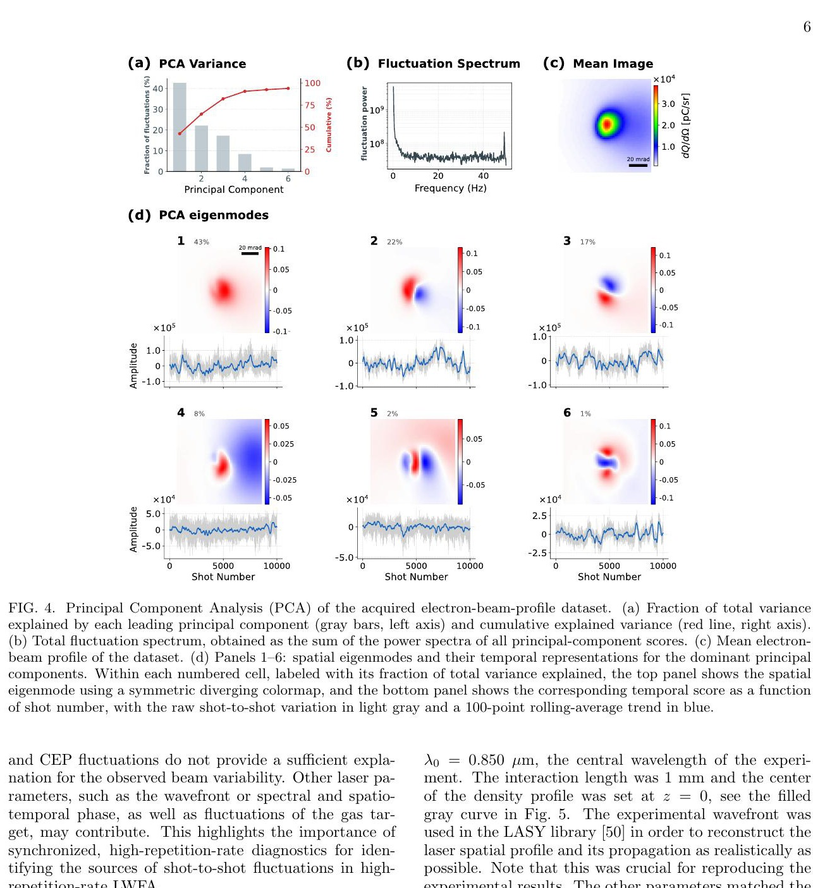
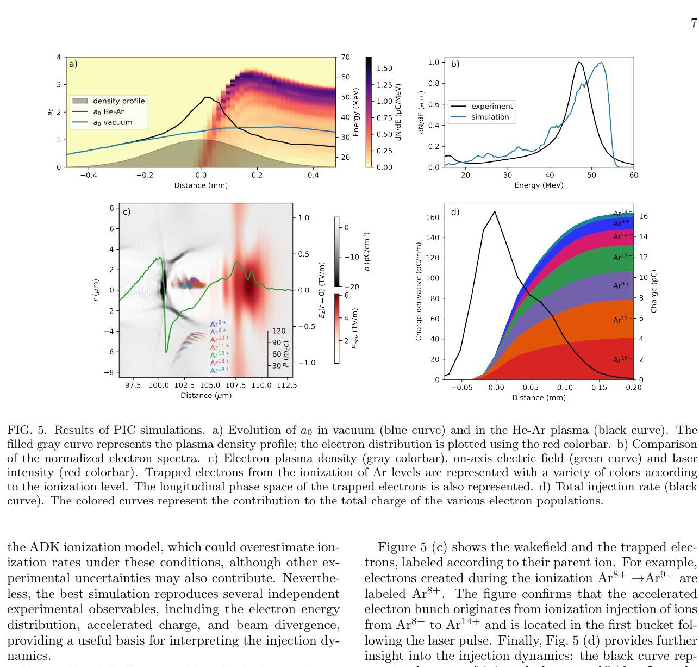

# OPCPA 驱动的 100 Hz 稳定 50 MeV 激光尾场电子束

> S. Smartsev 等，arXiv:2609.26390，2026-09-22 提交、2026-09-23 进入官方新论文列表。全文来自官方 arXiv PDF。MinerU 两个官方 URL 均解析失败，以下基于本地文本、页面渲染和逐图核对。论文包含真实 100 Hz LWFA 实验和作者 FBPIC 机制模拟；`1 kHz` 与 FLASH 放疗仍是未来外推。

## 一句话结论

ELI-ALPS 的 SYLOS 3 OPCPA 以 `70 mJ、8.1 fs` 脉冲在 `100 Hz` 下产生约 `47 MeV、15 pC` 的准单能电子束；连续 `10,000` 发中峰值能量波动为 `1.4% rms`、电荷波动 `12% rms`，本征能散的 `95%` 置信上限为 `10% FWHM`。六个 PCA 模态解释 `93%` 的束斑方差，主要漂移低于 `1 Hz`；FBPIC 支持“强自聚焦局域化电离注入”的解释，但最佳模拟需把 Ar 掺杂从实验的 `1%` 调到 `0.1%`，机制闭环仍有明显模型差异。

## 1. 实验构型与运行条件

- OPCPA 中心波长 `850 nm`，靶上能量约 `70 mJ`，脉冲 `8.1 fs FWHM`，焦斑 `10 μm FWHM`，估算峰值强度 `4.3×10¹⁸ W/cm²`、`a₀=1.5`。
- 三平面波前重建给出 `z_R=364 μm`，总波前误差 `0.097 waves rms`；载波包络相位稳定度为 `240 mrad rms`。
- 连续流气体喷嘴为 `99% He + 1% Ar`，电子密度约 `3×10¹⁹ cm⁻³`、不确定度 `±10%`，密度轮廓 `380 μm FWHM`。
- 电子束用荧光屏、绝对电荷标定、`500 mT/50 mm` 偶极磁铁和 `1 mm` 入射狭缝诊断；狭缝固定磁铁入射角，但也使能谱只采样束流的一部分。
- 激光和连续流气体靶可支持 `1 kHz`，本轮只在 `100 Hz` 运行；作者明确说明限制来自辐射防护和缺少高平均功率束流收集器。

真空中 `k_p w₀≈9`，而匹配值 `2√a₀≈2.5`；同时 `P/P_c≈10`，因此激光预期发生强自聚焦。短脉冲的线性共振密度约 `2.6×10¹⁹ cm⁻³`，接近实验密度，有利于稳定激发尾场。

## 2. 连续 10,000 发的束流稳定性

图 2 横轴为 shot number；电荷散点集中在约 `15 pC`，红线是 20 发滑动平均。上下两条 waterfall 分别给出两个横向方向的束斑投影，指向抖动远小于束流发散。

作者汇总的主要量为：

- 水平/竖直发散 `15.6/18.8 mrad FWHM`，相对波动 `9%/7.4% rms`；
- 水平/竖直指向抖动 `1.2/1.3 mrad rms`；
- 电荷 `15 pC`、`12% rms`；
- 峰值能量 `47 MeV`、`1.4% rms`。

测得谱峰宽度为 `6.5 MeV FWHM`，而 `47 MeV` 处仪器分辨率已达 `4.8 MeV`。作者用仪器响应卷积模型反演出最佳 Lorentzian 本征宽度 `3.8 MeV`，profile-`χ²` 给出的 `95%` 上限为 `4.6 MeV`，即 `ΔE/E<10% FWHM`。因此不能把测得的 `6.5 MeV` 直接当作本征能散，也不应把 `3.8 MeV` 写成无不确定度的直接观测值。

## 3. PCA 揭示慢漂移而非高速随机失稳

前六个模态解释 `93%` 的总方差，频谱在 `1 Hz` 以下明显上升：虽然束流以 `100 Hz` 采样，多数变化比 shot spacing 慢得多。空间模态与物理量的相关性为：

- 模态 1 与核心电荷 `r=0.94`；
- 模态 2/3 与两个方向的指向 `r=0.95/0.98`；
- 模态 5/6 与束宽 `r=0.48/0.69`；
- 模态 4 是 core–halo 结构，当前数据无法唯一解释。

补充材料用循环时间平移构造保留慢漂移的零假设，避免把 10,000 个强自相关样本错误视为独立样本。激光能量自身只有 `0.5% rms` 波动，并与电荷模态约 `r=0.54`，但因外部诊断采样慢、独立样本少而未达统计显著；CEP 与束流量也没有显著相关。故“慢反馈可能校正主导漂移”是有数据支持的工程判断，但漂移源尚未被唯一识别。

## 4. FBPIC 对局域电离注入的解释

作者使用四方位模 Fourier–Bessel FBPIC，纵向网格 `λ₀/32`、径向网格为其 5 倍，盒尺寸 `37.5×75 μm²`，相互作用长度 `1 mm`；LASY 导入实测波前。最佳匹配使用：焦点位于喷流中心后 `150 μm`、`GDD=-10 fs²`、`n_e=2.72×10¹⁹ cm⁻³`、Ar 掺杂 `0.1%`。

模拟中 `a₀` 从真空的 `1.5` 局部升到 `2.5`；电子主要在激光强度峰附近约 `200 μm` 的区间注入，其中大部分电荷集中在约 `100 μm FWHM`。模拟给出约 `50 MeV` 谱峰、`16 pC` 电荷和 `13/22 mrad` 发散，接近实验。作者据此解释为 self-truncated ionization injection：只有更高 Ar 电离级产生的电子在合适相位出现并满足俘获条件，快速自聚焦又把注入局限在短距离。

**关键不闭合处：** 最佳模拟使用 `0.1%` Ar，而实验为 `1%`；作者认为 ADK 率可能高估，也可能有实验不确定度，但没有解决这一个数量级差异。因此图 5 支持机制的定性一致性，不是对实验组成和全部相空间的无调参复现。

## 5. 应用含义与边界

- **已直接测量：** `100 Hz`、`10,000` 发束流的电荷、指向、发散和能谱；不是单发最佳值拼接。
- **模型辅助量：** 本征能散来自仪器响应反卷积；局域电离注入机制来自最佳匹配 FBPIC。
- **尚未实现：** 激光本身具备 kHz 能力，但本实验没有在 `1 kHz` 加速电子；也没有束流到水模、剂量学、放射生物学或 FLASH 终点。
- **放疗外推：** 作者估计 `1 kHz`、`1 cm²` 场可达几十 `Gy/s`，进一步优化可能进入 FLASH；这是按电荷和重复率缩放的前景，不是本文剂量测量。
- **未测高频诊断：** 激光能量和 CEP 的外部记录慢于束流相机，无法排除 shot-to-shot 波前、时空耦合或气体靶波动。
- **本轮未完成：** 没有运行 FBPIC/LASY、重做 PCA、反卷积或剂量换算；这里只验证作者 PDF、文本、图和内部口径。

## 6. 复习用速记

最稳妥的结论是：`70 mJ、8.1 fs` 的 OPCPA 已在真实 `100 Hz` LWFA 中给出 `47 MeV/15 pC`、能量 `1.4% rms` 的 10,000 发稳定束流。`1 kHz`、FLASH 和局域注入的精确成分仍分别受设施、剂量链和模拟掺杂差异限制。
