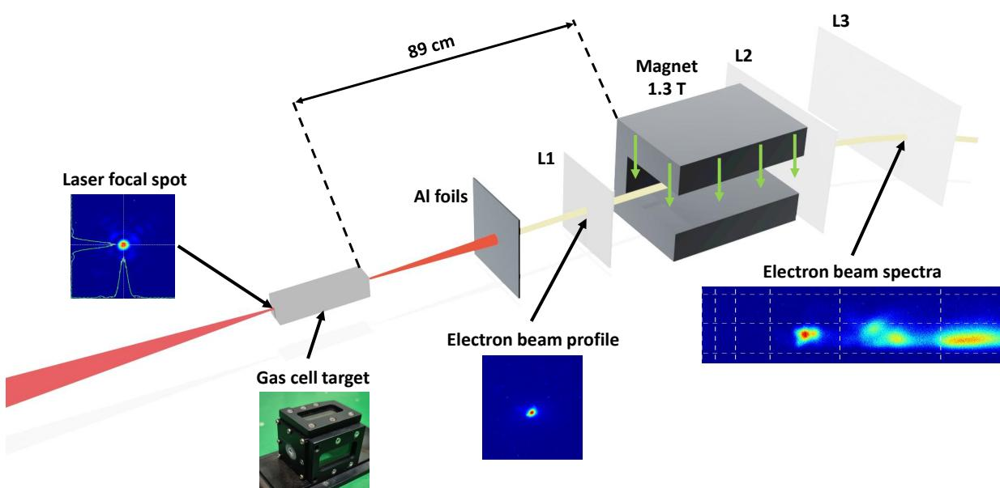
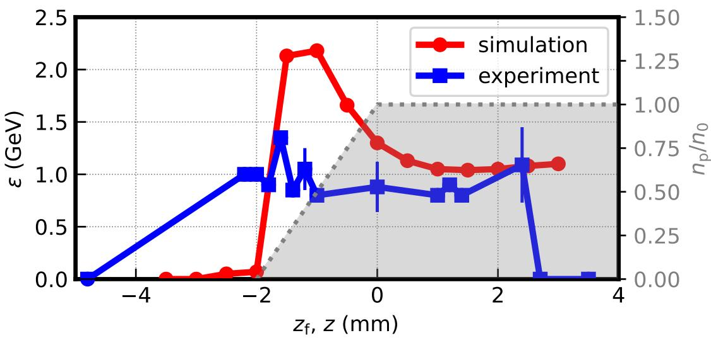
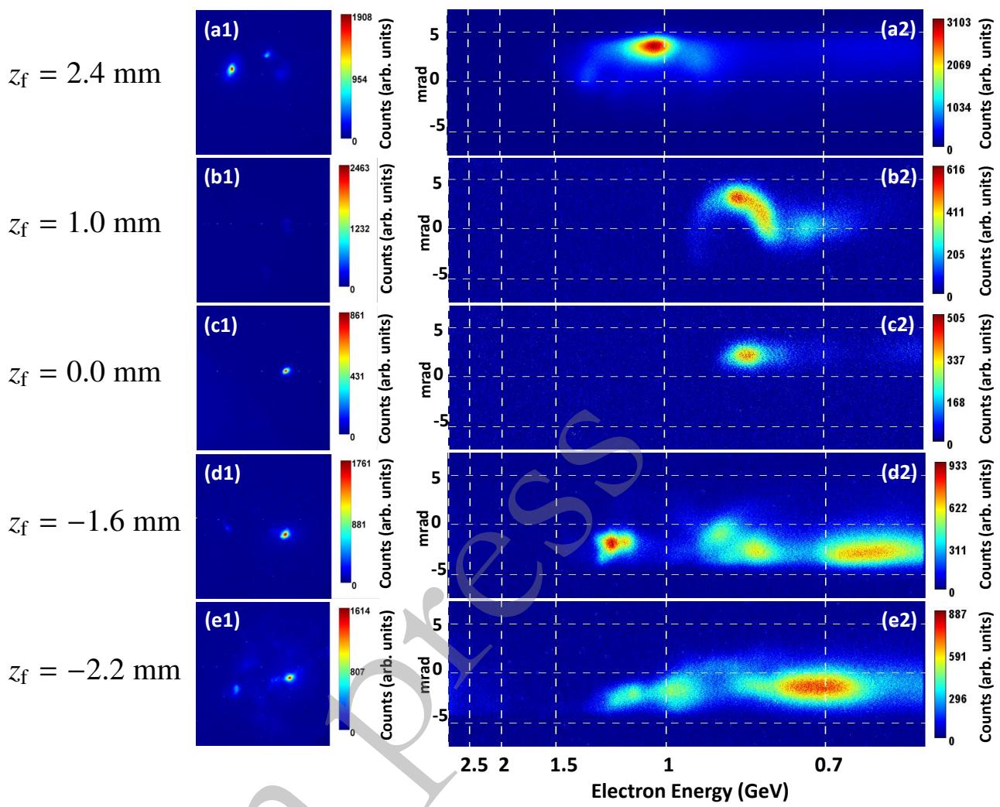
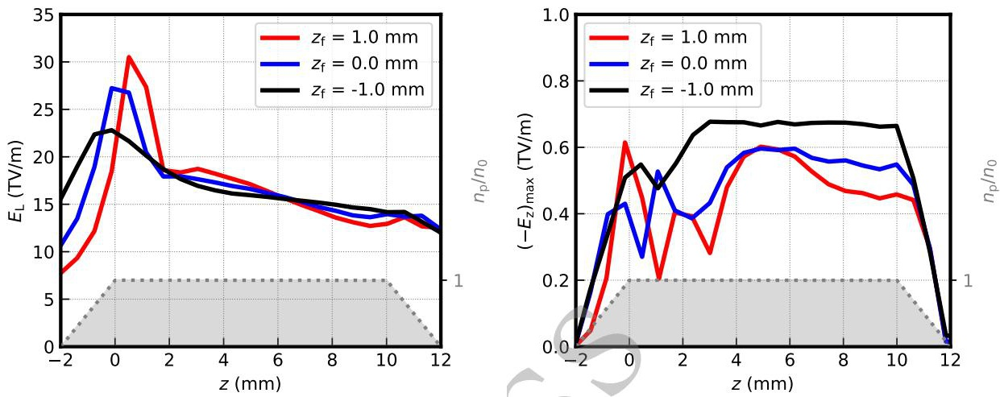

# 焦点位置调谐的等离子体望远镜 GeV LWFA 实验

> Xinyuan Chang 等，*Plasma Science and Technology*，DOI `10.1088/2058-6272/aeabfd`，2026-09-24 在线。正式元数据和开放全文均来自期刊官网；本地 PDF 是带 DOI 的 author-submitted accepted manuscript，不是排版后的 VOR。MinerU 成功解析该稿，以下同时核对了本地布局文本和 5 组图。本文包含真实 LWFA 实验与作者准三维 FBPIC 对照。

## 一句话结论

CoReLS 的 `15.22 J、54 fs` 激光在焦斑小于匹配尺寸时，通过把真空焦点放到气室入口上游约 `1.6 mm`，实验获得最高约 `1.4 GeV` 电子束；自注入只在 `-2.2<z_f<2.4 mm` 出现。准三维 FBPIC 复现“上游略离焦—等离子体再聚焦—更长稳定加速”的趋势，但预测最优位置 `-1.0 mm`、能量 `2.2 GeV`，并在实验已停止注入的下游焦点仍产生束流，故它支持机制而不是无调参的定量复现。

## 1. 实验平台与诊断链

- 4 PW CoReLS 系统经 `f=6 m、f/21` 聚焦；实际使用 Airy 盘内能量 `15.22±0.42 J`，脉宽经啁啾调到 `54±6 fs`，等效功率约 `265 TW`。
- 焦斑 `22.07±0.35 μm FWHM`，对应 `w₀≈18.74 μm`、`a₀≈4.74` 和峰值强度 `4.80×10¹⁹ W/cm²`。这个焦斑小于实验参数下约 `24 μm` 的匹配尺寸，是“等离子体望远镜”工作的前提。
- 靶为 He 气室，峰值电子密度估计为 `(9±2)×10¹⁷ cm⁻³`。残余激光由总厚 `180 μm` 的折叠 Al 箔阻挡。
- L1 测指向/发散，L2/L3 位于 `1.3 T、30 cm` 偶极磁铁之后记录能谱；图示磁铁到末级屏的尺度约 `89 cm`。

这套诊断直接测得束斑和磁偏转能谱，但论文主观测量是“最高能谱峰的能量增益”；没有给出与焦点扫描同等完整的电荷、能散、发射度和长期稳定性图谱。

## 2. 焦点扫描给出的注入窗口

图 2 横轴 `z_f` 以密度平顶起点为零，灰区表示 `2 mm` 线性上升沿；蓝色为实验、红色为 FBPIC，实验误差棒是多发间标准差。

- 实验只在 `-2.2<z_f<2.4 mm` 发生可见自注入与加速。
- 最优点为 `z_f=-1.6 mm`，最高能量约 `1.4 GeV`；其余可注入位置多在约 `0.8–1.1 GeV`。
- 焦点过早时，激光到达密度平台前已强烈衍射，等离子体不能把它重新聚到足以注入的尺寸；焦点过深时，实验同样停止注入。
- 模拟在 `z_f=-1.0 mm` 给出约 `2.2 GeV`，并在较深焦点仍维持约 `1 GeV` 束流，显示理想模型把可用窗口估得更宽。

## 3. 束斑与能谱的直接实验图像

图 3 左列是 L1 束斑，右列是能谱。`z_f=-1.6 mm` 的最高能分量延伸到约 `1.4 GeV`；`z_f=0` 和 `1.0 mm` 仍有 GeV 级束流，而窗口边缘的谱形和产额明显变化。作者把最右侧高能峰作为图 2 的能量增益，因此多峰谱不能简化成单一束团的平均能量。

这里最强的证据是“移动焦点会打开/关闭自注入，并改变最高能量”；论文没有证明焦点扫描同时最优化了电荷、能散或发射度，也没有给出对所有非理想激光参数的独立扫描。

## 4. FBPIC 机制解释

作者用 FBPIC 的圆柱准三维几何与 2 个方位模进行对照：

- 密度平台 `n₀=1×10¹⁸ cm⁻³`，前后各 `2 mm` 线性 ramp，中间 `1 cm` 平顶；
- 移动窗口约 `130×180 μm²`，`Δz=0.01k_p⁻¹`、`Δr=0.1k_p⁻¹`，每单元 32 个粒子；
- 激光 `15 J、53 fs、w₀=18 μm、a₀=4.9`，匹配尺寸 `23.66 μm`。

上游略离焦的黑线（`z_f=-1.0 mm`）进入密度平台后被等离子体重新聚焦，激光场变化更平滑，最大纵向加速场维持得更高、更久；这构成作者对 2.2 GeV 模拟峰值的机制解释。焦点在零点或平台内时，场幅先经历更大的波动，稳定加速距离缩短。

## 5. 实验—模拟不闭合处

- **能量差：** 模拟最优值 `2.2 GeV`，实验为 `1.4 GeV`；差异不是测量误差棒能够覆盖的微小偏差。
- **窗口差：** `z_f>2.4 mm` 时实验不再注入，模拟仍有稳定束流。
- **未建模非理想性：** 作者列出气体密度起伏/非均匀轮廓、激光能量、焦斑和波前的 shot-to-shot 变化，但没有在本文逐项测量并传入模拟。
- **模型维度：** 两方位模的准三维 FBPIC 比二维更接近实验，但仍不是含完整实测时空场、密度误差和诊断响应的 start-to-end 复现。

因此“等离子体望远镜机制获得初步实验支持”是稳妥表述；“2.2 GeV 已在实验实现”或“焦点位置单独决定束流品质”都不成立。

## 6. 应用意义与边界

- 短焦距光学加上入口前离焦，可在不更换昂贵聚焦镜的情况下改变进入等离子体的有效光斑，为紧凑 GeV LWFA 的调谐提供直接工程旋钮。
- 本文没有电子束到转换靶、韧致辐射、光核、中子、剂量或屏蔽测量；与下游应用的连接仍停留在“可提供 GeV 电子束”。
- 论文计划把电离注入、密度下坡注入或碰撞脉冲注入与该机制结合，以改善电荷、能散和偏振；这些是未来方案而非已验证结果。
- 本轮没有重跑 FBPIC、重建磁谱或读取原始 shot 数据；这里只验证官方全文、作者报告的数值、图中趋势和实验—模拟差异。

## 7. 复习用速记

记住三个数：实验最优焦点 `-1.6 mm`、最高能量 `1.4 GeV`、注入窗口 `-2.2` 到 `+2.4 mm`。模拟的 `-1.0 mm/2.2 GeV` 是机制对照，不应与实验混写。
