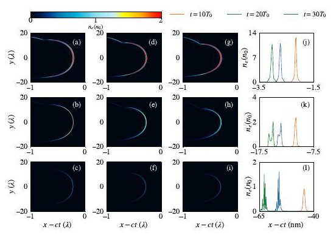
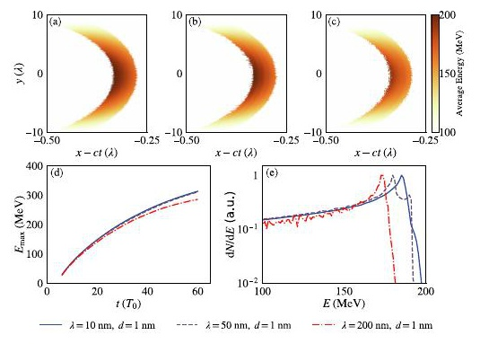
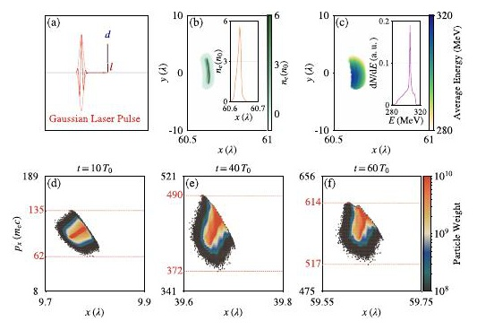
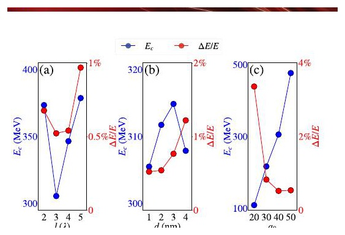

# 短波激光—纳米箔横向注入的阿秒电子束方案

> Zhenyu Li 等，*Optics Express* **34**(20), 37393–37407 (2026)，DOI `10.1364/OE.612056`，2026-09-23 正式上线。该条目在 2026-09-17 仅有 accepted 元数据、无官方 PDF，本轮从 Optica 官方 issue/PDF 路径恢复开放 VOR。MinerU 的公开 URL 解析失败，以下基于本地版式文本、页面渲染和逐图核对。全文是作者二维 EPOCH 与解析标度研究，没有本文新实验。

## 一句话结论

作者在二维 EPOCH 中提出：`10 nm、a₀=40` 的短波强激光从横向偏置 `3λ` 的 `1 nm` 固体纳米箔剥离电子，电子横穿光轴后因纵向加速梯度反转发生相空间旋转，可形成约 `305 MeV`、`0.5%` 相对能散、`1–10 as`、峰值密度约 `10²⁴ cm⁻³` 的束团。结果是高分辨率二维理想模拟；作者估算 `a₀=20–50` 需约 `80–500 TW` 软 X 射线输入，完整三维、多参数耦合和实验实现均未完成。

## 1. 解析机制与模拟条件

电子在上升沿被剥离后迅速满足 `v_x→c`，共动相位 `ω(t-x/c)` 近似冻结。对固定光学周期数，纵向有质动力近似按 `a₀²/λ` 增强，而纳米箔电荷分离场主要由靶密度和厚度决定、对波长不敏感。短波因此更容易让有质动力压过电荷分离力，并使整层电子锁定在加速相位。

二维 EPOCH 设置为：

- 靶电子密度 `1.8×10²³ cm⁻³`、厚度 `1 nm`、横向宽 `60λ`；
- 波长 `10/50/200 nm`，线偏振高斯脉冲 `a₀=40`、腰斑 `10λ`、时长 `2T₀`；
- 计算域 `100λ×60λ`，网格 `0.002λ×0.01λ`，每单元 `1000` 个宏粒子，演化 `100T₀`；
- 作者报告做过收敛测试，但底层数据未公开，本文也没有三维 PIC。

## 2. 波长控制密度压缩与能谱

`10 nm` 情形中，电子层在 `t=30T₀` 仍保持单峰；作者报告总厚约 `1.4 nm`、FWHM 约 `0.16 nm`。`50 nm` 的初始压缩较弱，`200 nm` 时有质动力与电荷分离力接近，电子分布出现多峰和更强扩散。图中的“峰值密度”是二维 PIC 网格上的作者结果，不是实测固体束团密度。

`10` 和 `50 nm` 的最大能量增长轨迹接近，反映短波下相位锁定；`200 nm` 增益更慢、截止更低。未经横向偏置优化的三种情形仍有较宽能谱，说明“短波”本身不足以得到 `0.5%` 能散，后续的横向注入与梯度反转才是谱压缩关键。

## 3. 横穿光轴后的谱压缩

高斯光束的纵向有质动力梯度在轴上最大。作者选择位于光轴一侧的电子层，使其在横向漂移中穿过光轴：

1. 穿轴前，电子看到逐渐增大的纵向梯度，动量展宽；
2. 穿轴后，梯度随横向位置减小，后部较低动量电子追赶前部；
3. 纵向相空间发生旋转，能谱随之压缩。

优化点 `l=3λ、d=1 nm、a₀=40` 给出：

- 能谱峰约 `305 MeV`，FWHM `1.6 MeV`，即 `ΔE/E≈0.5%`；
- 峰值归一化密度 `n_e/n₀≈6`，折合约 `10²⁴ cm⁻³`；
- 作者汇总的束团持续时间 `1–10 as`；
- 纵向动量展宽约从 `73m_ec` 增到 `118m_ec`，穿轴后回落到约 `97m_ec`。

这里的“高密度、低能散、阿秒”均来自同一二维数值构型，不是独立实验诊断的交叉验证。

## 4. 单参数扫描与所谓稳健性

- 横向偏置 `l=3λ` 给出约 `0.5%` 的能散最小值；太近会过早穿轴，太远则缺少足够梯度。
- 靶厚从 `1` 增到 `4 nm` 时，能散从约 `0.5%` 增到 `>1.2%`；薄靶更利于形成紧致电子层。
- `a₀` 从 `20` 增到 `50` 时，中心能量约从 `100` 升到近 `400 MeV`，`a₀≥40` 时能散约 `0.5%`。

作者称 `l=2–4λ、d=1–2 nm、a₀=30–50` 为较宽容差窗，但这些扫描一次只改变一个参数；没有验证多参数相关误差、靶起伏、时空耦合和三维横向泄漏。因此“稳健性”只适用于当前一维参数切片。

## 5. 实验可达性与 QED 边界

- 作者估算软 X 射线经固体密度凹面等离子体透镜聚焦后，`a₀≈5–10` 可能需要约 `5–20 TW`；本文核心扫描的 `a₀=20–50` 则需要约 `80–500 TW`，被明确列为下一代光源目标。
- `10 nm、a₀=40` 对应极端场，但电子与激光同向共传播，`E_y-v_xB_z` 近似抵消；作者估计量子参数 `η≈10⁻⁶`，所以本文不是强场 QED 或辐射反作用方案。
- 论文没有演示软 X 射线源、等离子体透镜、自由支撑 `1 nm` 大面积靶和纳米级偏置的端到端同步，也没有测得任何电子束。
- 数据未公开，只说明可向作者索取；本轮没有运行 EPOCH、复做收敛或估算工程容差。

## 6. 应用意义与限制

如果三维和实验仍保持 `300 MeV/0.5%/as` 级性能，该束团可服务超快电子衍射、时间分辨显微和二次辐射源。但本文没有 X/γ 光子产额、转换靶、光核、中子、剂量或屏蔽结果；这些都只是潜在下游用途。

## 7. 复习用速记

核心不是“短波自动给出窄谱”，而是“短波剥离和相位锁定 + 偏置靶横向注入 + 穿轴后的加速梯度反转”。`305 MeV/0.5%/10²⁴ cm⁻³` 是二维 EPOCH 最优点，实验门槛仍是几十到数百 TW 的软 X 光与三维纳米靶控制。
