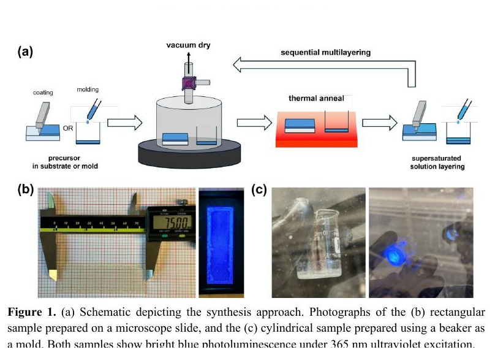
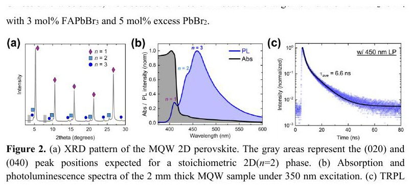
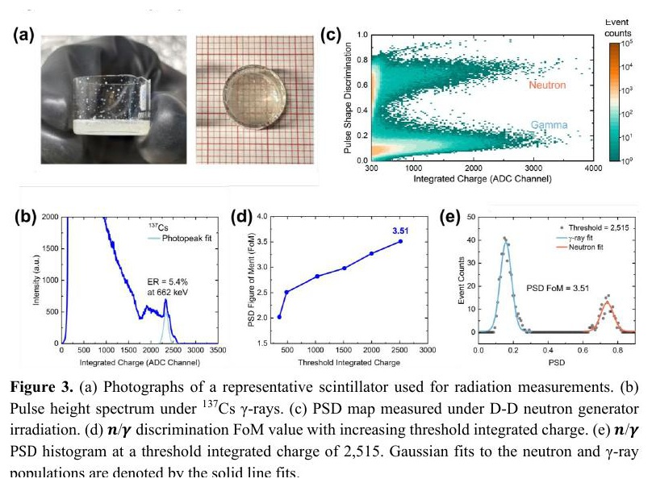
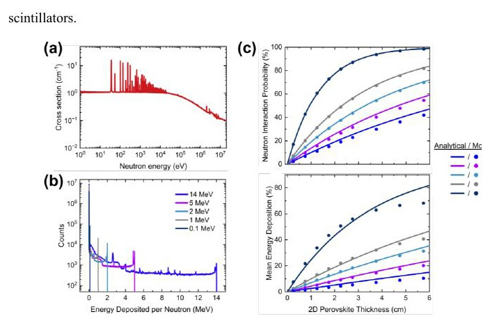

# 多量子阱二维钙钛矿的快中子—伽马甄别

> Shaun Tan 等，arXiv:2609.28468，2026-09-23 提交、2026-09-24 进入官方新论文列表。全文来自官方 arXiv 作者稿。MinerU 远程任务长时间未完成，以下基于本地布局文本、页面渲染和 4 组主图核对。本文包含材料制备、`¹³⁷Cs` 与 D–D 中子源直接测量，以及作者解析/Monte Carlo 输运计算；它不是激光驱动中子源实验。

## 一句话结论

作者把宽带隙 `PEA₂PbBr₄` 基体、少量较窄带隙高 `n` 相与可重复多层沉积结合，制成毫米厚二维钙钛矿闪烁体；`5 mm` 样品在 `662 keV` `¹³⁷Cs` 下能量分辨率为 `5.4%`，在 `2.45 MeV` D–D 中子与环境 γ 混合场中用脉冲形状甄别得到最高 `FoM=3.51`。该 FoM 在积分电荷阈值 `2515` 后取得、会排除低光子统计事件；`5 mm` 样品在约 `2 MeV` 的 `10.1%` 交互概率和 `3.6%` 平均能量沉积是模型值，不是直接效率标定。

## 1. 从微观相工程到毫米厚样品

作者用 N,N-二甲基甲酰胺前驱液涂布或浇注，真空干燥后退火；下一层使用室温过饱和溶液，以快速成核减少对已有层的再溶解。循环沉积把“横向面积”和“厚度”从二维钙钛矿通常的薄片形貌中解耦。

代表性样品包括：

- 载玻片上的 `75×25×0.4 mm³` 矩形片；
- 直径 `25 mm`、厚 `3.5 mm` 的圆片；
- 辐射测试使用面积 `490 mm²`、厚 `5 mm` 的圆柱样品。

两类样品在 `365 nm` 激发下发蓝光。论文展示的是几何可制造性和光能穿过毫米厚度的定性证据，不等于大面积均匀辐射响应已经完成逐点标定。

## 2. 多量子阱能量漏斗与快速发光

目标配方以 `PEA₂PbBr₄` 为主，加入 `3 mol% FAPbBr₃` 与 `5 mol%` 过量 `PbBr₂`。多数为宽带隙 `n=1` 相，少量 `n=2/3` 高 `n` 域提供较窄带隙发光位点。

- XRD 的主峰属于 `n=1` 基体，较弱峰与嵌入的高 `n` 域相容；这不是单一纯相晶体。
- 吸收主要由宽带隙基体决定，发光则集中到较窄带隙域，形成有效的吸收—发射光谱分离，降低厚样品中的自吸收。
- 405 nm 激发、450 nm 长通条件下，双指数拟合的平均寿命为 `6.6 ns`；这比依靠微秒级掺杂发光更适合保留中子/γ 脉冲形状差异。
- 作者还报告相对商业 EJ-254 的光产额约 `16,868 photons/MeV`；比较依赖补充材料中的标定程序，本文主稿未给出跨批次长期稳定性。

## 3. `¹³⁷Cs` 能谱与 D–D 混合场 PSD

在 `¹³⁷Cs` 下，`662 keV` 全能峰的能量分辨率为 `5.4%`。厚、高 Z 样品增强了 γ 相互作用与 Pb 特征 X 射线/Compton 光子的完全吸收，这对全能峰有利，但也说明材料天然对 γ 敏感，必须依赖 PSD 做混合场甄别。

D–D 发生器给出 `2.45 MeV` 单能中子；周围材料的中子诱发 γ 构成现实背景。作者采用电荷比较法：

$$
\mathrm{PSD}=\frac{Q_L-Q_S}{Q_L},
$$

其中短、长积分门分别为 `22 ns` 与 `160 ns`。图 3c 中中子和 γ 形成两条带；FoM 定义为两高斯峰心间距除以两者 FWHM 之和。随着积分电荷阈值提高，低光子统计事件被逐步剔除，FoM 单调上升；阈值 `2515` 时得到 `3.51`。因此这个最高 FoM 不能代表所有能量阈值下的无条件甄别性能。

## 4. 厚度—相互作用—光输运权衡

作者用能量依赖总截面、解析路径长度模型和 Monte Carlo 计算不同入射能量的输运：

- 单能中子产生宽的沉积能连续谱，反映弹性反冲、次级粒子输运和多次散射；这与 D–D 实验中宽脉冲幅度分布相容。
- 厚度增加会提高至少一次相互作用的概率与平均沉积能，但也延长光程、增加再吸收。
- 对约 `2 MeV` 中子，`5 mm` 样品的计算交互概率为 `10.1%`，平均仅沉积入射能量的 `3.6%`。

解析曲线大体跟随 Monte Carlo 趋势，说明一阶厚度依赖主要来自总截面和路径长度。但这些计算没有替代绝对中子探测效率、角响应、计数率线性、辐照损伤和温度稳定性测量。

## 5. 对中子诊断的价值与边界

- **直接测量：** 毫米厚样品的 Cs-137 光峰，以及 D–D 发生器混合场中的事件级中子/γ PSD。
- **阈值依赖：** `FoM=3.51` 是舍弃低积分电荷事件后的最佳点；实际诊断还需同时报告效率—阈值权衡。
- **模型量：** `10.1%` 交互概率、`3.6%` 平均沉积和厚度扫描来自作者解析/Monte Carlo，不是源强已知的绝对效率实验。
- **与激光应用的连接：** 材料可望用于聚变、激光驱动中子源或强 γ 本底环境的紧凑探测，但本文中子源是常规 D–D 发生器，没有 LPA/离子束—转换靶源项、飞行时间谱或现场 EMP 验证。
- **工程未覆盖：** 未给出高通量饱和、辐照老化、批次均匀性、封装湿热稳定性或长期漂移。
- **利益披露：** 三位作者是相关临时专利的发明人；这不否定数据，但产业化表述需要独立复现。
- **本轮未完成：** 没有运行 Monte Carlo、读取补充材料原始事件或重做 PSD 拟合；这里只验证作者 PDF、图和内部数值口径。

## 6. 复习用速记

最可靠的结论是“二维钙钛矿已在真实 `2.45 MeV` D–D 混合场中显示清楚的 n/γ 双带”。性能数字要成对记：`5.4% @ 662 keV` 是 γ 能量分辨率，`FoM=3.51` 是阈值 `2515` 后的 PSD；`10.1%/3.6%` 则是 5 mm、约 2 MeV 条件下的计算交互/沉积指标。
