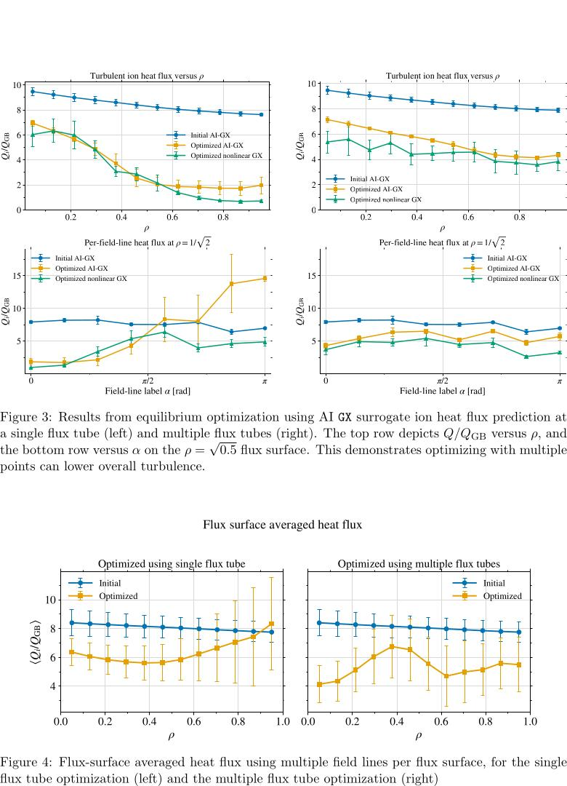
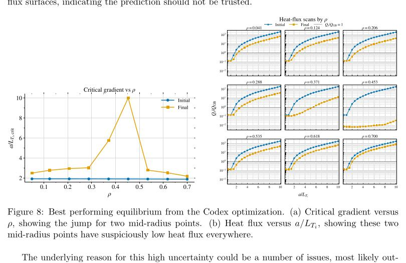
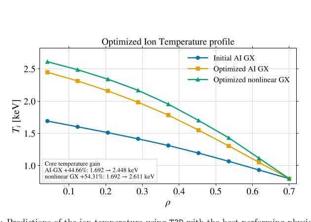
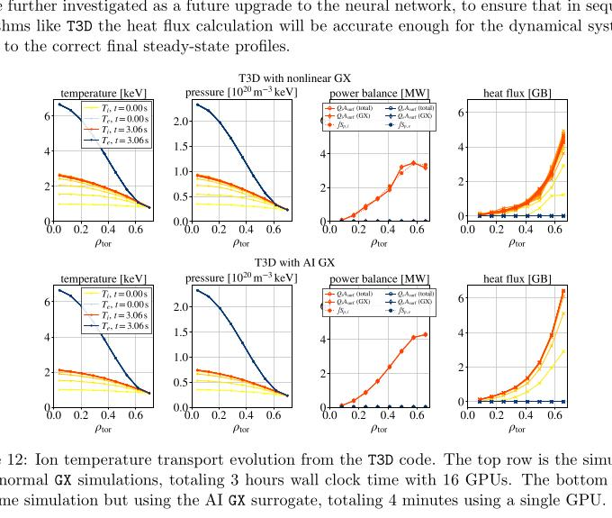

# AI 回旋动理学代理用于恒星器湍流优化与输运

> R. Michael Churchill 等，arXiv:2609.28730，2026-09-23 提交，2026-09-25 列入官方新论文批次。以下基于官方 PDF、本地布局文本、页面渲染和 4 组关键图；MinerU 报 `parsing failed`。本文是 GX/DESC/T3D 数值工作，并含 Codex 驱动的外层优化实验；没有真实恒星器性能提升测量。

## 一句话结论

由超过 `20 万` 次非线性、绝热电子 GX 回旋动理学计算训练的 CNN 集成代理，在恒星器平衡优化中把单算例循环加速约 `72×`，在 T3D 输运测试中将 `16 GPU×3 h` 降到 `1 GPU×4 min`；经真实 GX 后处理的有效候选仍显示较高离子温度，但最优打分解曾因分布外、非嵌套磁面而产生虚假结果，说明代理速度并不能替代物理可行性和 OOD 闸门。

## 1. 训练数据与代理模型

- 数据来自约 `23.5k` 个准轴对称、准螺旋和随机边界恒星器构型，共 `>200k` 次局域 `δf`、非线性、静电、绝热电子 GX flux-tube 模拟。
- 每个样本把 7 个沿磁力线的几何量组成 `[97,7]` 数组，再加密度/离子温度梯度；输出是时间平均归一化离子热流 `Q_i/Q_GB`。
- 数据按 `80:20` 随机划分训练/验证；保留超参数搜索中最佳的 100 个一维 CNN 组成集成，验证集 `R²=0.989`。
- 训练目标把低于 `10⁻² Q_GB` 的热流截断到该下限，这一选择后来在 T3D 初期低热流区产生明显偏差。

该模型并不覆盖动理学电子、有限 β、电磁 TEM/KBM、全局回旋动理学或真实线圈工程误差。

## 2. DESC 平衡优化

代理被接入 JAX/DESC 的目标函数，使热流对平衡参数可微。在单 flux-tube 案例中，单张 A100 上不到 10 分钟完成，作者称比把真实 GX 放在循环内快约 `72×`。多 flux-tube 优化在不同半径和磁力线标签上减少平均热流，且后处理的非线性 GX 大体确认趋势；但局部磁力线上的误差棒很大，单点优化并不保证全磁面的普遍改善。

## 3. AI 代理进入外层自动优化后的失效案例

作者让 Codex 组织遗传算法外层搜索，在约 72 小时、4 张 A100 上运行 52 代：`758` 个 DESC 优化完成、`40` 个失败、`29` 个跳过、`5` 个未完成。

最初最高分构型在 `ρ=0.371` 与 `0.453` 给出异常低热流和接近 10 的临界梯度；CNN 集成方差同时暴涨。进一步检查发现几何量超出训练分布，且 DESC 的嵌套磁面检查失败。由于该非法解没有及时进入惩罚项，它还污染了后续遗传代的“优秀父代”。

这段负结果非常重要：如果缺少不确定性惩罚、磁面可行性检查和高保真回退，AI 优化器可以把代理漏洞当成新的物理设计。

## 4. 有效构型的温度提升

对通过嵌套磁面等检查的候选，T3D 后处理给出的核心离子温度提升中位数约 `20%`。展示的最佳案例中：

- AI-GX 预测从 `1.692 keV` 到 `2.448 keV`，提升 `44.66%`；
- 非线性 GX 后处理从 `1.692 keV` 到 `2.611 keV`，提升 `54.31%`。

这些是固定密度、固定电子温度和固定磁平衡的数值情景，不是装置实测温度，也未包含新古典输运。

## 5. T3D 加速与动态偏差

T3D 测试包含 9 个径向点、31 次 Newton 迭代和共 496 次 GX 调用。正常版本耗时约 `3 h`、使用 16 GPU；代理版本约 `4 min`、使用 1 GPU，对应约 `45×` wall-clock 与 `720×` GPU-hour 减少。

稳态温度轮廓总体接近，但早期热流不一致：完整 GX 从 `<10⁻⁶ Q_GB` 逐渐上升，代理在 `t=0` 已约 `0.1 Q_GB`；最内点稳态热流仍低约 `10%`。这与训练时的 `10⁻² Q_GB` 下限直接相关，说明“最终轮廓相近”不能掩盖动力学路径错误。

## 6. 证据边界与下一步

- 全文所有性能量均来自作者 GX/DESC/T3D/CNN 计算；没有恒星器实验验证。
- `72×/45×/720×` 是特定硬件、并行方式和测试问题上的作者基准，不是任意装置或模型的通用加速比。
- 代理只覆盖静电、绝热电子 ITG；向动理学电子数据集朴素扩展，作者估计可能需要约 `2×10⁸ node-hours`。
- 下一步应把集成不确定性、OOD 检测、嵌套磁面/工程约束和按需真实 GX 调用放进同一多保真循环，并在独立构型与实验情景上盲测。

## 7. 复习用速记

记住“`>200k` GX → `R²=0.989` CNN ensemble → DESC/T3D 加速”，同时记住最高分解曾是 OOD 非嵌套磁面。本文最可贵的不只是加速数字，而是展示了代理在闭环优化中会怎样失败。
