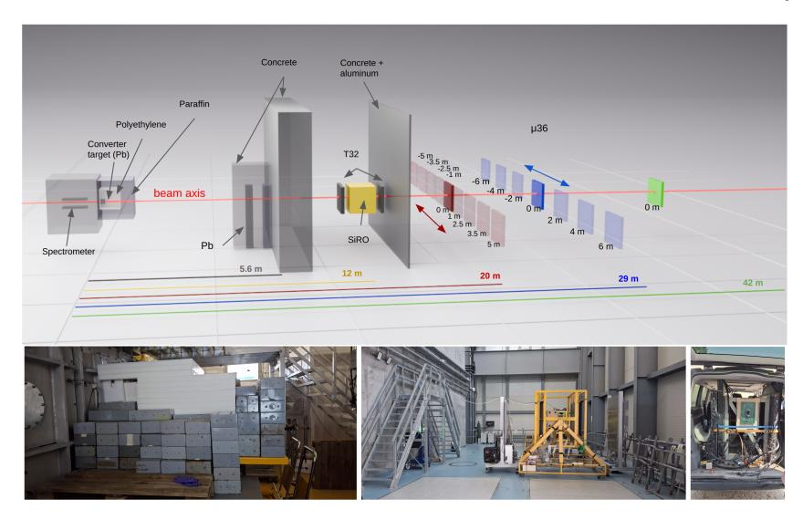
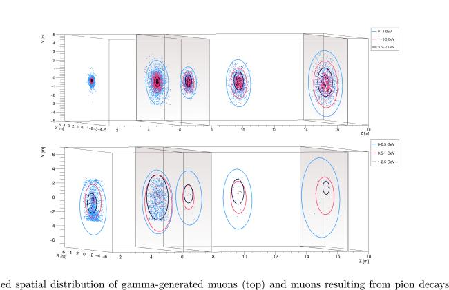
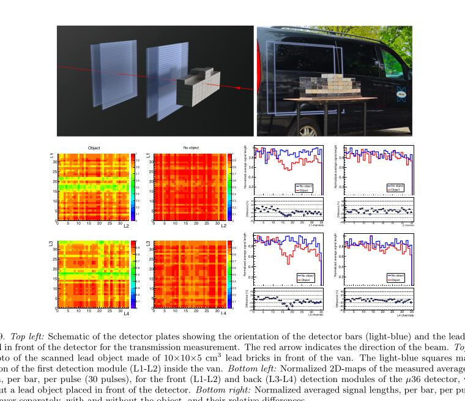
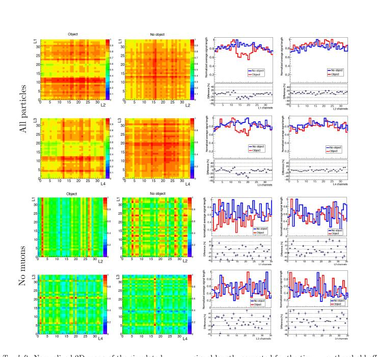

# 激光尾场电子驱动的 GeV 缪子成像实验

> M. Dobre 等，arXiv:2609.28788，2026-09-23 提交，2026-09-25 列入官方新论文批次。以下基于官方 arXiv PDF、本地布局文本、页面渲染和 4 组关键图；MinerU 远程任务报 `parsing failed`。本文包含真实 ELI-NP 激光—电子—铅转换靶—探测器实验，并用 GEANT4 解释粒子成分和能区。

## 一句话结论

ELI-NP 的最高约 `8 GeV` 激光尾场电子打入 `40 cm` 厚铅转换靶后，在 `20 m` 和 `29 m` 处得到前向峰化信号，并用 30 发完成铅物体透射成像；测得束宽与含实测电子谱的 GEANT4 相符，模拟还给出探测器沉积能约 `86.91%` 来自 Bethe–Heitler 缪子。论文因此支持“人工激光驱动缪子主导成像”，但逐粒子 GeV 能量、绝对缪子产额和背景占比并非独立直接测量。

## 1. 从激光电子到远场探测器

- ELI-NP 10 PW 臂可向靶面提供 `230 J、23 fs、810 nm` 脉冲，最高重复率 `1 shot/min`；本次实验共进行了 230 发。
- 电子束由 `60 mm` 气体靶中的 LWFA 产生，并由磁谱仪测得逐发能谱；本文使用的最高电子能量约 `8 GeV`。
- 转换靶是 `40×40×50 cm³` 铅块，沿束轴有效厚度 `40 cm ≈ 71.3 X₀`。它既产生缪子，也先行衰减强烈的电磁背景。
- 屏蔽依次含 `100 cm` 聚乙烯、`60 cm` 石蜡、附加铅束流收集器和 `2 m` 钢筋混凝土墙；T32/SiRO 位于 `12 m`，可移动车载 μ36 位于 `20/29/42 m` 并做横向扫描。

缪子的主要通道写成

$$
e^-+A\rightarrow e^{-*}+A+\gamma,
\qquad
\gamma+A\rightarrow \mu^++\mu^-+A.
$$

这是 Bethe–Heitler 双缪子光致产生链。强子通道的 π/K 衰变也会产生缪子，但作者模拟显示，能穿过屏蔽到达远场探测器的前向高能分量主要来自前者。

## 2. GEANT4 如何连接实测电子谱与次级粒子

作者使用 GEANT4 11.2.2、`FTFP_BERT` 物理表并显式开启 `GammaToMuons`。为避免逐发重跑，把 `2–9 GeV` 电子谱按 `0.5 GeV` 分箱，每个箱先模拟 `1.5×10⁸` 个电子，再按每一发实测电子数重加权。

- 对 `6×10⁸` 个 `8±1 GeV` 电子，模拟得到的 Bethe–Heitler 缪子不仅总量更高，也更前向；在约 `13°` 全锥角内优势尤其明显。
- 用 30 多发电子谱平均值作源项时，模拟给出每发到 `12 m` 位置约 `3.2×10³` 个缪子，同时仍有更多 γ 与中子数目；但“粒子数更多”不等于“探测器信号更强”。
- μ36 的聚苯乙烯闪烁体对最小电离缪子的沉积约为 `1.936 MeV cm²/g`。在 `20 m` 处，模拟给出缪子占总沉积能 `86.91%`，γ/中子等占 `13.09%`。

这一步是论文证据链的关键，也是主要模型依赖：探测器没有逐事例完成粒子鉴别，缪子占比来自含几何、材料与探测器响应的 Monte Carlo。

## 3. 束流剖面与飞行时间

- μ36 每个横向位置累积 10 发。实验 FWHM 为 `4.51 m @ 20 m` 与 `6.35 m @ 29 m`；对应 GEANT4 为 `4.43 m` 与 `6.27 m`，给出的等效张角约 `12.6°`。
- 固定 T32 的前后层相距 `3.1 m`，测得飞行时间 `12.43±1.34 ns`，模拟为 `10.02 ns`。二者量级一致但不是统计误差内的精确重合。
- 作者指出，穿过全套屏蔽的缪子在源端需至少约 `1.5 GeV` 才有非零存活概率；模拟到达探测器的缪子最高约 `6–7 GeV`。因此“几 GeV”是传播阈值与模拟约束的推断，不是磁谱仪对缪子的直接测量。

## 4. 铅物体透射成像

铅砖物体置于车载 μ36 前方，前后各获取 30 发。每层 36 根闪烁条的归一化平均信号在有物体时出现与几何位置对应的衰减，前后两组正交条纹共同给出二维轮廓。由条宽决定的固有空间分辨率为 `2.5 cm`。

图 10 是很重要的反事实对照：全粒子模拟可产生类似阴影，而只保留 γ、中子等背景时，强衰减和散射使图像趋于平坦。它支持“测得图像由缪子主导”，但仍是模拟内的粒种剥离，并非实验上的事件级标记。

## 5. 证据边界与应用意义

- **直接测量：** 电子谱、远场闪烁条信号、横向束形、层间飞行时间和铅物体透射阴影。
- **模型推断：** Bethe–Heitler 与 π/K 通道分量、到达探测器的缪子能谱、`86.91%` 沉积能占比和“去掉缪子后不能成像”的粒种对照。
- **尚未闭合：** 没有逐粒子动量测量、绝对缪子通量标定、完整的探测器非线性/温漂修正，也没有与传统宇宙线成像在相同物体和曝光剂量下做性能比较。
- 这项工作第一次把 LWFA 电子—高 Z 转换靶—人工缪子—成像探测器串成实验链，直接相关于高密物体无损检测；但效率、重复频率、辐射防护和规模化仍需单独评估。

## 6. 复习用速记

记住 `8 GeV` 电子、`40 cm Pb`、`20/29 m`、`4.51/6.35 m FWHM`、`30 shots` 成像和 `86.91%` 模拟沉积占比。核心结论是“实测图像与缪子主导的 GEANT4 一致”，不是“每个事件都被直接鉴定为 GeV 缪子”。
