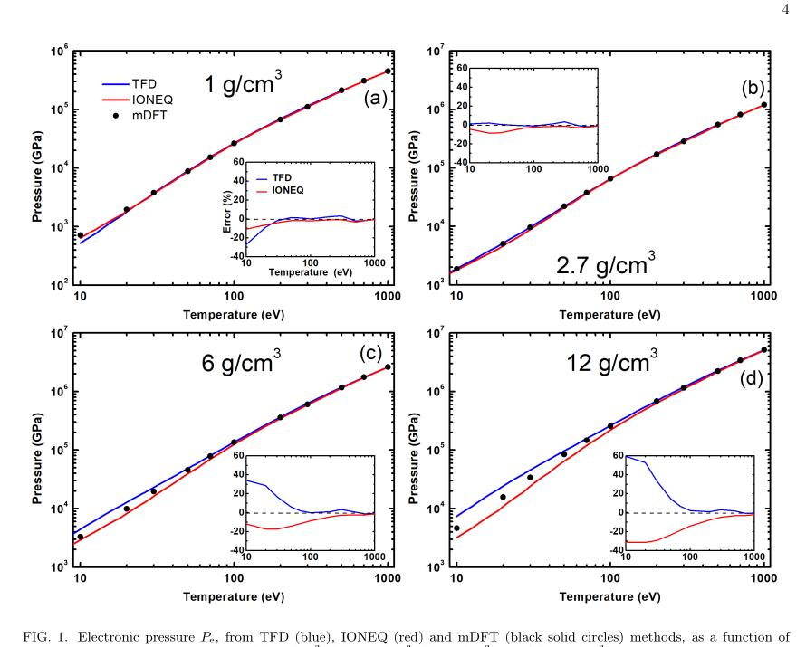
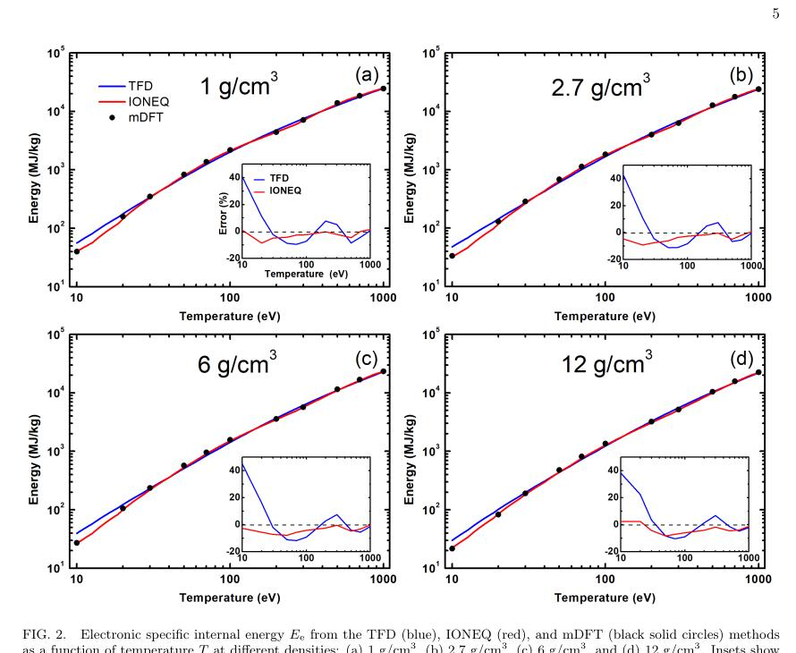
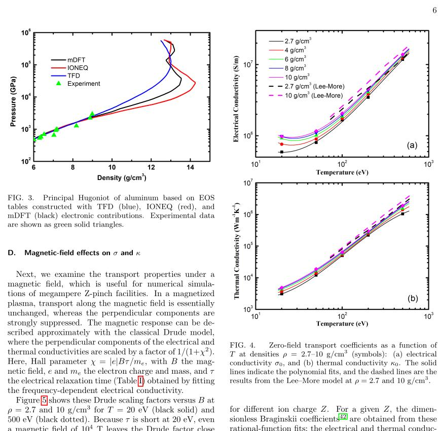
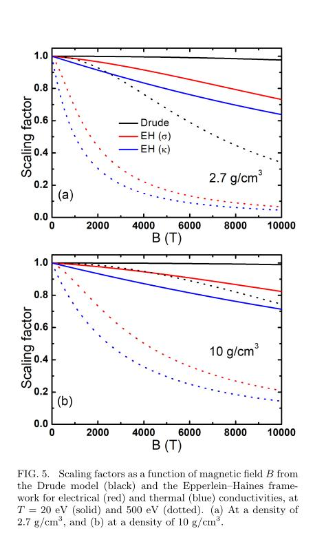

# 暖稠密铝的 mDFT 状态方程与输运系数

> Zi Li、Weijie Li、Cong Wang、Ping Zhang、Xianjue Peng，arXiv:2609.29435，2026-09-24 提交，2026-09-25 列入官方新论文批次。以下基于官方 PDF、本地布局文本、页面渲染和 4 组图；MinerU 报 `parsing failed`。本文为作者有限温度 DFT/QMD/Kubo–Greenwood 数值表，不是新的 Z-pinch 或冲击实验。

## 一句话结论

混合确定性—随机有限温 DFT 把液态铝电子热状态方程扩展到 `10–1000 eV、1–18 g/cm³`，并在 `20–500 eV、2.7–10 g/cm³` 计算电/热导率；在高密低温区，常用 TFD/IONEQ/Lee–More 模型与 mDFT 可差几十个百分点，导致高压 Hugoniot 和强磁场横向输运预测显著分叉，但现有实验主要止于 `<9 g/cm³`，尚不能检验最强差异区。

## 1. 方法与计算域

有限温 Kohn–Sham DFT 在高温下需要处理大量部分占据轨道。mDFT 将低能强占据态确定性求解，把高能弱占据尾部用与低能子空间正交的随机轨道采样，以降低对角化成本。

作者在 ABACUS 中使用 13 价电子赝势、PBE 泛函和最高 `500–1000 Ry` 截断。电子热 EOS 的主计算域为

$$
T=10\text{–}1000\ \mathrm{eV},
\qquad
\rho=1\text{–}18\ \mathrm{g/cm^3}.
$$

输运采用 mDFT 电流响应与 Kubo–Greenwood 框架，先做 4000 步 QMD 取得无序结构，再取 3 个构型平均；输运表的有效域较窄，为 `20–500 eV、2.7–10 g/cm³`。

## 2. 电子热压力与内能

- 在环境密度 `2.7 g/cm³`，TFD/IONEQ 压力在 `10–1000 eV` 内大致保持于 mDFT 的 `10%` 以内。
- 在 `12 g/cm³、10 eV`，TFD 高估 `59%`，IONEQ 低估 `31%`；到 `T≥200 eV` 后差异收敛到约 `10%` 以内。

IONEQ 内能在研究域内大多保持于 `10%` 以内，而 TFD 在 `T<100 eV` 偏差较大，`10 eV` 时可达约 `45%`。`1000 eV` 附近内能仍比完全电离理想气体高约 `20%`，因为电离能不能忽略。

## 3. Hugoniot：实验锚点与未验证高压区

主 Hugoniot 由 Rankine–Hugoniot 能量跃迁条件计算：

$$
E-E_0=\frac{1}{2}(P+P_0)
\left(\frac{1}{\rho_0}-\frac{1}{\rho}\right).
$$

- `ρ<8 g/cm³` 时三种 EOS 的 Hugoniot 基本重合，并与现有冲击实验相符。
- `ρ=10 g/cm³` 时，TFD 约 `4385 GPa`、IONEQ 约 `3069 GPa`、mDFT 约 `3470 GPa`，对应 `+26%/-12%` 偏差。
- `ρ=12 g/cm³` 时，TFD 与 IONEQ 相对 mDFT 分别高约 `120%`、低约 `31%`，高压拐点位置也不同。

关键边界是：实验数据主要在 `9 g/cm³` 以下，恰好是三个模型尚未明显分叉的区间。高压多拐点是数值 EOS 的预测，不是实验确认。

## 4. 零磁场输运与拟合

- `2.7 g/cm³` 下电导率从 `20 eV` 的 `5.9×10⁵ S/m` 增至 `500 eV` 的 `1.2×10⁷ S/m`；热导率随温度变化约 300 倍。
- `100 eV` 时，Lee–More 相对 mDFT 的电/热导率偏差在 `2.7 g/cm³` 为 `42%/63%`，在 `10 g/cm³` 为 `26%/38%`。
- 论文给出对 `log ρ`、`log T` 的双变量多项式拟合；电/热导平均相对误差为 `1.3%/2.4%`，最大 `5.4%/6.8%`。这些误差只描述对作者 mDFT 数据的拟合，不是对真实实验的误差。

## 5. 磁场依赖

作者用 mDFT 得到的零场输运与弛豫时间，再分别代入 Drude 和 Epperlein–Haines（EH）框架。`B≈10⁴ T` 时，平行分量近似不变，横向分量显著受抑。

例如 `ρ=2.7 g/cm³、T=500 eV、B=10⁴ T`，EH 的电/热导缩放因子约 `0.06/0.04`，仅为相应 Drude 值 `0.34` 的 `19%/13%`。这不是“磁化 mDFT 直接算出了 10 kT 输运”，而是零场 mDFT 加两类磁化闭合的后处理比较。

## 6. 应用与证据边界

- 这些表可作为 MagLIF/Z-pinch 辐射流体代码的材料输入，尤其提示高压区使用简化模型可能改变压缩轨迹和横向热/电流输运。
- 本地没有重跑 ABACUS、QMD、Kubo–Greenwood、Hugoniot 或辐射流体模拟，也没有验证拟合表在代码中的守恒与插值稳定性。
- 需要在 `ρ>9 g/cm³` 的冲击/等熵压缩区获得新数据，并用独立有限温 DFT/路径积分方法交叉核验高压拐点和 10 kT 闭合。

## 7. 复习用速记

记住两个计算域：EOS `10–1000 eV、1–18 g/cm³`，输运 `20–500 eV、2.7–10 g/cm³`。最强模型分歧出现在高密低温区，而现有实验恰好尚未覆盖那里。
