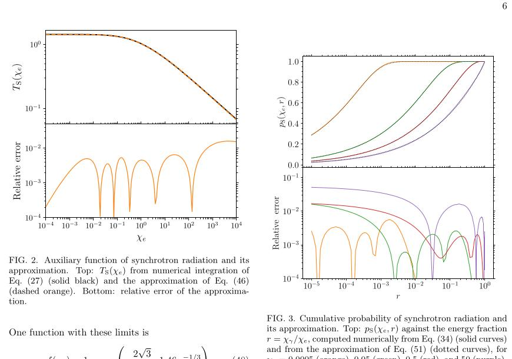
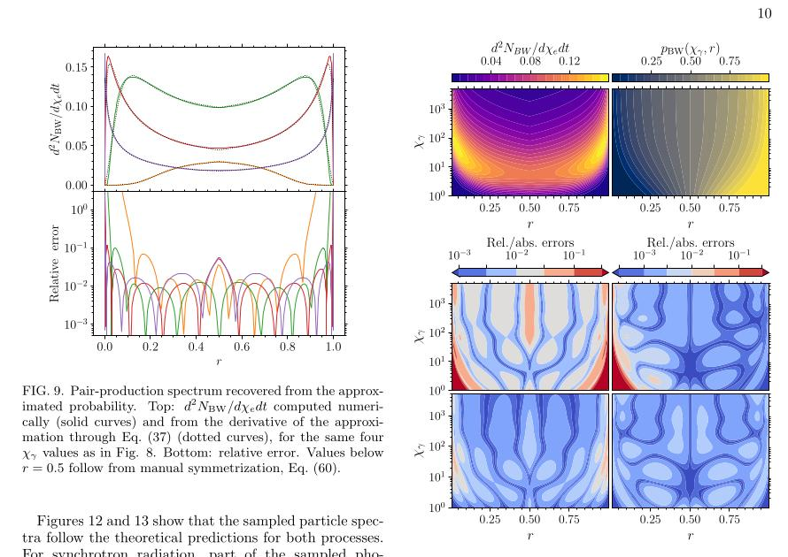
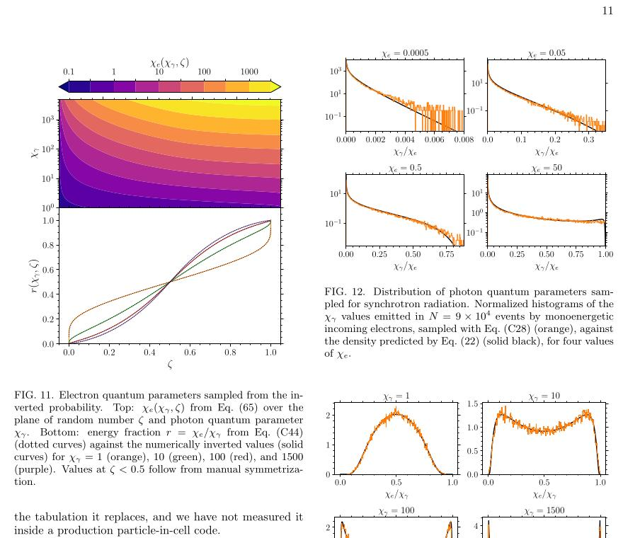

# 强场 QED 过程的无查表 Monte Carlo 采样

> Verneri Sarjomaa、Joonas Nättilä，arXiv:2609.29325，2026-09-24 提交，2026-09-25 列入官方新论文批次。以下基于官方 PDF、本地布局文本、页面渲染和 4 组误差/采样图；MinerU 报 `parsing failed`。本文是解析近似与独立事件采样验证，不是强场 QED 实验，也没有把算法接入生产级 PIC 进行端到端基准。

## 一句话结论

作者用满足渐近行为的低阶 Padé 近似替代同步辐射与非线性 Breit–Wheeler 过程的 Bessel 积分查表，并把累积分布的反演降为可闭式求解的四次方程；在目标量子参数区间内，过程率和抽样谱误差约在百分比或更低量级，但尚未报告真实 PIC 中的速度提升或级联误差累积。

## 1. PIC 中需要采样什么

辐射 PIC 对每个事件通常抽两个随机数：第一个决定光深何时达到触发阈值，第二个决定出射粒子如何分配能量。对过程总率可统一写成

$$
\frac{dN}{dt}
=\frac{\alpha_f m_e^2c^4}{\hbar\varepsilon}\,\chi T(\chi),
$$

其中 `T(χ)` 是含修正 Bessel 函数积分的辅助函数。产生粒子的量子参数 `χ₁` 则由累积概率

$$
p(\chi,\chi_1)
=\frac{\int_0^{\chi_1}(d^2N/d\chi' dt)d\chi'}
{\int_0^{\chi}(d^2N/d\chi' dt)d\chi'}
=\zeta
$$

反演得到。传统实现会预计算 `T` 和 `p` 的表，再插值、寻根；本文目标是完全去掉这三步。

## 2. 同步辐射近似

- `T_S(χ_e)` 的近似显式嵌入经典极限与高 `χ_e` 渐近标度，并用两个修正函数拟合中间区。
- 在拟合区 `χ_e∈(10⁻³,10²)`，总率辅助函数相对误差低于 `0.7%`；外推到 `χ_e≈5×10³` 时约 `1.6%`。
- 累积概率使用能量分数 `r=χ_γ/χ_e` 的四阶 Padé 形式，并强制 `p(r=0)=0`、`p(r=1)=1`。

局部相对误差在谱值极小处会放大，但绝对误差仍小。作者因此同时检查谱、累积概率和全二维误差，而不是只展示少数切片。

## 3. 非线性 Breit–Wheeler 近似

- `T_BW(χ_γ)` 在 `χ_γ≳1` 的相对误差优于 `3.3×10⁻⁴`；在拟合区 `χ_γ∈(0.5,5×10³)` 优于 `2.3×10⁻³`，到 `χ_γ≈0.2` 附近退化到约 `5.5×10⁻³`。
- 对产生累积概率利用电子—正电子对称性，只显式拟合一半能量分配区间，再映射到另一半。
- 同步辐射和对产生的 Padé 反演都归结为四次方程；选取物理根后直接得到 `χ_γ` 或 `χ_e`，无需逐事件数值寻根。

## 4. 抽样验证与数值边界

作者对每组参数抽样 `N=9×10⁴` 个事件。同步辐射光子谱和 Breit–Wheeler 电子谱整体跟随理论分布，差异约为百分比量级。端点 `ζ→1` 时逆函数导数发散，实际实现必须裁剪随机数；文中使用同步辐射 `ε=5×10⁻⁴`、对产生 `ε=10⁻⁴`。

适用区应明确保留：同步辐射优化于 `χ_e≈10⁻³–10²`，Breit–Wheeler 优化于 `χ_γ≈0.5–5000`。区间外虽有正确渐近式，但没有等价的全域精度保证。

## 5. 不能从本文推出什么

- 没有在 EPOCH、OSIRIS、WarpX 或其他生产 PIC 中测过真实吞吐，因此论文明确不报 speedup。
- 单过程误差可能在“电子辐射 → 光子对产生 → 级联”的多步模拟中累积或抵消；本文只做孤立过程测试。
- 推导采用常交叉场/LCFA 类型的过程率。算法提高的是采样实现效率与可移植性，不是对 LCFA 本身适用性的改进。
- 没有实验数据，也没有对具体激光装置给出新的粒子产额预测。

## 6. 对强场 QED/PIC 的意义

无查表形式可降低 GPU/加速器上的内存访问与插值复杂度，并让代码更容易在不同精度、硬件和参数网格间移植。其真正价值需要下一步在完整辐射 PIC 中比较：总运行时间、统计谱、能量守恒、级联增长率和跨硬件可复现性。

## 7. 复习用速记

核心是“`T(χ)` 与 `p(χ,r)` 都用 elementary-function Padé 近似，`p=ζ` 化成四次方程”。记住 `<0.7%` 的同步总率误差、`N=9×10⁴` 抽样验证，以及“尚无生产 PIC speedup”这个硬边界。
