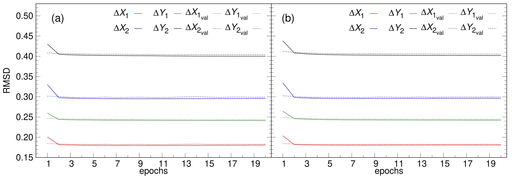
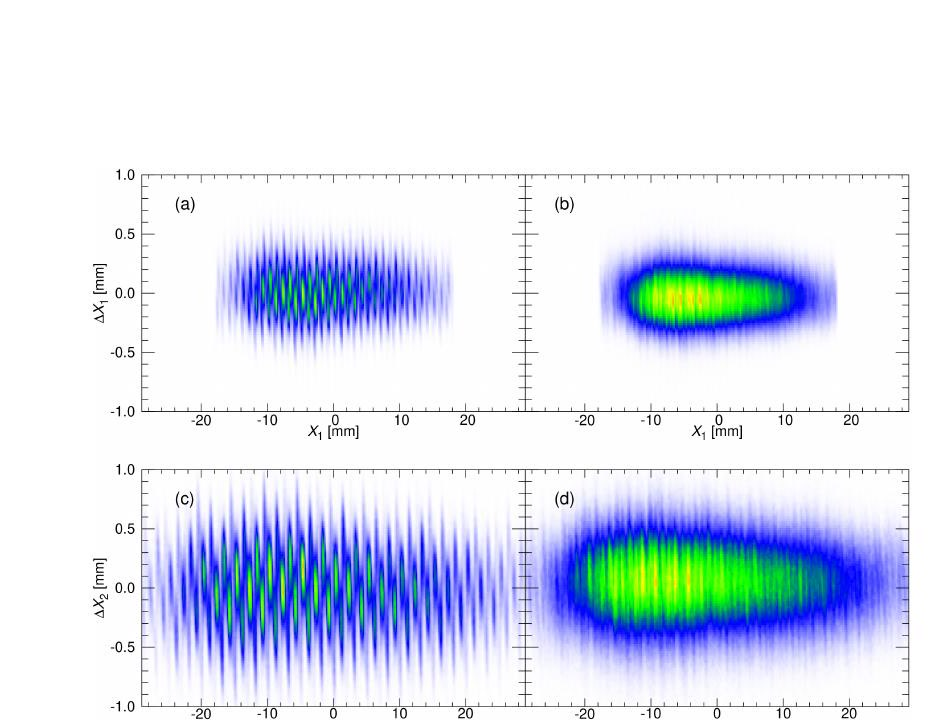
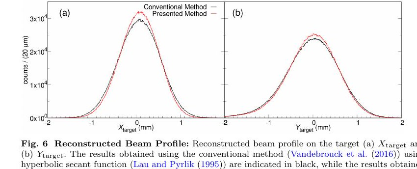
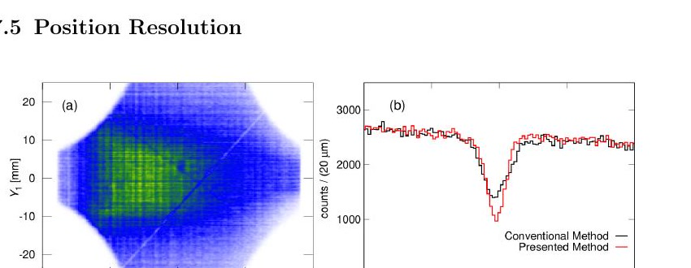

# VAMOS++ 多丝探测器的物理约束自监督校准

> A. Lemasson 与 M. Rejmund，arXiv:2609.28604，2026-09-23 提交并列入 2026-09-25 官方新论文列表。以下基于官方 arXiv PDF、本地布局文本、页面渲染和 4 组关键图；MinerU 公开 URL 任务返回 `parsing failed`。本文含真实 GANIL/VAMOS++ 探测器数据，神经网络用于校准和位置重建。

## 一句话结论

作者把两台入口 MWPPAC 的线增益和逐事例击中位置作为共同隐变量，只用双平面几何一致性与电荷—能量一致性训练；在 400 万个真实事件上约半分钟收敛，相比传统双曲正割响应模型，把独立 `100 μm` 参考丝推得的位置分辨率由前/后 `0.09 mm` 改善到 `0.06/0.05 mm`，对应 `33%/44%`，但只验证了这一装置、线性增益和一次实验条件。

## 1. 数据来自真实核谱仪

研究使用 GANIL E850 实验的 VAMOS++ 入口双位置灵敏 MWPC：`238U` 以 `5.95 MeV/u` 轰击 `100 μg/cm²` 的 `12C` 靶，裂变碎片由磁谱仪鉴别。

- 前、后探测器有效面积分别为 `40×61 mm²` 与 `65×93 mm²`，两阴极平面相距 `105 mm`。
- 四个阳极面 `X1/X2/Y1/Y2` 分别有 `39/64/60/92` 根丝，丝距 `1.0 mm`。
- 模型使用 `4×10^6` 个事件，80/20 划分训练/验证集，每批 `10^3` 个事件。

## 2. 自监督信号从哪里来

传统方法先假设 Gaussian 或双曲正割感应电荷剖面，再逐平面拟合；本方法不提供真实位置或真实增益标签，而是共同优化：

1. 每根丝共享于所有事件的全局乘性增益；
2. 每个事件独立的局部击中位置；
3. 前后平面投影到同一轨迹后的几何残差；
4. 电离室提供的电荷—能量一致性。

位置网络只看最大电荷丝附近的局部电荷分布，装置几何主要进入损失函数；因此作者主张同一位置网络可迁移，换探测器时只需重优化增益子网。这仍是作者提出的可迁移性，本文未给出跨装置实测验证。

## 3. 训练收敛与残差结构

- 单个 epoch 约 `6 s`，一般在约 `0.5 min` 内收敛。
- 取 3、5、7、9、11 根相邻丝没有显著差异；复杂化位置网络也没有明显收益。
- 四个平面几何残差 RMSD 为 `0.179(1)、0.293(1)、0.242(1)、0.401(2) mm`，训练/验证曲线贴合，但这不是跨实验留出测试。

传统模型在丝附近形成周期性聚集，因为固定解析感应剖面不能完全描述真实响应；学习到的局部映射去除了大部分伪影。四个残差宽度平均减少约 `0.017 mm`。

## 4. 束斑重建和独立参考丝验证

靶面重建宽度从传统的 `σ_X=0.468(2) mm、σ_Y=0.592(2) mm` 变为 `0.433(2) mm、0.572(2) mm`，并消除一处系统重建偏差。

前后探测器外各放置一根直径 `100 μm` 的金丝。根据丝阴影宽度，传统方法前/后均为 `0.09(2) mm`，新方法为 `0.06(1)/0.05(1) mm`；这是本文最强的外部验证，因为参考丝没有进入自监督目标。

## 5. 证据边界

- **直接实验：** 真实反应事例、四平面电荷分布、投影束斑与参考丝阴影。
- **模型结果：** 线增益、亚丝位置与感应剖面由网络和物理约束共同反演，不是独立真值。
- **尚未闭合：** 未在不同运行期、不同老化/漂移状态或另一台 MWPPAC 上做冻结模型测试；非线性响应和饱和事件仅作展望。
- 方法依赖足够的几何冗余和正确物理约束；若隐变量不可辨识，仍需额外标定。时间标定目前也还用传统流程。
- 本地没有重训网络或重放原始事件，只核验了作者 PDF、文本、图表和数值口径。

## 6. 复习用速记

记住 `4×10^6` 事件、`39/64/60/92` 根丝、约 `0.5 min` 收敛、参考丝 `0.09→0.06/0.05 mm`。核心是“真实探测器上的自监督校准有独立参考丝验证”，不是“无需任何物理先验即可普适自校准”。
