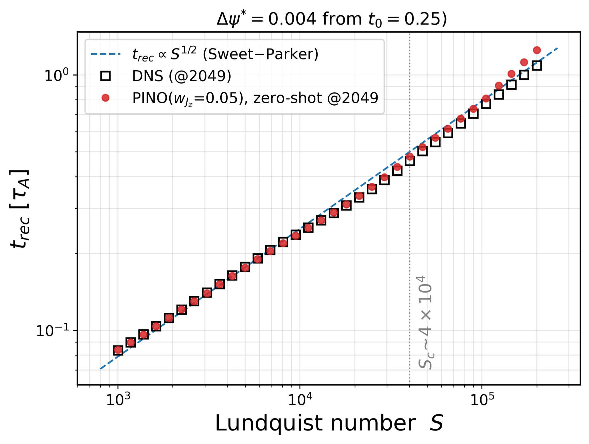
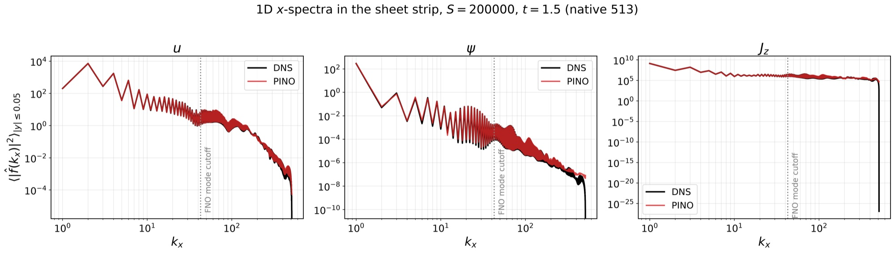

# 用 PINO 加速二维电阻 MHD 重联参数扫描

> K. K. Pothula 与 A. Kumar，arXiv:2609.29514，2026-09-24 提交并列入 2026-09-25 官方新论文列表。以下基于官方 arXiv PDF、本地布局文本、页面渲染和 4 组关键图；MinerU 公开 URL 任务返回 `parsing failed`。本文是作者 DNS 数据与神经算子代理的数值研究，不是实验或动理学 PIC。

## 一句话结论

作者用 34 条二维可压缩、黏性、电阻 MHD DNS 轨迹训练 1.51 亿参数的 Fourier/PINO 代理，在两个留出 Lundquist 数上把密度/压力/导向场误差压到 `<0.2%`、速度误差 `3.2–3.9%`、磁通函数误差 `1.0%`、谱电流误差 `7.5%`；低至中等 `S` 的重联率可到 `3%` 内，但 `S≥1.05×10^5` 出现训练窗未覆盖的晚期 plasmoid burst 时误差升到 `32–42%`。

## 1. 物理问题与模型约束

- 模型求解二维、可压缩、黏性、电阻 MHD，区域有完美导体壁，磁 Prandtl 数固定为 `Pr_m=1`。
- Lundquist 数覆盖 `10^3≤S≤2×10^5`；初态未人为播种 plasmoid，积分只到 `T=2 τ_A`。
- 网络直接预测磁通函数 `ψ`，由 `B_x=-∂_yψ、B_y=∂_xψ` 保证 `∇·B=0`；查询时间是连续输入，避免自回归误差逐步累积。
- 这个设定主要覆盖层流 Sweet–Parker 与临界区。高 `S` 完全发展 plasmoid 所需更长时间和受控扰动不在当前训练数据中。

## 2. 数据、架构与留出验证

DNS 在 `2049²` 网格计算并降采样到 `513²` 存储，每条轨迹含 41 个快照（`Δt=0.05`）。训练集共 34 条轨迹，其中 32 个 `S` 用于训练，`1.1×10^4` 和 `7.6×10^4` 两个 `S` 完全留出。

网络为 4 层、宽度 64、每轴保留 48 Fourier 模的 FNO，参数量 `1.51×10^8`。损失同时含相对 `L2`、`H¹` 导数、初值一致性、强形式方程残差和电流密度监督。

- 两个留出 `S` 的全轨迹平均误差：`ρ 0.12%`、`p 0.20%`、导向场 `0.15%`、三速度分量 `3.2–3.9%`、`ψ 1.0%`、谱 `J_z 7.5%`。
- 单看 `ψ` 很容易高估质量：不加电流监督时 `ψ` 误差仅 `0.82%`，但其二阶导数 `J_z` 误差达 `24.9%`。加入监督能显著改善电流，却会提高 `ψ` 与 induction residual，说明损失项存在真实张力。

## 3. 小尺度与重联率

代理虽只保留约 43 个有效 Fourier 模，但点态混合和非线性可生成更高波数成分；谱在能量主导区和电流片耗散区仍跟随 DNS。高波数“有输出”不等于自动正确，作者仍用 `H¹` 与 `J_z` 损失校准。

- `S=10³`、邻近 `10^4` 的训练点与留出 `1.1×10^4` 的重联率相对误差分别为 `3.0%`、`2.6%`、`2.8%`。
- `S=1.3×10^4–4.7×10^4` 误差逐步升到 `7.8%`；`S≥1.05×10^5` 时为 `32–42%`，因为 DNS 在 `t≈1.8` 出现训练窗未充分包含的爆发。
- 重联时间幂律指数为 DNS `0.478`、代理 `0.497`，接近 Sweet–Parker 的 `1/2`；这并未验证高 `S` plasmoid 饱和平台，因为阈值诊断发生在爆发前。

## 4. 分辨率迁移与速度

在 `S=2×10^5`，把同一模型从 `513²` 零样本查询到 `2049²` 时，`u` 误差由 `4.1%` 变成 `4.7%`，`ψ` 由 `1.29%` 变成 `1.34%`，但 `J_z` 由 `8.4%` 增到 `12.5%`。一条 41 快照的 `2049²` 轨迹在单张 A100 上约 `30 s`，作者 DNS 则需数小时，因此得到两数量级以上的作者基准加速。

## 5. 证据边界

- **已验证：** 对作者同一 MHD 方程、边界、数据生成器和 `S` 扫描的留出插值与网格迁移。
- **未验证：** 跨初始几何、边界、磁 Prandtl 数、Hall/双流体/动理学尺度、实验观测和外部独立求解器。
- **失败区已经出现：** plasmoid burst 的相位和幅度误差明显上升，当前短时间窗不能支持“高 `S` 普适代理”的结论。
- **可复现性限制：** 论文说代码、检查点和作图脚本将于发表时存入公共仓库；当前版本仅声明可向作者索取，本地没有得到或重跑这些代码。

## 6. 复习用速记

记住 `34×41` 条件化轨迹、`513²→2049²`、`1.51×10^8` 参数、留出 `S=1.1×10^4/7.6×10^4`、低 `S` 重联率 `<3%` 和高 `S` burst 误差 `32–42%`。它是 MHD 代理，不是 PIC，也不是重联实验。
