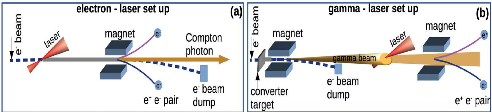
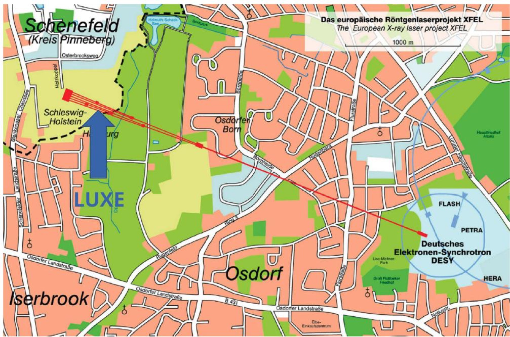
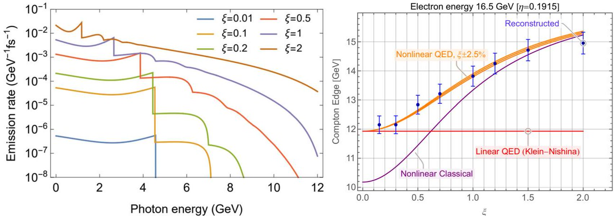
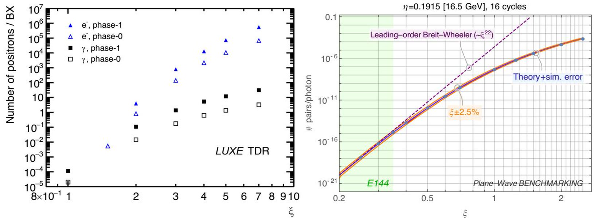

# LUXE 强场 QED 精密实验的实施更新

> A. F. Żarnecki（代表 LUXE Collaboration），*The European Physical Journal Plus* 141, 1095 (2026)，DOI `10.1140/epjp/s13360-026-08312-1`。以下基于开放版本正式 PDF、MinerU Markdown、本地布局文本和 4 组关键图。本文是装置设计与实施状态更新，不是 LUXE 已获得的强场 QED 数据。

## 一句话结论

LUXE 计划让欧洲 XFEL 的 `16.5 GeV` 电子束或其转换产生的高能制动辐射与 `40 TW`、后续 `350 TW` 激光相撞，在 `ξ=O(10)、χ=O(1)` 区域测量 Compton 边、单电子光子数和正电子率；论文给出的谱和产额均是设计/模拟预期，当前新证据是 ELBEX 束线选址、探测器原型进展与“2029 年开始安装”的实施时间线。

## 1. 两种碰撞模式

- 电子—激光模式直接用 `16.5 GeV` 电子束与激光碰撞，研究非线性 Compton、trident 与后续对产生。
- 伽马—激光模式先让电子束穿过薄转换靶产生制动辐射，再用磁场移走主电子束，使高能光子与激光相撞；这是更干净地研究非线性 Breit–Wheeler 过程的路径。
- Eu-XFEL 束团列频率为 `10 Hz`，LUXE 每列只需抽取一个约 `1.5×10^9` 电子的束团；激光脉冲宽度设计为 `30 fs`。

## 2. 为什么要同时看 ξ 与 χ

经典强度参数可写为

$$
\xi=\frac{eE_L\lambda_L}{mc^2},
$$

它刻画单个电子与相干激光场中多光子耦合的强弱；量子非线性参数 `χ` 则比较电子静止系中的场强与 Schwinger 临界场。LUXE 不是直接用实验室激光达到 `1.3×10^18 V/m`，而是依靠相对论电子参考系中的洛伦兹增益接近量子强场区。

- Phase-0：`40 TW` Ti:sapphire 激光。
- Phase-1：计划升级到 `350 TW`。
- 目标参数约为 `ξ=O(10)`、`χ=O(1)`；这描述可测试的强场 QED 区域，不代表已经观察到真空自发 Schwinger 对产生。

## 3. 设施和探测器的实施状态

论文把此前概念/技术设计更新到 ELBEX 抽取束线。该束线已有部分经费，作者预计探测器安装于 `2029` 年开始。

- 高通量光子侧有 gamma profiler、由薄靶 Bethe–Heitler 对反演的 gamma spectrometer，以及看束流 dump 泄漏的 gamma flux monitor。
- 电子侧用充气 Cherenkov straw/玻璃棒和闪烁屏，设计位置分辨率分别约 `2 mm` 与 `0.5 mm`。
- 正电子侧用四层 ALPIDE 像素跟踪器与钨—硅采样量能器，跟踪位置分辨率目标约 `5 μm`。
- 电子侧原型与 ALPIDE 已在 FACET-II E-320 测试，正电子量能器原型已做 DESY 电子束测试；这些是分系统原型验证，不是 LUXE 完整束线运行。

## 4. 预期可观测量

作者提出三类核心观测：Compton 边、每电子辐射光子数、电子—激光及伽马—激光模式下的正电子率。图 5 显示模拟在 `ξ≈0.5` 已能区分经典与量子非线性预测。

Phase-1 每个激光脉冲预计可产生至多约 `10^9` 高能光子，电子—激光模式的电子量也在相近量级；正电子最高约 `10^5/pulse`。这些跨越多个数量级的信号要求互补探测器，而图中产额曲线仍是 LUXE TDR 的模拟，不是测量点。

## 5. 证据边界与库内定位

- **正式且新的内容：** 2026 年正式发表的实施更新、ELBEX 新位置、探测器原型状态和 2029 安装计划。
- **既有设计基础：** 物理目标和大部分产额/谱预测来自已有 Conceptual/TDR 工作；本库此前的 `10.1140/epjp/s13360-026-07595-8` 讨论的是 LUXE 至未来对撞机路线，当前论文有独立 DOI、作者与实施更新，不是其正式版重复。
- **尚未完成：** 无 LUXE 碰撞数据、无非线性 Breit–Wheeler 精密测量、无 Schwinger 真空对产生观测，也没有本文附带数据集。
- **本地工作：** 仅核验全文、提取图文与整理证据；没有重跑 LUXE Monte Carlo、探测器响应、背景或束线光学。

## 6. 复习用速记

记住 `16.5 GeV`、`40→350 TW`、`30 fs`、`ξ=O(10)`、`χ=O(1)`、电子/伽马两模式和 `2029` 安装计划。最稳妥表述是“正式实施更新给出可测量方案和模拟精度”，不是“LUXE 已验证非微扰 QED”。
