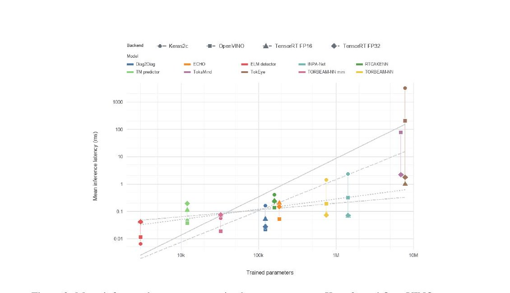
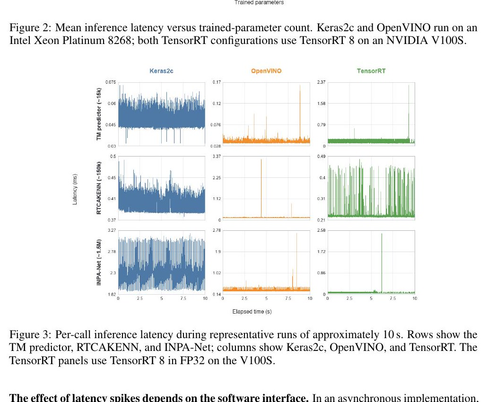

# 聚变控制中的 AI 推理是否足够快

> Nathaniel Chen 等，arXiv:2610.00845v1（2026-10-01）。以下基于官方 arXiv PDF、布局文本和 4 个抽样渲染页；MinerU URL 任务在限定等待期内仍为 `pending`，故使用本地 fallback。论文是跨模型、跨推理后端的部署基准，不是聚变反应堆闭环控制实验。

## 一句话结论

MILF-BENCH 对十个聚变 AI 模型/组件的批量为 1 推理进行比较，没有任何后端在所有模型上最优：小模型在 CPU 上即可满足毫秒控制，大于约 `5M` 参数的模型通常更适合 GPU，最极端案例 GPU 比最佳 CPU 快约 `200×`；但测试硬件、运行节点和调用次数不完全对等，平均延迟也不能替代真实控制系统的最坏时延与闭环稳定性验证。

## 1. 控制时限与测试设计

DIII-D 诊断采样率从 `1 Hz` 到 `2 MHz`，典型控制周期约 `2–50 ms`。论文列举的部署预算包括：归一化 β/内部输运垒约 `50 ms` 周期、`0.8 ms` 推理；撕裂模小于 `10 ms/0.6 ms`；ELM 约 `2 ms/0.2 ms`；Alfvén 模约 `5 ms/0.65 ms`；profile control 约 `20 ms/15 ms`；ITER 预期量级约 `15 ms/5 ms`。

基准覆盖 10 个模型或子模块，统一 batch size 1，并以约 `1 kHz` 发起请求、每项运行约 `10 s`。CPU 后端为 Xeon Platinum 8268 上的 Keras2c 与 OpenVINO；GPU 后端为 Tesla V100S 上 TensorRT 8 的 FP16/FP32。CPU/GPU 分属不同节点，因此结果衡量的是“部署组合”，不是隔离后的纯软件后端效率。

## 2. 模型规模与延迟

没有单一后端包揽全部最优：Keras2c 最快 `1` 项，OpenVINO `5` 项，TensorRT FP16 `2` 项、FP32 `2` 项。

- INPA-Net：Keras2c `2.28 ms`、OpenVINO `0.311 ms`、FP16 `0.0693 ms`、FP32 `0.0700 ms`。
- TokaMind：OpenVINO 约 `76.9 ms`，TensorRT FP32 约 `2.20 ms`，约 `35×` 加速。
- TokEye：Keras2c 约 `3.2 s`、OpenVINO `203 ms`、FP16 `1.01 ms`，相对最佳 CPU 约 `201×`。

作者据此建议参数量超过约 `5M` 时优先考虑 GPU，但阈值是这些模型、硬件和图优化的经验结论，不是架构无关定律。FP16 也并不总比 FP32 快，部署时仍要逐模型 benchmark。

## 3. 抖动与控制策略

逐次调用显示部分后端存在尾部尖峰；Keras2c 在一些小模型上更稳定。作者提出异步控制可在新输出未到时复用上一次结果，但这种容错策略会引入等效延迟和状态陈旧，必须和受控等离子体的时间尺度共同分析，不能只看平均推理时间。

## 4. 证据边界

- **已测量：** 指定 CPU/GPU、编译器和模型下的离线推理延迟与抖动。
- **未测量：** DIII-D PCS 或反应堆现场的传感器读取、预处理、网络传输、调度、后处理和 actuator 延迟；两项大模型也尚未用于实时控制。
- **统计限制：** 慢模型在约 `10 s` 窗口内调用次数很少，例如 TokEye/Keras2c 只有约 4 次，尾延迟估计不稳健。
- **精度限制：** 本文重点是 latency，不代表 FP16/图转换后的物理预测精度和闭环稳定裕度已验证。

因此稳妥结论是“现有部署栈能让多种聚变 AI 模型进入毫秒预算”，而不是“AI 已足够快且可靠地运行聚变反应堆”。
