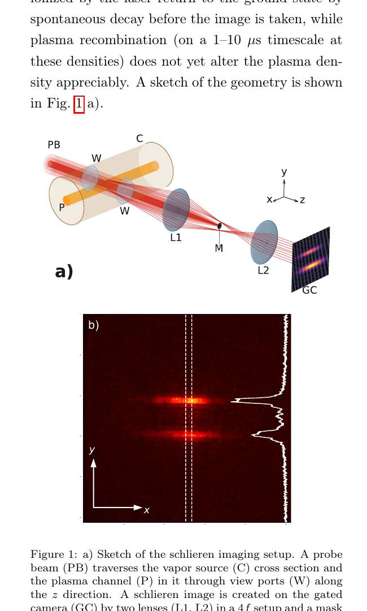
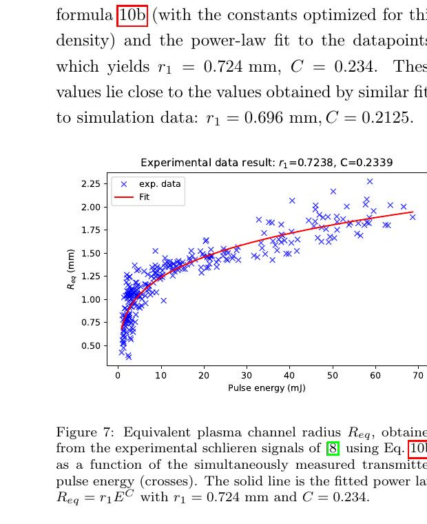

# 用符号回归定量反演 AWAKE 激光电离等离子体通道

> Gabor Demeter，arXiv:2610.01485v1（2026-10-01）。以下基于官方 arXiv PDF、布局文本和 4 个抽样渲染页；MinerU 的 URL 任务在限定等待期内仍为 `pending`，故使用本地文本与页面渲染 fallback。论文重新分析既有 AWAKE schlieren 实验图像，并以模拟信号训练符号回归；不是新一轮通道实验。

## 一句话结论

作者把非对称双 Lorentzian 特征压缩成可解释的解析式，用约 `10^3` 个模拟样本就能把等效等离子体半径反演到约 `0.02–0.03 mm` 的平均绝对误差，并从旧实验图像恢复出半径—脉冲能量幂律；但鞘层宽度对密度、碰撞展宽和探针失谐更敏感，跨工况不能直接套用同一公式。

## 1. 实验信号与反演目标

AWAKE 的铷蒸气源长约 `10 m`。探针波长为 `780.311 nm`，接近 Rb D2 线 `780.241 nm`；`4f` schlieren 系统用 `1.5 mm` 挡片滤除未偏折光，门控相机在电离脉冲后约 `100 ns` 取样，门宽也是 `100 ns`。

论文把径向电离概率 `P(r)` 定义的等效半径写成

$$
\pi R_{\mathrm{eq}}^2=2\pi\int_0^\infty P(r)r\,dr.
$$

一维强度剖面先拟合为非对称双 Lorentzian，再提取两峰间距 `Δ=y_2-y_1`、幅度加权的内外半高宽 `W_in`、`W_out`、总宽 `W` 与差宽 `W_diff`。这样做不是让回归器直接“看图”，而是把光学信号变成少数具有几何意义的特征。

## 2. 符号回归给出的解析式

作者搜索到的半径表达式包括

$$
f_1=C_1(2\Delta+W)-W_{\mathrm{diff}},
$$

$$
f_2=(C_2+C_1\Delta)(\Delta+W)-W_{\mathrm{diff}}.
$$

在 `5×10^14 cm^-3` 和 `7×10^14 cm^-3` 两个密度上，`f_1` 的平均绝对误差分别约 `0.0240 mm`、`0.0264 mm`，`f_2` 约 `0.0203 mm`、`0.0216 mm`；相机像素尺度约 `0.013 mm`。训练信号约 `10^3` 组，样本生成约 `2 min`、回归约 `20 min`，而作者对比的旧 DNN 工作使用约 `10^6` 组样本。

鞘层宽度也得到 `g_1/g_2/g_3` 一类公式，但在高密度下误差约 `0.10–0.16 mm`。原因不是单纯的回归容量不足：碰撞展宽会改变折射率谱，固定探针失谐对不同密度的灵敏度也不同。作者模拟表明把探针调到约 `780.336 nm` 可改善跨密度迁移。

## 3. 旧数据重分析

对既有实验图像，作者用

$$
R_{\mathrm{eq}}=r_1 E^C
$$

拟合，得到实验 `r_1=0.724 mm`、`C=0.234`；相应模拟拟合为 `r_1=0.696 mm`、`C=0.2125`。两者接近说明特征—公式链能恢复能量标度，但这仍是“模拟校准公式对旧测量的再分析”，不是独立的新实验验证。

## 4. 证据边界

- **直接实验材料：** 输入是此前 AWAKE 获得的 schlieren 图像；本文没有新增蒸气源运行或探针扫描。
- **作者计算：** 原子响应和光学传播生成训练信号，符号回归据此得到解析式；本地没有重跑模拟或回归。
- **适用条件：** 误差只对应文中密度、波长、光路、噪声和参数范围；改变原子谱线、挡片或成像系统需重新标定。
- **可解释性边界：** 解析式比黑箱网络便于审计，但变量选择和训练分布仍决定泛化范围；半径反演成功不自动证明鞘宽也可靠。

对诊断设计最有价值的地方，是把“训练数据量、可解释公式和跨工况失配”放在同一框架内：符号回归降低了部署与审计成本，但不能取代密度相关的光谱与仪器校准。
