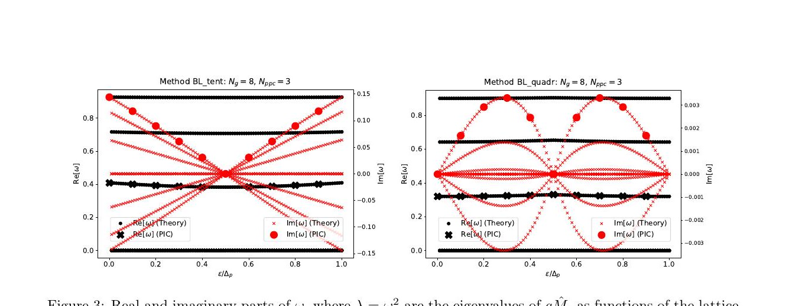
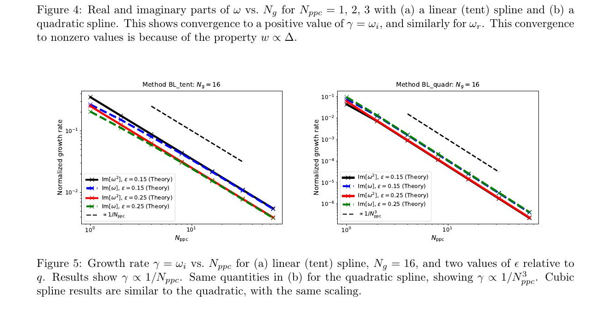

# 从无网格模型追踪 PIC 网格不稳定性

> J. M. Finn 与 E. G. Evstatiev，arXiv:2610.02052v1（2026-10-01）。以下基于官方 arXiv PDF、布局文本和 4 个抽样渲染页；MinerU URL 任务超出限定等待期后使用本地 fallback。论文是理论推导与作者 PIC 数值比较，范围限定在一维静电冷等离子体。

## 一句话结论

从粒子—粒子无网格相互作用出发，作者证明能量守恒 PIC（ECP）的冷、静止等离子体动力学矩阵为对称正定，因而线性稳定；动量守恒 PIC（MCP）的网格采样/aliasing 使矩阵非对称并产生复特征值。提高每格粒子数可按形函数阶数压低增长率，但仅细化网格并不能消除不稳定性。

## 1. 从连续核到网格离散

作者先写出周期一维系统中的平滑电荷密度

$$
\rho(x)=q\sum_{\beta}K(x-\xi_\beta),\qquad q=\frac{1}{N_p},
$$

并让源与受力使用同一核 `K`。这一无网格基准保持粒子交换对称性。引入网格后，MCP 与 ECP 的差别体现在场插值、沉积和离散能量是否来自同一作用量。

- ECP 的线性动力学矩阵对称正定，冷静止平衡中的本征频率为实数。
- MCP 矩阵一般既不对称也不正定；梯形求积误差与网格 aliasing 产生复共轭本征值，从而出现指数增长。

把均匀粒子晶格相对网格平移 `ε` 后，矩阵元素对位移呈周期性，周期为 `q=Δ/N_{ppc}`。利用循环矩阵结构，作者把 `N_p×N_p` 问题约化为 `N_g×N_g`，并用离散 Fourier 变换去除 `N_p-N_g` 个平凡零模。

## 2. 理论增长率与 PIC

最快增长模的理论值与直接 PIC 测量吻合，说明增长来自离散算子的谱，而非单次随机噪声。当每格粒子数固定而网格数增加时，增长率趋向非零极限，因为粒子形函数宽度随 `Δ` 同步缩小；因此“只把网格做细”没有逼近固定物理核的无网格极限。

每格粒子数增加时，线性 spline 约有 `γ∝N_{ppc}^{-1}`，二次和三次 spline 约有 `γ∝N_{ppc}^{-3}`。高阶形函数更快压低 aliasing，但计算代价和支持宽度也增加。

## 3. 漂移与更一般问题

冷漂移束使动力学矩阵随时间周期变化，形成 Floquet/参数不稳定；此时即使冷静止 ECP 稳定，也不能据此断言漂移 ECP 永远稳定。温等离子体、有限速度分布、多维电磁耦合和真实边界被留作后续工作。

## 4. 证据边界

- **严格结论范围：** 一维、周期、静电、冷、初始均匀体系的线性分析；ECP 的稳定性结论不能直接升级到 relativistic electromagnetic PIC。
- **作者数值证据：** 自有 PIC 运行验证理论增长率；本地没有重跑代码或本征值计算。
- **工程含义：** 增加 `N_ppc` 和形函数阶数能压低 MCP 网格增长，但不能替代针对具体生产配置的能量、动量、噪声与色散测试。
- **未覆盖：** 温分布 Landau 响应、碰撞、非均匀密度、开放边界、AMR、并行舍入与多维模耦合。

这篇论文最有用的不是给出一个“万能稳定算法”，而是把网格采样、形函数和粒子晶格相位对离散谱的影响明确拆开，为生产 PIC 的稳定性回归测试提供了可审计的理论基线。
