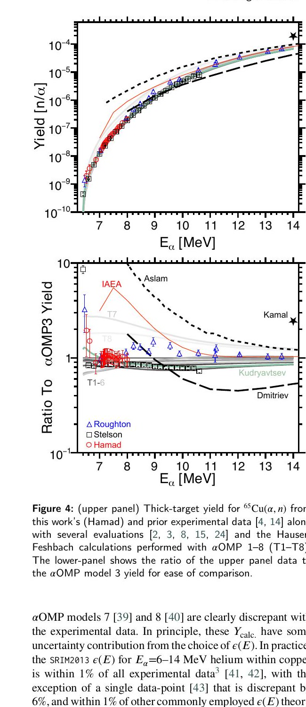
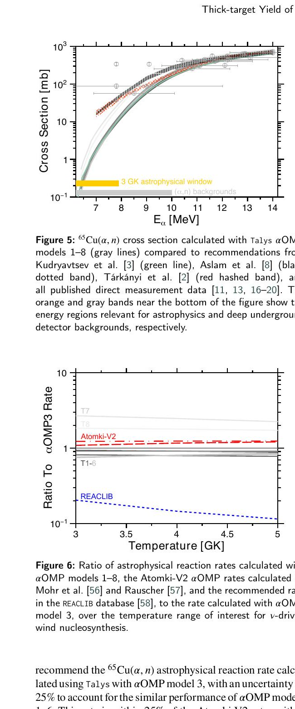

# 近阈值 ⁶⁵Cu(α,n)⁶⁸Ga 厚靶产额及核医学与本底含义

> Zach Meisel 等，arXiv:2610.01719v1（2026-10-01；稿件标注 accepted to *Applied Radiation and Isotopes*）。本地全文为 arXiv 接收稿/预印本，不是期刊排版 VOR。以下基于官方 PDF、布局文本和 4 个抽样渲染页；MinerU URL 任务超出限定等待期后使用本地 fallback。

## 一句话结论

作者在 `6.533–7.996 MeV` 直接测量天然铜靶的 `⁶⁵Cu(α,n)⁶⁸Ga` 厚靶中子产额，并用 TALYS+SRIM 把结果连接到核医学、地下探测器本底和核合成速率；`8 MeV` 的天然铜物理产额为 `0.12±0.02 MBq/μAh`，明显低于 IAEA 推荐值，但 `14 MeV` 富集 ⁶⁵Cu 的 `161^{+5}_{-24} MBq/μAh` 是模型锚定外推，不是直接测量。

## 1. 实验设置与产额定义

实验在 Ohio University Edwards Accelerator Laboratory 的 `4.5 MV` tandem 上进行，使用 He²⁺ 束，电流约 `10–50 nA`（粒子率约 `10^11 s^-1`），照射 `0.8 mm` 天然铜靶。近 `4π` 的 HeBGB ³He/BF₃ 中子探测器效率为 `7.5±1.2%`，计数率不超过约 `200 s^-1`，live fraction 接近 1。

测得的每个 α 粒子中子产额可写成

$$
Y=\frac{N_{\mathrm{det}}-N_{\mathrm{bg}}}{I_\alpha t\,\eta\,f_{\mathrm{live}}},
$$

其中 `I_α` 在这个式子里应理解为入射 α 粒子率。统计不确定度约 `1–4%`，束流积分约 `1%`，探测效率约 `16%`，另加本底项后按平方和合成。

环境本底只有约 `0.4 s^-1`，但束流会激发靶面碳污染中的 `¹³C(α,n)`。作者用 ¹³C 靶测量缩放扣除，并给本底产额约 `±6×10^-10 n/α` 的系统范围；最低的 `6.5–6.6 MeV` 数据可能因扣除不足而偏高。

## 2. 近阈值直接测量

这部分是论文最直接的实验约束：探测器记录厚靶中所有可达反应能区的积分中子产额。作者把 TALYS 2.0 Hauser–Feshbach 截面和 SRIM2013 stopping power 组合成

$$
Y_{\mathrm{calc}}(E_\alpha)=\int_0^{E_\alpha}\frac{\sigma_{\mathrm{HF}}(E)}{\varepsilon(E)}\,dE.
$$

八组 α 光学模型势中，OMP 1–6 与数据大体相容，OMP 7–8 明显偏离。实验因此约束的是“接近阈值的厚靶积分产额”，而非逐能点微分截面的直接测量。

## 3. 核医学与天体物理外推

物理活度产额写为 `\widetilde Y=\lambda Y/q`，其中 He²⁺ 的电荷为 `q=2e`。

- 在 `8 MeV` 天然铜条件下，测量锚定的结果为 `0.12±0.02 MBq/μAh`，而 IAEA 采用约 `0.52 MBq/μAh`。
- 对 `14 MeV` 富集 ⁶⁵Cu，模型外推为 `161^{+5}_{-24} MBq/μAh`，与 IAEA 的约 `156 MBq/μAh` 接近；这里没有 14 MeV 实验点。
- 论文估算 `5 mA`、照射 `2 h`、冷却 `2 h` 可得约 `210 MBq`，但约 `5 μm` 有效靶层承受约 `7.5 kW`，作者也指出工程上不实际。这是情景计算，不是已运行的同位素生产试验。
- 对地下探测器本底和核合成，模型锚定的截面/反应率与现有采用值大体一致，建议的不确定度量级约 `25%`；REACLIB 给出的率明显更低。

## 4. 证据边界

- **直接实验：** `6.533–7.996 MeV` 天然铜厚靶中子计数及其本底扣除；不是 ⁶⁸Ga 活度的直接化学分离/计量。
- **模型依赖：** TALYS OMP 和 SRIM stopping power 用于把积分产额转成截面与高能外推；`14 MeV` 富集靶结果因此不是测量值。
- **应用未完成：** 没有展示高流强靶冷却、放射化学、核纯度、患者剂量或地下实验本底重放。
- **来源状态：** 稿件已标注接收，但本地归档的是 arXiv 版本，正式期刊版可能有校样差异。

这篇论文同时给出可靠的近阈值实验锚点和清晰的外推边界；应用时应把“测得中子产额”“模型推导活度”和“高流强工程可行性”三层分开。
