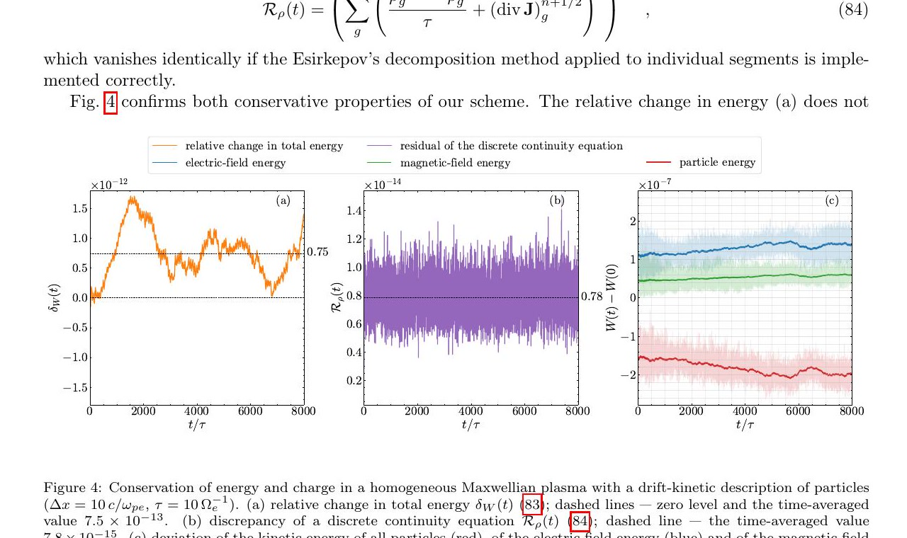
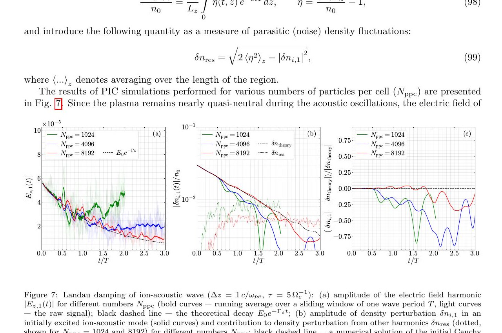

# 面向有限 β 等离子体的能量—电荷守恒漂移动理学 PIC

> O. P. Morozov、V. A. Kurshakov 与 I. V. Timofeev，arXiv:2610.01429v1（2026-10-01；稿件标注 submitted to *Journal of Computational Physics*）。以下基于官方 arXiv PDF、布局文本和 4 个抽样渲染页；MinerU URL 任务超出限定等待期后使用本地 fallback。全文是算法推导和作者数值测试，不是实验结果。

## 一句话结论

作者构造了全隐式电磁漂移动理学 PIC，把磁化电流、场插值和粒子推进写成同一离散变分/守恒框架，从而允许 `Δt≫Ω_e^{-1}`、`Δx≫λ_D` 仍保持机器精度级能量与电荷守恒；但当前验证主要把所有物种都按漂移动理学处理，预期的“漂移动理学电子 + 全动理学离子”混合模型和性能收益尚未完成验证。

## 1. 模型为什么能跨越电子尺度

有限 `β` 开放磁阱中，电子回旋与 Debye 尺度远小于装置尺度。标准显式 PIC 若同时解析 `Ω_e^{-1}`、`ω_pe^{-1}` 和 `λ_D`，代价很高。本文以 guiding-centre 电子替代完整回旋运动，并保留磁化电流

$$
\mathbf{J}_{M}=\nabla\times\mathbf{M},
$$

但忽略电子极化电流；目标覆盖论文讨论的 `β<0.6` 范围。能量守恒不仅来自隐式时间推进，还依赖 `∇B`、`∇×\mathbf b` 与磁化强度 `M` 的一致网格插值，以及类似 Esirkepov 的电荷守恒电流沉积。

代码实现于 `xpic`，使用 C++/PETSc。粒子内循环采用 Picard 迭代，粒子—Maxwell 外循环使用 Anderson acceleration，并支持 MPI/OpenMP。

## 2. 守恒与有限 β 平衡测试

均匀等离子体测试故意选择 `Δx=10c/ω_pe≫λ_D`、`Δt=10Ω_e^{-1}≫ω_pe^{-1}`。最大相对能量变化约 `1.7×10^-12`，平均约 `7.5×10^-13`；连续性方程残差约 `7.8×10^-15`，没有随时间累积的漂移。

在 `β≈0.3` 的有限 β 对等离子体层中，抗磁效应把归一化磁场从 `0.2` 压低到约 `0.168`，平衡剖面相对理论偏差不超过约 `3%`。开放边界运行的能量误差平台约 `4.6×10^-11`，电荷误差约 `3.7×10^-14`。

## 3. 离子声 Landau 阻尼

作者用离子声波测试动理学相空间响应。每格 `8192` 个宏粒子时，密度模在约 `1.8T` 之前与理论的偏差不超过约 `5%`，频率高约 `3%`；降低每格粒子数会显著增加噪声。这说明“守恒到机器精度”不等于任意统计量都自动收敛，Landau 阻尼仍受宏粒子噪声、速度空间采样和有限时间窗限制。

## 4. 证据边界

- **作者已证明：** 对给定离散方程，均匀、有限 β 平衡与离子声测试展示了能量/电荷守恒及合理的动力学响应。
- **尚未证明：** 论文目标中的漂移动理学电子—全动理学离子混合运行、复杂开放磁阱几何、碰撞源、真实装置边界和端到端加速比。
- **近似边界：** guiding-centre 假设要求强磁化和缓变场；忽略电子极化电流及高频电子回旋物理，不适合需要解析这些效应的问题。
- **本地状态：** 没有编译或运行 `xpic`，也没有独立复现守恒曲线与收敛率。

这项工作的核心贡献是把“跨尺度”建立在离散守恒闭合上，而不是只靠放大时间步和网格；但正式用于有限 β 装置前，还需要混合物种、复杂几何与并行性能证据。
