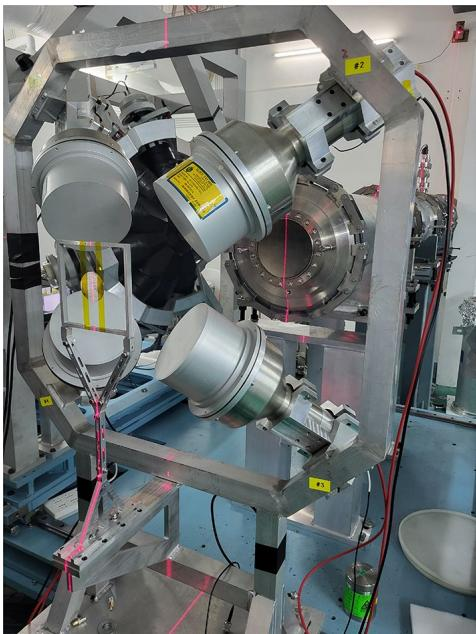
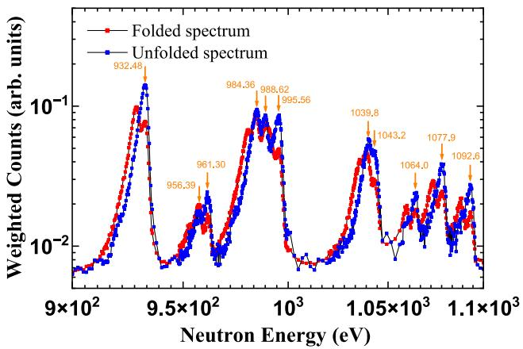
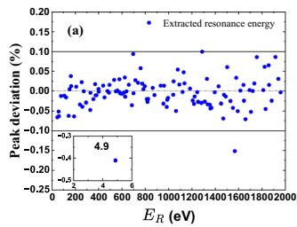
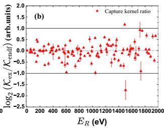
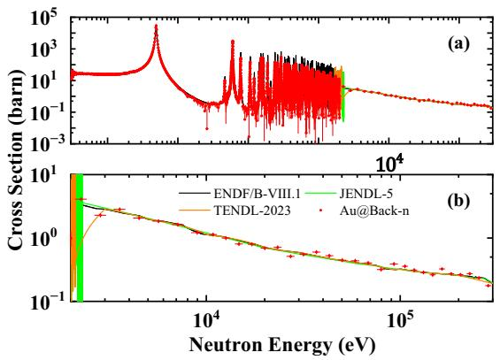
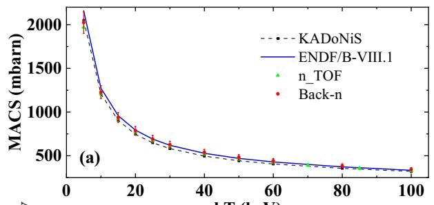
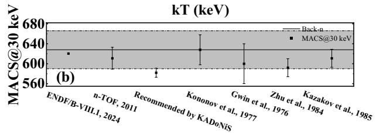
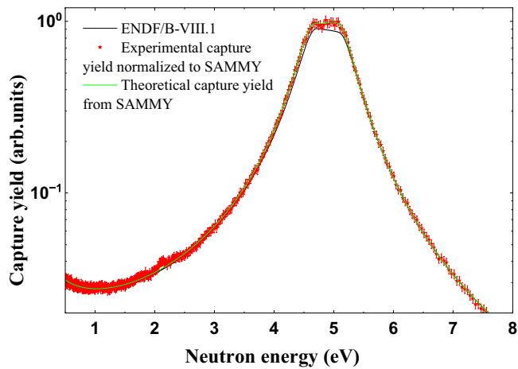

# CSNS Back-n 的 ¹⁹⁷Au(n,γ) 截面新测量

> Zhan-Qiao Cui 等，*Nuclear Science and Techniques* 37, 233 (2026)，DOI：`10.1007/s41365-026-02072-4`，2026-10-03 在线发表。以下基于 Springer 正式排版 PDF、MinerU 全文、`pdftotext -layout` 和 11 页逐页渲染抽查。MinerU 已完成解析；结果 ZIP 因服务端 CDN 证书过期，使用 `curl` 传输回退并通过 ZIP 完整性检查。

## 一句话结论

作者在 CSNS Back-n 白中子束线上用四台 C₆D₆ 探测器重新测量 `0.5 eV–300 keV` 的 ¹⁹⁷Au(n,γ) 俘获产额，通过双束团展开、脉冲高度加权、分项本底扣除和 SAMMY R-matrix 拟合，把平均总不确定度压到约 `5.9%`；共振能量总体与 ENDF/B-VIII.1 相差不超过约 `0.1%`，但 `151.4、534.2、738.7、1822.7 eV` 等若干共振的俘获核偏差超过 `30%`。这是一项直接中子俘获实验，但最终俘获截面仍借用了 ENDF/B-VIII.1 的总截面，不能写成完全独立的绝对截面测量。

## 0. 论文信息与研究定位

- **正式来源：** Springer 期刊排版版，不是预印本或作者稿。
- **实验对象：** ¹⁹⁷Au(n,γ)¹⁹⁸Au，主要覆盖已分辨共振区（RRR，`0.5 eV–2 keV`）并延伸到 `300 keV`。
- **直接测量：** C₆D₆ 对俘获级联 γ 的波形/计数、空靶/碳/铅辅助测量、黑共振滤片数据。
- **分析依赖：** PHWT 响应模拟、贝叶斯双束团展开、ENDF/B-VIII.1 弹性散射/总截面、SAMMY R-matrix 拟合和高于 `300 keV` 的评价库截面。
- **与本库的关系：** 它不是激光驱动中子实验，但 ¹⁹⁷Au(n,γ) 是中子场标定与核反应数据的重要标准通道；其本底拆分、TOF、响应加权和评价库依赖，对激光驱动宽谱中子/活化诊断具有直接方法学参考价值。

## 1. 引言：为什么要重测金俘获截面

¹⁹⁷Au(n,γ) 在 `0.2–2.5 MeV` 被 IAEA 推荐为中子截面标准，也常用于相对归一化。问题在于较低能的 RRR 中，ENDF/B-VIII.1、JENDL-5 和 CENDL-3.2 仍存在差异，RRR 的上边界也有 `2–5 keV` 的不同取法，所以该区间尚不能直接沿用高能区的“标准”地位。

本文相对 Back-n 既有测量有三项增量：把能区从约 `0.1 MeV` 延伸到 `0.3 MeV`，用更新后的中子通量谱，且系统加入双束团展开与更细的本底扣除。作者随后用 SAMMY 在 `0.5 eV–2 keV` 拟合共振参数，并从实验俘获产额导出截面和 `5–100 keV` 的 Maxwell 平均截面（MACS）。

## 2. 实验设置与样品

实验位于 CSNS Back-n 的 ES#2，飞行路径约 `77 m`。Back-n 位于质子束方向的 `180°`，白中子谱覆盖约 `0.3 eV–300 MeV`，通量最高约 `10^7 n cm⁻² s⁻¹`；本次运行束流功率为 `160 kW`。两束质子脉冲间隔 `410 ns`，有限飞行路径使两套 TOF 谱发生重叠，因此原始谱不能直接逐事件判断来自哪一束团。

### 图 1：C₆D₆ 探测器系统

- **来源：** 论文 Fig. 1，正式 PDF。
- **结构：** 四台 C₆D₆ 液体闪烁体围绕样品支架布置，配 1 GS/s、12 bit 波形采集。
- **选择理由：** C₆D₆ 中子灵敏度低、约 `10 ns` 阳极上升时间适合 TOF，并能使用 PHWT 把级联路径依赖压缩为总激发能依赖。
- **限制：** 图片说明装置几何，但不单独证明绝对效率；效率修正仍来自响应模拟和加权函数。

### 2.1 TOF 到中子能量

非相对论条件下，飞行时间 `T` 和路径 `L` 给出

$$
E_n=\frac{1}{2}m_n v_n^2
=\frac{1}{2}m_n\left(\frac{L}{T}\right)^2
\approx \left(\frac{72.2977L}{T}\right)^2.
$$

**变量与单位：**

- `E_n`：中子能量，论文的数值常数对应 eV；
- `m_n`：中子质量；
- `L`：飞行路径，单位 m；
- `T=T_f-T_0`：从质子脉冲参考时刻到中子事件的 TOF，单位 μs。

**推导与直觉：** 先用 `v=L/T` 代入经典动能，再把中子质量和 eV、m、μs 的单位换算吸收到 `72.2977` 中。由于 `E_n∝T^{-2}`，高能端的小时间误差会更强地放大为能量误差；这也是质子束团宽度、双束团混叠和束线本征时间分辨率必须纳入分析的原因。

### 2.2 样品与辅助测量

- ¹⁹⁷Au：直径 `40.00±0.02 mm`、厚度 `0.20±0.02 mm`、纯度至少 `99.99%`，无滤片/有滤片测量 `16.5/6 h`。
- 天然碳：表征样品相关的散射中子本底；测量 `8.5 h`。
- 天然铅：提供 in-beam γ 本底的谱形；测量 `8 h`。
- 空靶：表征样品无关环境本底；无滤片/有滤片测量 `15.5/3.5 h`。
- `0.4 mm` 的天然 Ag 和 ⁵⁹Co 黑共振滤片分别在 `5.19 eV` 与 `132 eV` 制造深吸收谷，用于钉住 in-beam γ 本底归一化。

## 3. 数据分析链

### 3.1 脉冲高度加权：从部分能量沉积到俘获产额

C₆D₆ 不会吸收整套级联 γ 的全部能量。若不校正，探测效率会依赖具体的级联分支。PHWT 的目标是让单 γ 的加权效率与 γ 能量成正比：

$$
\epsilon_\gamma=kE_\gamma.
$$

在 `ε_γ≪1` 时，各级联 γ 被探测可近似视为独立，因此

$$
\epsilon_c(E_n)
\approx\sum_i\epsilon_{\gamma i}
=k\sum_iE_{\gamma i}
\approx k(E_n+S_n),
$$

其中 `S_n` 是 ¹⁹⁸Au 的中子分离能。级联如何拆分不再重要，因为所有 γ 能量之和接近复合核激发能。

实际加权函数取四阶多项式：

$$
W(E_d)=\sum_{n=0}^{4}b_nE_d^n,
$$

系数 `b_n` 由多组单能 γ 的 C₆D₆ 响应模拟拟合，使

$$
\int_{E_{\mathrm{low}}}^{\infty}
R(E_d,E_{\gamma j})W(E_d)\,dE_d
\approx kE_{\gamma j}.
$$

**物理直觉：** `W(E_d)` 不是把每个事件“还原成真实 γ 能量”，而是重新加权统计，使整个探测器对不同级联路径的总响应只看总激发能。

扣除加权本底后，俘获产额为

$$
Y(E_n)=f\,
\frac{N_w(E_n)-B_w(E_n)}
{I_n(E_n)(E_n+S_n)}.
$$

这里 `N_w`、`B_w` 分别是加权后的样品计数和总本底，`I_n` 是入射中子数，`f` 是绝对归一化因子。

### 3.2 双束团展开

- **来源：** 论文 Fig. 3。
- **坐标：** 横轴为 `900–1100 eV` 的中子能量；纵轴为对数坐标的加权计数，任意单位。
- **趋势：** 红色 folded 谱中的重叠结构，经迭代贝叶斯展开后变成蓝色谱；约 `956–1093 eV` 的若干 ENDF/B-VIII.1 共振位置更加可分。
- **论证作用：** 这张图证明展开改善了结构辨识，但不能单独证明每个弱峰的核参数都唯一；紧邻双峰仍受能量分辨率限制。

### 3.3 四类本底

总本底被拆成环境本底、¹⁹⁸Au 活化延迟 γ、样品散射中子和 in-beam γ 四部分。碳靶残余计数通过弹性散射产额比缩放到金靶，铅靶用于构造 in-beam γ 谱形，再用 Ag/Co 黑共振谷决定绝对尺度。

**证据边界：** 其中 Au/C/Pb 的部分弹性散射比来自 ENDF/B-VIII.1，金的弹性产额还依赖装置模拟；因此本底并非全部由独立辅助实验直接给出。

## 4. 结果

### 4.1 RRR 共振参数与俘获核

作者用 SAMMY 在 `0.5 eV–2 keV` 拟合，初值来自 ENDF/B-VIII.1，并校正多重散射、自屏蔽、Doppler 展宽和 Back-n 能量分辨率。单个峰的俘获核定义为

$$
\mathcal{K}
=g\frac{\Gamma_n\Gamma_\gamma}
{\Gamma_n+\Gamma_\gamma},
$$

其中统计因子

$$
g=\frac{2J+1}{(2s+1)(2I+1)}.
$$

**变量说明：**

- `Γ_n`、`Γ_γ`：中子宽度和 γ 宽度，控制入口与出口通道；
- `J`：¹⁹⁸Au* 共振态总角动量，本工作取 1 或 2；
- `s=1/2`：入射中子自旋；
- `I=3/2`：¹⁹⁷Au 基态自旋。

**物理直觉：** `Γ_nΓ_γ/(Γ_n+Γ_γ)` 类似两个串联通道的“瓶颈”组合，任一通道很窄都会限制峰面积；`𝒦` 因而比只报一个宽度更适合比较俘获共振强度。

#### 图 7：共振能量与俘获核相对评价库的偏差

- **坐标：** 两图横轴均为共振能量 `E_R`（eV）。上图纵轴是峰位相对偏差（%）；下图纵轴是 `log₂(𝒦_exp/𝒦_ENDF)`。
- **趋势：** 峰位绝大多数在 `±0.1%` 内；俘获核总体落在比值 `0.5–2` 的区间，但若干点明显越界。
- **关键结果：** `151.4、534.2、738.7、1822.7 eV` 等统计较好的峰与 ENDF/B-VIII.1 偏差超过 `30%`，值得重评。
- **限制：** 双峰无法分离或弱峰落在强峰翼部时，拟合参数不唯一；论文表格已对部分值加括号或标为不可辨识。

### 4.2 由俘获产额导出截面

有限厚样品中，至少发生一次相互作用的概率为

$$
P_{\mathrm{int}}=1-\exp(-N_V\sigma_t d).
$$

把总相互作用概率乘以俘获在总反应中的比例 `σ_γ/σ_t`，得到

$$
Y=\frac{\sigma_\gamma}{\sigma_t}
\left[1-\exp(-N_V\sigma_t d)\right].
$$

反解即论文使用的关系：

$$
\sigma_\gamma
=\frac{\sigma_t}
{1-\exp(-N_V\sigma_t d)}Y.
$$

`N_V` 是样品中 ¹⁹⁷Au 的体数密度，`d` 是厚度。这里最重要的边界是 `σ_t` 取自 ENDF/B-VIII.1；所以红色实验点虽以实测 `Y` 为核心，仍不是与评价库完全解耦的截面。

#### 图 8：`0.5 eV–300 keV` 的俘获截面

- **坐标：** 横轴中子能量（eV，对数）；纵轴截面（barn，对数）。下半图放大 `1–300 keV`。
- **归一化/来源：** 红点由实验俘获产额结合 ENDF/B-VIII.1 总截面反演；黑/绿/橙线分别为 ENDF/B-VIII.1、JENDL-5、TENDL-2023。
- **趋势：** RRR 内有密集尖锐共振；`2–300 keV` 的分箱截面整体随能量下降，并与三套评价大体相容。
- **论证作用：** 给出从峰参数到连续能区的整体一致性，但不能把曲线贴合作为所有局部共振参数都正确的证明。

### 4.3 Maxwell 平均截面

作者把截面按 Maxwell-Boltzmann 中子能谱加权：

$$
\langle\sigma\rangle_{kT}
=\frac{\int_0^\infty
\sigma(E_n)E_n\exp[-E_n/(kT)]\,dE_n}
{\int_0^\infty E_n\exp[-E_n/(kT)]\,dE_n}.
$$

分母可直接积分为

$$
\int_0^\infty E_n\exp[-E_n/(kT)]\,dE_n=(kT)^2,
$$

所以 MACS 本质上是用 `E_n exp[-E_n/(kT)]` 归一化后的权重平均。`300 keV` 以下使用本工作实验截面，以上仍取 ENDF/B-VIII.1。

#### 图 9：MACS 随热能与 `30 keV` 横向比较

- **坐标：** 上图横轴 `kT=5–100 keV`，纵轴 MACS（mbarn）；下图固定 `kT=30 keV`，纵轴约 `560–680 mbarn`。
- **趋势：** MACS 随 `kT` 增大单调下降；Back-n 在中高 `kT` 略高于多数推荐值。
- **定量结果：** `kT=30 keV` 时为 `628±38 mb`，比 KADoNiS 推荐的 `582 mb` 高约 `7.9%`，与 ENDF/B-VIII.1 的 `620 mb` 在不确定度内一致。
- **截断影响：** 高于 `300 keV` 的评价库贡献在 `50/60/80/100 keV` 时约为 `0.8/1.9/5.7/10.8%`；热能越高，结果越不再是纯实验积分。

### 4.4 绝对归一化与不确定度

- **来源与坐标：** 论文 Fig. 10；横轴中子能量（eV），纵轴俘获产额（任意单位，对数）。
- **方法：** 实验红点不是直接对齐未修正的 ENDF/B 黑线，而是对齐考虑多重散射等实验条件的 SAMMY 绿线。
- **意义：** 避免把评价库中缺少具体装置展宽/多重散射校正的曲线直接当作归一化真值。
- **边界：** 归一化仍依赖 SAMMY 和评价库初始参数，不是无模型的绝对标准。

主要不确定度包括：低于 `0.15 MeV` 的中子通量 `3.4–6.7%`、高于该能量 `2.3%`，PHWT `2–3%`，展开 `2%`，本底扣除 `2%`，归一化 `0.5%`，统计 `0.5–1%`。合成后全能区约 `4.2–7.6%`，平均约 `5.9%`；低于 `0.15 MeV` 的平均值约 `6.3%`。

## 5. 对激光驱动中子/核诊断的可迁移结论

1. **Au 活化或俘获不是“只查一条截面”即可。** 宽谱中子场需要把能谱、分辨率、样品厚度、自屏蔽、多重散射和 γ 本底共同传播到响应。
2. **白中子源的双束团展开不能照搬到激光单脉冲。** 但“先建立时间响应矩阵，再对重叠 TOF 结构做受约束展开”的思路可迁移到激光装置的 prompt-γ、EMP 和散射尾重叠问题。
3. **¹⁹⁷Au 低能 RRR 尚不是完全稳定的标准。** 某些俘获核偏差超过 `30%`；若激光中子诊断对 eV–keV 慢化谱敏感，应把评价库版本和核数据不确定度显式写入反演。
4. **本文不验证激光中子源。** 没有激光—靶相互作用、pitcher/catcher、激光 EMP 或激光源逐发波动数据；它提供的是核数据和诊断方法基准。

## 6. 开放问题与证据边界

- **直接实验：** `0.5 eV–300 keV` 俘获产额、辅助靶/空靶/滤片计数和装置条件。
- **模型辅助：** PHWT 响应、双束团贝叶斯展开、Au 散射本底、SAMMY R-matrix 共振参数和实验条件修正。
- **评价库依赖：** `σ_γ` 使用 ENDF/B-VIII.1 总截面；MACS 的 `E_n>300 keV` 部分也来自该库。
- **未完成：** 作者明确建议专门测量 ¹⁹⁷Au 总截面，才能得到完全实验性的俘获截面。
- **本地工作边界：** 本轮没有重放原始波形、重新展开、运行 GEANT4/PHWT 响应模拟、复跑 SAMMY 或重新计算 MACS；本地验证限于来源、PDF、正文、公式、图表和数值口径核对。

## 7. 复习用速记

这篇工作的核心链条是：`TOF → 双束团展开 → PHWT → 四类本底 → 俘获产额 → SAMMY 共振参数 → 评价库辅助截面 → MACS`。实验显著提高了 ¹⁹⁷Au RRR 数据精度并指出若干评价库异常峰，但“俘获产额直接测量”和“完全独立的绝对截面”仍须严格区分。
