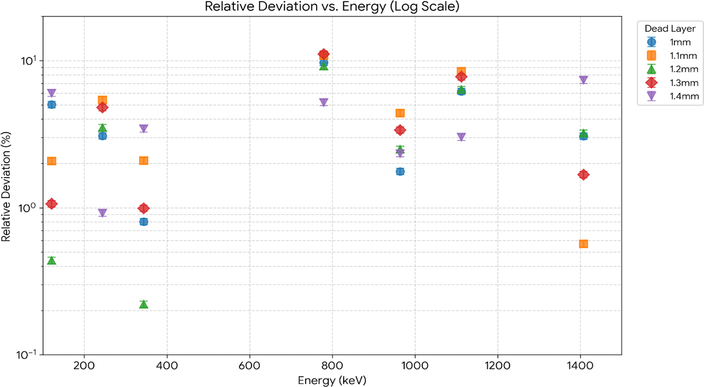
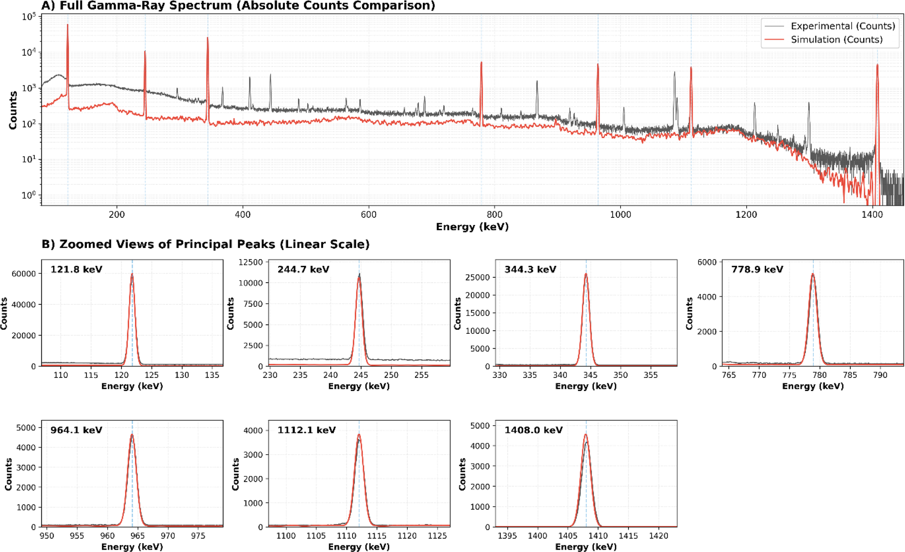
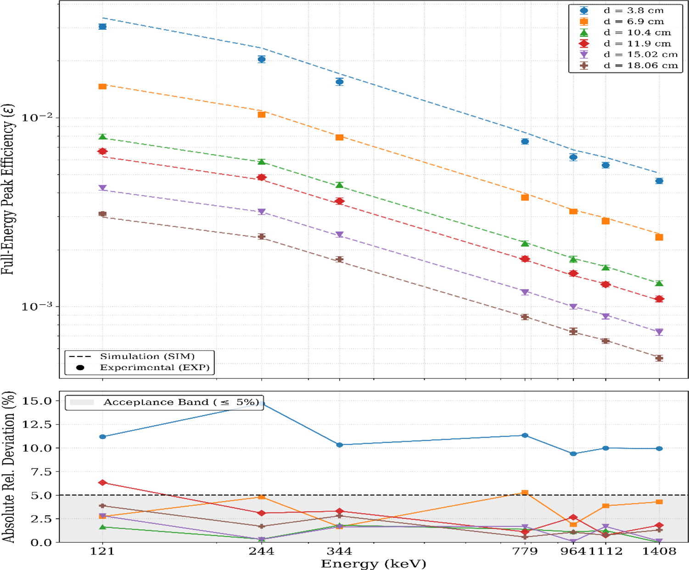
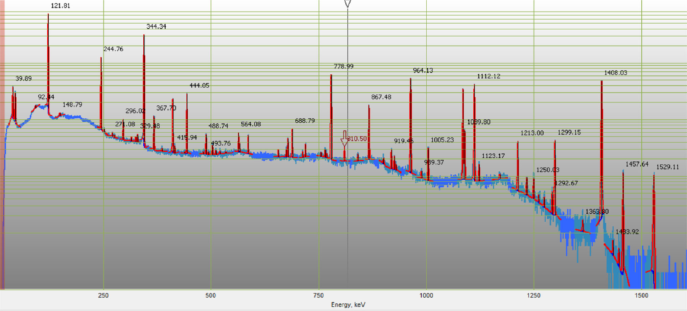
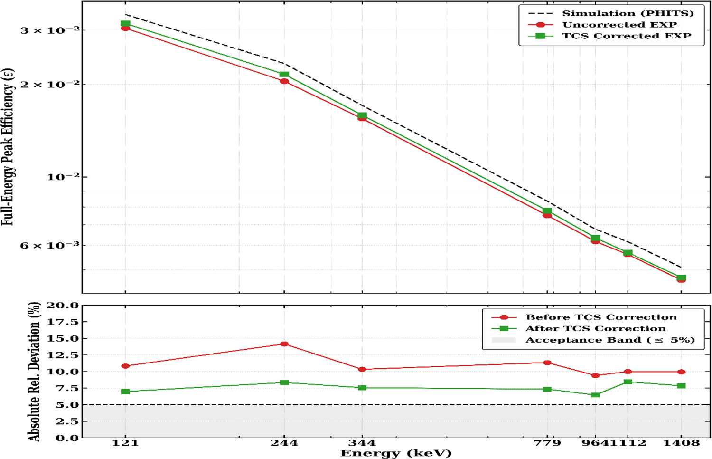

# HPGe 探测器效率标定：死层优化、近场真符合求和与 PHITS

> Abdelwahab Badague 等，*The European Physical Journal Plus* 141, 1130 (2026)，DOI：`10.1140/epjp/s13360-026-08383-0`，2026-10-04 在线发表。以下基于 Springer 正式排版 PDF、`pdftotext -layout` 和全部 10 页逐页渲染核查。MinerU 对官方 PDF URL 返回 `parsing failed`，因此本文明确采用本地全文与渲染回退，不把 MinerU 记为成功。

## 一句话结论

作者用 ¹³⁷Cs、¹⁵²Eu 点源实验约束一台 p 型同轴 HPGe 的 PHITS 模型，把前/侧死层优化为 `1.2 mm`；在源距 `≥10.4 cm` 时，`121–1408 keV` 全能峰效率的模拟—实验偏差大多不超过 `5%`。但在 `3.8 cm` 近场，¹⁵²Eu 级联 γ 的真符合求和（TCS）使未修正偏差约为 `9.4–14.7%`；Efftran 修正后仍有 `6.51–8.46%` 残差，尚未进入作者采用的 `≤5%` 验收带。

## 0. 论文信息与研究定位

- **正式来源：** Springer 期刊 version of record，不是预印本或作者稿。
- **直接实验：** ¹³⁷Cs、¹⁵²Eu 标准点源在 6 个源—端帽距离上的 HPGe 能谱和峰面积。
- **模拟与校正：** PHITS 3.2 单光子输运、角偏置与高斯能量展宽；近场 ¹⁵²Eu 的符合求和因子由 Efftran 计算。
- **与本库的关系：** 它不是激光等离子体或转换靶实验，但 HPGe 全能峰效率、近场 TCS、源距与死层不确定度直接影响 γ 谱定量、活化分析和光核/中子产额诊断。

## 1. 为什么 HPGe 效率不能只用厂家几何

γ 谱定量需要把峰面积换成单位衰变产生的全能峰计数。实验效率写成

$$
\varepsilon(E_\gamma)=
\frac{N_E}{A\,M\,T\,P_E},
$$

其中 `N_E` 是净峰面积，`A` 是源活度，`M=1` 是本文点源质量因子，`T` 是活时间，`P_E` 是该 γ 线的发射概率。作者按独立量传播相对不确定度：

$$
\frac{u(\varepsilon)}{\varepsilon}
=
\sqrt{
\left[\frac{u(N_E)}{N_E}\right]^2+
\left[\frac{u(A)}{A}\right]^2+
\left[\frac{u(P_E)}{P_E}\right]^2
}.
$$

标准源活度证书给出约 `3%` 相对不确定度，峰统计控制在 `1%` 以下，活时间不确定度低于 `0.1%`。真实晶体的死层、有效体积、端帽间距和内部材料若与厂家名义值不一致，模拟效率会产生系统偏差；近场还会因大立体角显著增强 TCS。

## 2. 实验和 PHITS 模型

探测器为 Baltic Scientific Instruments GCD-30200：Ge 晶体直径 `59.8 mm`、长度 `54.5 mm`，晶体到端帽距离 `8.3 mm`，铝入射窗厚 `0.6 mm`；标称相对效率 `30%`，⁶⁰Co `1.33 MeV` 峰的 FWHM 为 `1823 eV`。¹⁵²Eu 覆盖 `121.78–1408.01 keV`，测量距离为 `3.8、6.9、10.4、11.9、15.02、18.06 cm`。

PHITS 使用 `10^6` 个历史（10 批、每批 `10^5`），以 `[T-Deposit]` 统计有源 Ge 区的能量沉积。为减少无效历史，作者把各距离的发射限制在覆盖探测器端面的圆锥内，再用

$$
f_\Omega=
\frac{\Omega_{\mathrm{cone}}}{4\pi}
=\frac{1-\cos\theta}{2}
$$

恢复到等效各向同性发射。半角从 `3.8 cm` 时的 `44°` 降到 `18.06 cm` 时的 `11.6°`。这种角偏置只提高采样效率；它本身不补偿错误几何、死层或级联符合。

## 3. 死层优化：`1.2 mm` 是低能约束，不是全能区完美拟合

- **来源：** 论文 Fig. 4，正式 PDF 嵌图。
- **坐标：** 横轴 γ 能量 `121–1408 keV`；纵轴为 `|ε_exp-ε_sim|/ε_exp`（%，对数坐标）。颜色/符号对应 `1.0–1.4 mm` 死层。
- **趋势：** `1.2 mm` 在 `121` 和 `344 keV` 的偏差低于约 `0.5%`，因此被选为后续模型；高于 `700 keV` 后，不同死层曲线不再单调分离，`779 keV` 附近所有模型都有较大偏差。
- **物理意义：** 死层首先是低能 γ 的吸收层，高能 γ 对亚毫米差异不敏感；高能端更容易受有效体积、级联与核数据影响。
- **限制：** “`1.2 mm` 最优”主要由两个低能点约束，不能理解为所有能量、所有几何都达到亚百分比准确度。

## 4. 远场效率转移与谱形比较

作者用经验高斯能量展宽

$$
\sigma(E)=\frac{a+b\sqrt{E}}{2.355},
$$

其中 `a=0.0008 MeV`、`b=0.0009 MeV`，把离散能量沉积卷积为实际峰宽。

- **来源：** 论文 Fig. 5；¹⁵²Eu，源距 `10.4 cm`。
- **坐标：** 横轴能量（keV），纵轴绝对计数；上图为对数全谱，下图放大 7 条主峰。
- **趋势：** 主峰位置和展宽吻合较好；实验连续本底和额外峰明显高于理想化 PHITS 几何。
- **论证作用：** 支持能量刻度、峰宽和主要光子输运几何基本正确。
- **限制：** 背景、房间返照和级联 TCS 没有完整进入基线 PHITS；因此“谱峰对齐”不等于全谱或绝对效率已全面验证。

- **来源：** 论文 Fig. 6。
- **坐标：** 上图横轴能量、纵轴全能峰效率（对数）；下图为绝对相对偏差（%），灰带是 `≤5%`。
- **趋势：** `10.4–18.06 cm` 基本落入 5% 带；`6.9 cm` 是过渡区，部分线接近或略超 5%；`3.8 cm` 全部明显超带。
- **物理意义：** 距离增大后，立体角变小、TCS 概率和亚毫米定位敏感性快速下降。
- **限制：** 这只是同一台探测器、同一支架和点源的距离转移；不能直接替代体源、扩展源、屏蔽体内样品或脉冲高计数率场景的效率标定。

## 5. 近场 TCS：看见了和峰，但修正后仍未达 5%

¹⁵²Eu 级联中的多颗 γ 若在电子学分辨时间内同时沉积，会从各自全能峰“移出”计数，并在能量和处生成假峰。论文在 `3.8 cm` 观测到 `121.8+244.7≈367.7 keV` 的和峰：

- **来源：** 论文 Fig. 7；横轴能量（keV），纵轴为对数计数谱。
- **直接证据：** `367.7 keV` 结构支持近场存在 summing-in；主峰损失则对应 summing-out。
- **限制：** 单个和峰不能单独决定所有主峰的修正量，仍需完整衰变分支、内转换和探测器几何。

作者用 Efftran 给出 `1.014–1.055` 的符合求和因子（CSF），按

$$
\varepsilon_{\mathrm{corr}}
=\varepsilon_{\mathrm{exp}}\,\mathrm{CSF}
$$

修正实验效率。

- **来源：** 论文 Fig. 8。
- **坐标：** 上图比较 PHITS、未修正实验和 TCS 修正实验效率；下图给出修正前后相对偏差。
- **定量结果：** 表 2 的未修正偏差约 `9.4–14.7%`；表 3 报告修正后为 `6.51–8.46%`。
- **结论边界：** TCS 修正确实去除了明显的能量依赖并缩小偏差，但绿色点仍全部高于 `5%` 验收线，所以不能写成“近场效率已高精度闭合”。

## 6. 对 γ / 中子 / 活化诊断的可迁移结论

1. **效率曲线必须绑定几何。** 标准点源的距离变化已能让效率和 TCS 显著改变；激光转换靶后的活化箔、体样品或屏蔽孔道更不能直接套用单一曲线。
2. **低能线优先约束死层，高能线约束有效体积。** 若只用 ¹³⁷Cs `662 keV` 单线，难以唯一确定低能死层响应。
3. **近场高效率不等于更小系统误差。** 大立体角提高计数率，但同时放大级联符合、定位和样品自吸收误差。
4. **单光子输运与衰变级联要分开审计。** PHITS 基线负责单光子几何/材料输运，Efftran 负责 ¹⁵²Eu 衰变相关性；两者任一缺失都可能把峰面积偏差错归因于几何。
5. **本文不是激光核诊断验证。** 没有脉冲 pile-up、EMP、prompt-γ、宽谱中子激活、自吸收、逐发波动或现场屏蔽数据；迁移到激光装置需重新建模和实验标定。

## 7. 证据边界与内部一致性检查

- **直接实验：** 标准源谱、峰面积、六个距离及 `367.7 keV` 和峰。
- **模型辅助：** `1.2 mm` 死层、角偏置、PHITS 效率/谱形、Gaussian 展宽和 Efftran CSF。
- **已验证口径：** 表 2 在 `3.8 cm` 给出的最大未修正偏差约 `14.7%`（`244 keV`），与正文“约 `9–15%`”一致。
- **论文内部不一致：** 结论写“初始偏差超过 `20%`”，但表 2、Fig. 6 和第 3.5 节给出的峰值约 `14–15%`；本笔记采用表格可复核数值，不接受“>20%”为已证实结果。
- **因果强度限制：** 修正后近似常数残差与几何偏置相容，但“纯几何且被证明”强于现有证据；未见独立晶体尺寸测量、位置公差扫描、完整级联 Monte Carlo 或跨软件复现。
- **数据开放：** 数据仅注明“可向作者索取”，没有公开原始谱、PHITS 输入或 Efftran 配置。
- **本地工作边界：** 本轮没有运行 PHITS、Efftran、重算峰面积或重新拟合死层；本地验证限于正式来源、PDF、正文、公式、表格、嵌图和可直接复算的相对偏差。

## 8. 复习用速记

这篇工作的核心链条是：`标准源峰面积 → 实验效率 → PHITS 几何/死层 → 多距离转移 → 近场 TCS 识别 → Efftran 修正 → 残差审计`。远场模型表现较好；近场修正有效但尚未达到 5% 准则，且不能把未公开的模拟输入和作者因果解释当成独立复现。
