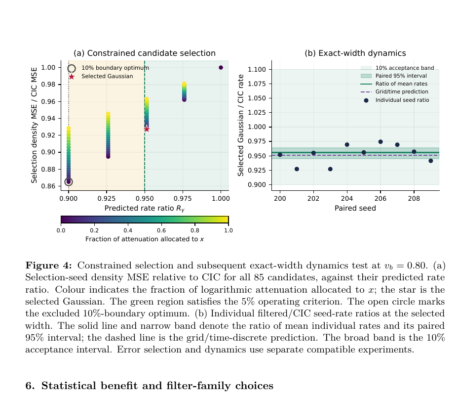

# 面向动力学约束的二维静电 PIC 平滑带宽选择

> Ayushi Agrawal、Shan-Chang Lin、Ezhilmathi Krishnasamy、Pascal Bouvry，arXiv:`2610.03230`（2026-10-02）。以下基于官方 arXiv v1 PDF、布局文本、选定页渲染和图表核查。

## 一句话结论

把 PIC 电荷沉积的平滑宽度只按密度误差最小化会改变物理模的增长/阻尼率；作者用“统计误差目标 + 指定线性模速率容差”联合选带宽，在测试的二维静电两流系统中把密度和网格场 MSE 分别降低 `7.40%`、`3.70%`，同时把增长率比保持在 `0.9556 [0.9453,0.9640]`，但证据只覆盖受投影的线性模和分离的 snapshot/dynamics 试验。

## 1. 问题定义

电荷沉积可看成网格上的核密度估计。增大核带宽会减小宏粒子噪声，却通过 deposition–filter–gather 的总传递函数削弱某些波数的电场，进而改变两流增长或 Landau 阻尼。因而同一初始密度、同一滤波器在不同平衡态附近可能对应不同的相对速率误差。

作者将候选滤波器集合限制为满足

$$
|R_\gamma(H)-1|\le \epsilon_{\rm op}
$$

的“动力学可接受域”，再在域内最小化密度/场误差。`ε_op` 是工作裕量，最终用较宽的 `ε_acc=10%` 验收；这两者不应混为一谈。

## 2. 受控两流扫描

作者保持初始空间密度、热样本、波矢和固定滤波传递不变，只改变 beam drift `v_b`。固定滤波造成的单次增长率降幅从 `v_b=0.60` 的 `0.72%` 增至 `v_b=0.80` 的 `9.11%`，说明误差不是滤波器的常数属性，而依赖平衡态及其色散根对传递函数的敏感度。

按模型预先选择的 interior 带宽从 `0.6284` 缩到 `0.1739` cell，使 4 个已解析平衡态的速率比维持在 `0.9504–0.9545` 并通过 10% 区间准则。终点 `v_b=0.818` 的信号/扰动条件不满足预定义质量门槛，论文正确保留为 unresolved，没有把完成运行写成物理测量成功。

## 3. 85 个候选的选择与独立动力学检查

- **来源：** arXiv PDF Fig. 4。
- **左图坐标：** 横轴预测增长率比 `R_γ`；纵轴候选密度 MSE / CIC MSE；颜色表示衰减分配到 `x` 方向的比例。
- **右图坐标：** 横轴配对随机种子；纵轴选中 Gaussian / CIC 的增长率比。
- **选择：** 85 个对角 Gaussian 中 43 个满足 5% 工作约束；最优候选为 `(h_x,h_y)=(0,0.1716393)`，预测 `R_γ=0.95130085`。
- **误差收益：** 独立 snapshot seeds 上，密度 MSE 下降 `7.40%`，pre-return grid-field MSE 下降 `3.70%`。
- **动力学验收：** 另一组 seeds 的 exact-width projected-linear test 给出 `0.955645 [0.945273,0.964006]`，在 10% 验收带内且包含模型预测。
- **限制：** 左图误差选择和右图动力学测试是“分离但兼容”的两个实验，不是同一 full-f 轨道同时证明误差下降和动力学保持。

## 4. 为什么更强平滑不一定更好

弱 Landau 对照中，更宽滤波器可把密度误差降低 `4.612×`，却让定义的场误差增加约 `1.58×`，且相干衰减率越出容差；一 cell Gaussian 则在该窗口内同时改善密度和场误差并保留速率。这说明“噪声更低”不能单独作为算法验收，至少要同时报告受保护模、速率/频率、统计误差和能量守恒。

## 5. 适用范围与证据边界

- **作者数值证据：** 二维静电、空间均匀、matched filtering；两流与弱 Landau 的线性/近线性测试，含配对 bootstrap 和预定义质量门槛。
- **未证明：** 电磁 PIC、多维非均匀靶、强非线性阶段、移动窗口、碰撞/QED 模块、长期能量守恒与 unrestricted full-f 网格稳定性。
- **重要限定：** snapshot 误差参考是有限 `PPC=1024` 数据，不是连续极限；初始化预测复现有限粒子速率不等于收敛到目标本征值。
- **本地边界：** 未运行作者代码或复算 85 候选；本地仅核对 PDF、表格、图和作者给出的统计区间。
