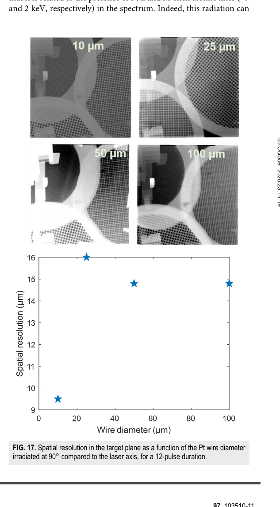

# 激光驱动 X 射线背光源：光谱、空间分辨率与靶几何的实验权衡

> Y. Benkadoum 等，*Review of Scientific Instruments* 97, 103510 (2026)，DOI：`10.1063/5.0323034`。以下基于 AIP 正式 version of record、`pdftotext -layout`、选定页渲染和图像核查。

## 一句话结论

LULI2000 的系统扫描表明，适合高分辨 X 射线照相的背光源不是“激光越强、靶越大越好”：接近焦斑直径的单根细丝、激光与细丝近 `90°` 入射、无 CH 承载膜，并把滤片贴近探测器，能较好兼顾光子数、单色性和约 `10–20 μm` 级空间分辨率；增大丝径或加入承载膜虽提高容错/产额，却会引入硬韧致辐射、多重源和模糊。

## 1. 实验范围

- 激光：LULI2000，波长 `1.053 μm`，靶上平均能量约 `50 J`，脉宽 `1.2–12 ps`，焦斑约 `10 μm`；计入约 `35%` 的耦合损失后，丝靶实际强度约 `2.5×10^18–2.5×10^19 W cm^-2`。
- 靶：Ti、Ni、Cu、Ag、Pt 细丝，以及 foil、paver、平面/ V 形 CH 承载几何；扫描丝径、材料、激光脉宽、入射角、焦点位置和滤片。
- 诊断：FSSR、LCS 线谱仪，15 层 imaging-plate / 滤片韧致辐射 canon，以及点投影网格照相。软 X 射线、硬线谱、宽带韧致辐射与成像分辨率被分开测量。
- 直接测量是谱线、imaging-plate 信号和照相图；GEANT4 响应、双 Maxwellian 拟合、PrismSPECT 温度解释和线扩散函数反演属于模型辅助。

## 2. 光谱与激光参数

软 X 射线段中，把脉宽从 `12 ps` 缩短到 `1.2 ps` 会把强度提高约一个数量级并出现 Lyα，但总光子数只增加约 `1.5–2` 倍；更高电离态与更强连续谱会损害单色性。Heα 组约占一半软 X 射线产额，典型为 `2–5×10^13` photons。Cu 的 K 壳总产额约 `2–3×10^13` photons，低于 Ti。

Ag 的 `22.1 keV` Kα 与 `24.9 keV` Kβ 线在 `1.2–12 ps` 和 `15–25 μm` 丝径范围内都存在，Kα/Kβ 约 `6.25`。这说明硬线谱对上述参数不如软段敏感，但不等于全谱或总剂量不变。

韧致辐射 canon 的信号不能唯一反演入射谱。作者假设

$$
S(E)=A_c\exp(-E/T_c)+A_h\exp(-E/T_h),
$$

将其与 GEANT4 响应卷积后拟合。典型两温结果约为 `T_c=14.4 keV`、`T_h=397 keV`；单温拟合约 `111 keV`。这些是给定谱形和响应下的特征温度，不是直接测得的电子分布，也不同于 PrismSPECT 推断的 `1.2–1.5 keV` bulk 温度。作者还明确指出软 X 射线再吸收和角分布不确定，因此双温参数宜视作模型相关、部分为下界。

## 3. 丝径—产额—分辨率的核心权衡

- **来源：** 正式 PDF Fig. 17；上方为不同 Pt 丝径的实测 radiograph，下方为靶面空间分辨率。
- **坐标与单位：** 横轴丝径 `10–100 μm`；纵轴空间分辨率（`μm`）。
- **趋势：** `10 μm` 丝的分辨率约 `9.5 μm`；`25 μm` 时约 `16 μm`，`50–100 μm` 数据约 `15 μm`。论文也承认大丝径后的非单调平台“数据有矛盾”，可能受 Pt 的 L/M 壳低能辐射、自吸收和局域硬 X 射线区影响。
- **物理意义：** 细丝把源区限制在焦斑/丝径尺度；粗丝提高命中容差和光子数，但热电子输运、再吸收和多能段贡献使“几何尺寸=源尺寸”的简单关系失效。
- **论证作用：** 支持“丝径应接近焦斑，而不是无条件增大”的设计准则。
- **限制：** 每个配置的 shot 数、逐发散布和系统误差没有在该图中完整展开；不能据这 4 个点宣称 `25–100 μm` 分辨率严格不依赖丝径。

Pt 结果还显示，总光子数随丝径增加；`10 μm` foil 的光子数约为 `10 μm` wire 的 5 倍、`100 μm` wire 的 2 倍，但 hot 分量增长更快，会增加韧致连续本底。材料原子序数从 Ti 增至 Pt 时，总光子数可增约 `4–5` 倍，hot 分量占比却可增近 `60` 倍，光谱纯度下降。

## 4. 几何与滤片

- 入射角从 `22.5°` 接近 `90°` 时分辨率改善；小角度同时扩大投影源并让热电子朝探测器方向传播，增加背景。
- 单根 Ag wire 的分辨率最接近源尺寸。加入平面 CH 后降为约 `25–30 μm`，V 形 CH 超过 `30 μm`，并出现双重/三重网格像，说明承载体生成了次级 X 射线源。
- 直接打 CH 时分辨率进一步恶化超过 `20%`。这一部分虽给出数值，作者要求按定性结果理解。
- 厚滤片会引入额外模糊；论文没有得到唯一机制解释，只给出工程建议：滤片尽量靠近探测面。

## 5. 与激光电子束转换靶问题的关系

这篇实验不是 LWFA 电子束打转换靶，也没有给出激光到目标能段的完整绝对转换效率。它的价值在于把背光源设计分解为可审计的四个量：`源尺寸、线谱/连续谱、光子数、几何/滤片模糊`。迁移到 GeV 电子束韧致辐射、光核或厚靶诊断时，还需另行处理电子束相空间、厚靶 shower、角分布、剂量、屏蔽和脉冲电磁噪声。

## 6. 证据边界

- **直接实验：** 多材料/丝径/脉宽/角度/承载几何下的谱和照相图。
- **模型辅助：** GEANT4 响应、双 Maxwellian、PrismSPECT、线扩散函数反演。
- **未完成：** 未见公开原始 shot 数据；数据需向作者申请。本地未运行 GEANT4/PrismSPECT，也未重做谱反演或空间分辨率拟合。
- **外推限制：** 作者认为趋势可指导 PETAL、LFEX、NIF-ARC，但这些装置能量更高、多束本底更强，必须重新标定滤片、探测器动态范围和次级源。
