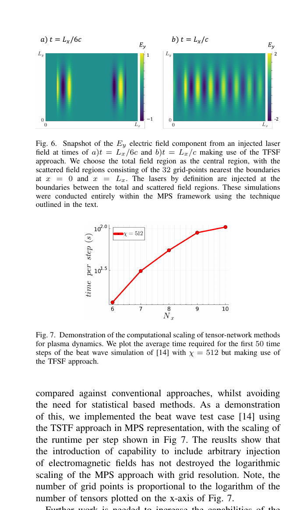

# 面向 PIC 的张量网络方法：任意位置电磁场注入

> Ryan J. J. Connor、Andrew J. Daley、Callum W. Duncan、Preetma Soin，arXiv:`2610.03254`（2026-10-02）。以下基于官方 arXiv v1 PDF、布局文本和全部 4 页渲染核查。

## 一句话结论

论文把 total-field / scattered-field（TFSF）边界注入写入 matrix-product-state（MPS）Vlasov–Maxwell 表示，演示两个对向激光场可在任意内部边界注入，且在所示 beat-wave 测试中没有破坏随编码网格位数的近对数运行时标度；但正文没有给出与成熟 PIC 的等精度 wall-clock、内存或物理误差闭合，因此只能视为算法能力原型。

## 1. 方法定位

PIC 用宏粒子推进—沉积—解场—插值循环近似 Vlasov–Maxwell，统计噪声与 self-heating 随粒子数/网格共同制约成本。张量网络直接压缩离散相空间分布 `f_s(x,v,t)`，希望在相关性可压缩时避免宏粒子噪声。

作者把每个相空间轴二进制化，并用 MPS 表示分布函数：

$$
f_s=\sum_{\{\alpha\}}M^{\sigma_1}_{\alpha_1}M^{\sigma_2}_{\alpha_1\alpha_2}\cdots M^{\sigma_N}_{\alpha_{N-1}}.
$$

bond dimension `χ` 控制保留相关性的能力与成本。此前 bump-on-tail 测试显示奇异值快速衰减；beat-wave 问题则需要高达 `χ=512` 才能让电流密度看不到明显截断误差，说明“可压缩性”依问题而变。

## 2. TFSF 注入

TFSF 将域分成 total-field 区和只含散射场的区域。激光在两区边界注入；靠近边界的有限差分要显式扣除已知入射场，从而避免把入射激光误计为散射场。作者用只在两个网格点非零的 MPS 修正算子实现该边界项，并指出同一构造可扩展到两个相向激光。

- **来源：** arXiv PDF Fig. 6–7。
- **上图：** `E_y` 在 `t=L_x/(6c)` 与 `t=L_x/c` 的快照，显示两侧注入波在 MPS 域内传播和叠加；色标是归一化场幅。
- **下图：** `χ=512`、beat-wave 前 50 步的平均每步时间随编码位数 `N_x` 增长；纵轴为 seconds/step，对数刻度。
- **论证作用：** 证明新增 TFSF 机制能在纯 MPS 表示内工作，且测试曲线仍与作者所称的网格分辨率对数标度相容。
- **限制：** 横轴是二进制编码位数，真实网格点数是 `2^{N_x}`；图中没有 PIC 等精度基线、误差棒、内存曲线或跨 `χ` 扫描，不能从该图推断普遍量子优势或 HPC 加速比。

## 3. 与 PIC 的关系

这不是“量子计算机运行 PIC”，而是经典硬件上的量子启发张量网络 Vlasov–Maxwell 原型。它可能在高维但低有效相关性的分布上压缩数据，并自然连接未来量子算法；若相空间发展出细尺度/高纠缠结构，`χ` 必须增大，优势可能消失。

## 4. 证据边界

- **新贡献：** 任意位置电磁场注入的 TFSF–MPS 构造与传播演示。
- **复用证据：** bump-on-tail、beat-wave 的主要物理验证来自前序工作；本文更多是方法进展/会议式短稿。
- **未证明：** 真实激光—等离子体加速、离子/碰撞/QED、3D 大规模算例、守恒量、长期稳定性、相同误差下对 WarpX/EPOCH 等 PIC 的速度与内存优势。
- **本地边界：** 未运行张量网络代码或 PIC 对照；所有“对数标度”口径仅限作者图示范围。
