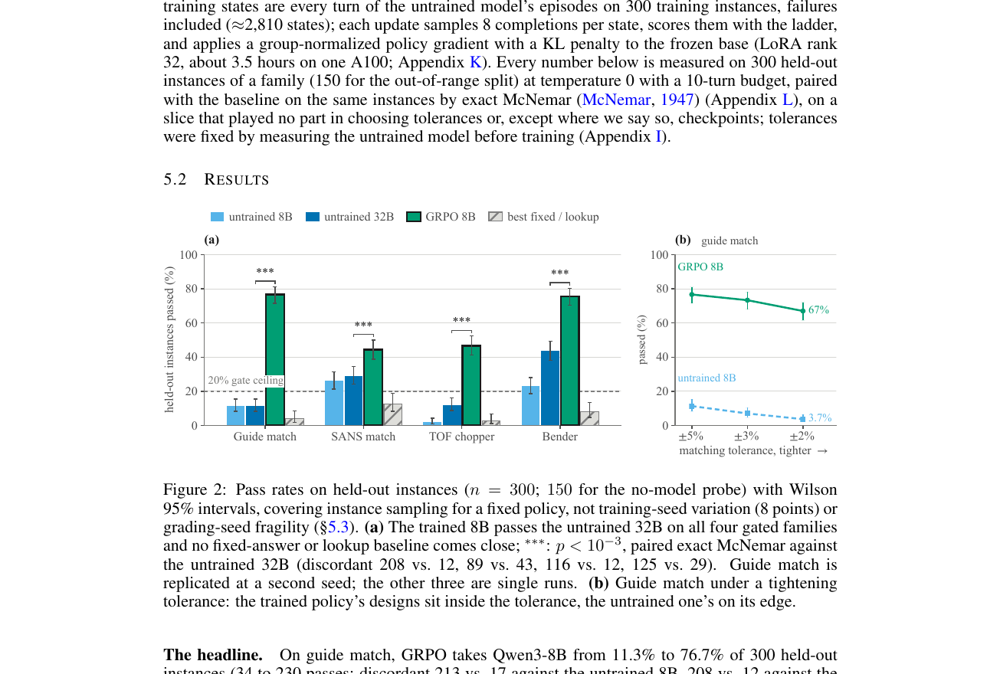

# NeutronGym：用可执行中子光学与物理分级评测 LLM 仪器设计

> Lijie Ding、Changwoo Do，arXiv:`2610.03631`（2026-10-02）。以下基于官方 arXiv v1 PDF、布局文本、选定页渲染和图表核查。

## 一句话结论

NeutronGym 用 McStas 对 LLM 生成的中子仪器做语法、运行、结构和物理四级可执行评分；在固定布局的少参数任务上，GRPO 把 Qwen3‑8B 的 held-out guide-match 通过率从 `11.3%` 提到 `76.7%`，但 16 题真实仪器基准太小、训练大多只有单 seed、几何固定且模拟理想化，因此这不是自主中子装置设计或实验验证。

## 1. 环境与评分梯度

代理不能直接写文件或运行 shell，只能通过 22 个受控工具构建 McStasScript 仪器并运行 McStas。评分梯度从低到高包括：

1. 任务是否完成；
2. 文件是否可编译；
3. 组件顺序/参数/monitor 角色是否符合规范；
4. 物理输出是否满足束斑、发散、波长分布或透过率目标。

作者还用 no-model 固定动作、读取 prompt 数字的规则、跨实例拷贝和手写物理反演来找 reward shortcut。若固定/查表基线能轻易通过，任务族不得进入训练评测。这一点比单纯“LLM judge”更适合物理设计，但只能排除已测试的 shortcut 类。

## 2. McStasBench 的真实仪器复现

McStasBench 含 16 个任务、12 个 seen 和 2 个 held-out 仪器，每个模型/任务只跑 1 episode。7 个模型中最好结果一轮通过 7/16，迭代 loop 通过 5/16；没有模型完成 improvement tier。样本太小，作者没有把模型/脚手架差异当作稳定排名，并指出 held-out 两台仪器比 seen 中位任务更简单。

## 3. 程序化任务与强化学习

训练族只调固定布局中的 2–3 个连续参数，例如 guide 出口尺寸/镀层、SANS 准直、TOF chopper 频率/相位/开口和 bender 参数。headline guide-match 要在 `±5%` 内复现隐藏设计的束斑与发散。

训练使用约 300 个实例、约 2810 个状态，GRPO 每状态采样 8 个 completion，LoRA rank 32，约在单张 A100 上训练 `3.5 h`；评测为 300 个 held-out 实例、temperature 0、10-turn budget。

- **来源：** arXiv PDF Fig. 2。
- **左图：** 4 个任务族的 held-out 通过率（%）；柱为 untrained 8B、untrained 32B、GRPO 8B 和最佳 fixed/lookup 基线；误差棒是固定策略下实例采样的 Wilson 95% 区间。
- **右图：** guide-match 容差从 `±5%` 收紧到 `±2%`；训练模型仍约 `67%`，未训练 8B 降到 `3.7%`。
- **定量结果：** guide-match 从 `34/300=11.3%` 升到 `230/300=76.7%`；第二训练 seed 为 `69.0%`，两 seed 本身有显著差异。物理公式初始化后、同预算坐标下降为 `81.0%`，与 `76.7%` 在当前样本下不分离；frontier 模型在前 100 例为 `98–99%`。
- **关键消融：** 去掉分级 reward、只保留 pass/fail 后降到 `16.7%`，说明 dense partial credit 在这组训练中是必要但不充分条件。

## 4. 作者主动暴露的失败

- 原 guide 任务曾把 binding limits 直接写进 prompt，简单复制规则即可通过 `96.3%`；该任务被废弃。
- 多任务训练对 seed 不稳定，同一配置的 TOF 通过率可从 `55.0%` 崩到 `2.3%`。
- 重新用 3 个随机 seed 评估 230 个通过设计时，只有 `80%` 在所有 seed 都保持通过，约 `5%` 三次都失败，说明阈值边缘受 Monte Carlo 随机性影响。
- imitation learning 把 `40.3%` 降到 `31.3%`，表明只模仿自身成功轨迹会在新状态形成错误动作偏置。

## 5. 对中子/核诊断自动化的意义

NeutronGym 提供的是“固定拓扑、可执行模拟、可验证 reward”的代理训练场，可用于研究中子导管、准直、chopper 与小角散射仪参数调节。它没有覆盖：探测器电子学、γ/中子脉冲形状判别、屏蔽、源项不确定度、机械公差、辐射损伤、真实设施调试或拓扑生成。因此不能把通过率写成“LLM 已能独立设计中子仪器”。

## 6. 证据边界

- **数值/软件实验：** McStas 理想化 ray tracing、固定 seed/预算的 agent 与 RL 评测。
- **不是实验：** 没有制造仪器或束线上机验证。
- **统计限制：** benchmark 仅 16 题单 episode；4 个 RL 家族中 3 个只有单训练 seed，Wilson 区间不含训练 seed 方差。
- **可复现性：** 作者声明发布环境、任务、episode 证据和 LoRA checksums；本地未运行 McStas、GRPO 或复核代码生成结果。
