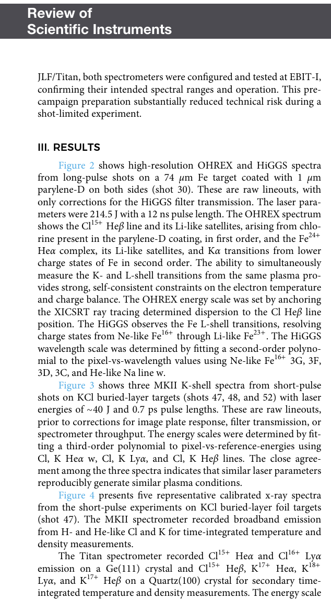

# Titan 二倍频短脉冲激光的热致密等离子体 X 射线谱平台

> A. J. Fairchild 等，*Review of Scientific Instruments* 97, 103506 (2026)，DOI：`10.1063/5.0350551`。以下基于 AIP 正式 version of record、布局文本和选定页渲染核查。

## 一句话结论

LLNL 在升级后的 Titan `2ω` 短脉冲线上首次用 5 台时间积分谱仪获取埋层 KCl 靶的多通道 K 壳谱；与 Orion 历史谱和 MERL 线形的初步比较与 `T_e≈1 keV、n_e≈10^23 cm^-3` 相容，但这些温度/密度仍是模型依赖的初步推断，尚不是带完整不确定度的基准测量。

## 1. 平台与诊断

- Titan `2ω`：`527 nm`，短脉冲约 `0.7–20 ps`，能量最高 `50 J`；首轮短脉冲 shots 46–52 的能量约 `20–50 J`。
- 靶：KCl 埋层 foil（KCl 约 `0.15 μm`，两侧 parylene-N）；长脉冲参考还使用带 parylene-D 的 Fe foil。
- 5 台时间积分谱仪覆盖 7 个谱道：MKII、Titan、OHREX、HiGGS、STOHREX，分别提供 K 壳/L 壳、温度、密度和电荷态信息。
- 光谱强度用 image plate 响应、滤片透过率、晶体反射率和收集立体角标定；论文同时说明多个绝对标定仍将在后续独立复核。

## 2. 直接结果

相近激光参数下的三发 KCl 短脉冲 MKII 原始线形高度一致，支持平台可重复地产生相似状态。shot 47 的校准谱同时观测到 Cl、K 的 H-like / He-like 发射及 Cl Heβ 精细结构；多条独立跃迁为温度、电离平衡和密度提供交叉约束。

- **来源：** 正式 PDF Fig. 5–6。
- **坐标与单位：** 横轴能量 `3220–3300 eV`；纵轴为按晶体立体角标定的 `J keV^-1 sr^-1`。
- **上图趋势：** JLF/Titan shot 47 与 AWE/Orion shot 10142 的 Cl Heβ 形状接近，但 Orion 曲线被任意缩放到相同强度，因此只能比较线形，不能比较绝对产额。
- **下图趋势：** MERL 计算采用 `T_e=1100 eV`、`n_e=3.16×10^23 cm^-3`，对主线宽与总体轮廓有初步一致性，但局部卫星线/肩部并非完全闭合。
- **物理意义：** Stark 展宽、密度依赖线移和 Li-like 卫星线可共同约束近固体密度原子物理。
- **限制：** MERL 曲线是选定参数下的比较，不是完整后验拟合；时间积分谱把空间/时间温度梯度混合在一起。

## 3. 温度和密度口径

作者根据 MKII 的电离平衡、短脉冲谱中 Li-like 卫星线变弱、Orion 对比和 MERL 线形，给出峰值 `T_e` 可达约 `1 keV`、`n_e` 约 `10^23 cm^-3`。这组数值应读作“多条谱学证据与该状态相容”，不能写成独立、直接的温度计和密度计已经给出同一结果。

未来基准化需要：

1. X 射线 pinhole 测量发光体积；
2. shot 间焦斑实测与 deformable mirror 优化；
3. image plate/scanner 和晶体反射率独立标定；
4. 在前向模型中加入时间积分下的温度梯度；
5. 用 Heα/Lyα、DR 卫星/共振线、Stark 展宽和线移做真正联合约束。

## 4. 科学价值

高密度下的 Stark 展宽、电离势降低、密度依赖线移和 dielectronic-recombination suppression 会影响 HEDP 与天体吸积盘的谱解释。Titan 平台的价值是把同一埋层靶上的宽带、电荷态和高分辨线形并列记录，为模型组件级验证创造条件；本论文仍是 commissioning / 首轮平台结果，而非最终原子物理基准数据集。

## 5. 证据边界

- **直接实验：** 多谱仪时间积分光谱、相似参数三发重复性、谱线位置与标定后强度。
- **模型/历史对照：** MERL 线形、Orion 历史谱、温度/密度解释。
- **限制：** Orion 数据被任意缩放；当前没有发光体积、完整 shot-to-shot 误差和严格联合拟合。数据需向作者申请。
- **本地边界：** 未运行 MERL、原子动力学或谱线拟合，未重算响应函数；本地工作限于正式全文、图表和数值口径核查。
