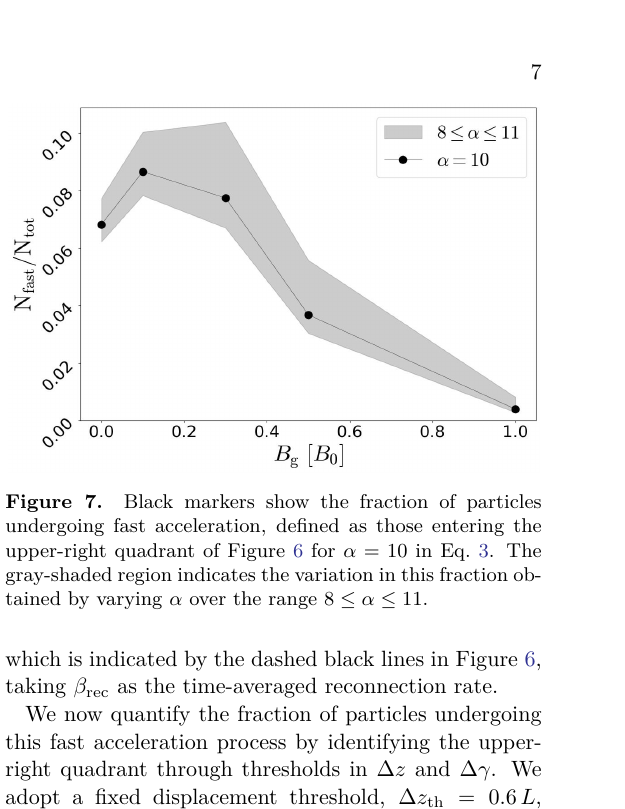

# 三维相对论磁重联中导引场对快速粒子加速的影响

> Despina Karavola、Lorenzo Sironi、Maria Petropoulou，arXiv:`2610.03427`（2026-10-02）。以下基于官方 arXiv v1 PDF、布局文本、选定页渲染和图像核查。

## 一句话结论

在 `σ=10` 的电子—正电子 Harris 层 3D PIC 中，沿重联电场方向的“逃逸—自由加速”通道在 `B_g/B_0=0–1` 都存在，但参与粒子比例随导引场增强从约百分之几到接近零，重联率下降、谱变陡、最大 Lorentz 因子降低；这个通道在对应 2D 模拟中缺失。

## 1. 数值设计

- 代码：TRISTAN-MP；电子—正电子等离子体，磁化参数 `σ=B_0^2/(4πn_0mc^2)=10`。
- 导引场：`B_g/B_0={0,0.1,0.3,0.5,1.0}`。
- 3D 每格平均 2 个宏粒子（两物种合计），2D 每格 32 个；skin depth `c/ω_p` 用 2.5 格解析。
- `x` 方向采用开放 outflow，`y` 方向移动注入器持续补充上游等离子体和磁通，`z` 方向周期；3D 尺寸 `L_x=4000` 格、`L_z=2040` 格。
- 每组追踪 `10^5` 个曾达到 `γ≥σ` 的粒子；作者比较同参数 2D/3D，以识别真正的三维机制。

这些设置用于建立准稳态并减少周期盒回流，但只覆盖一组磁化度、pair plasma 和有限盒长，不能直接代替电子—离子实验条件。

## 2. 导引场怎样改变重联和能谱

导引场增强后，下游结构由强烈三维 corrugation / 多细通量管转向数量更少、截面更大的结构。2D 与 3D 中重联率都降低；同一 `B_g` 下 3D 率系统性低于 2D。高能粒子谱在两种维数中都随导引场变陡、cutoff 下降，但 2D 会系统性低估高能尾，说明高能端受三维逃逸通道影响。

自由加速的近极限尺度写成

$$
\dot\gamma_{\rm acc}\sim \beta_{\rm rec}\,\omega_c,
$$

即粒子离开重联下游后沿大尺度上游电场获得能量。论文用 `Δz` 与 `Δγ` 的相关性识别该通道；它在 3D 的右上象限出现，在 2D 没有对应群体。

## 3. 关键图：快加速粒子比例

- **来源：** arXiv PDF Fig. 7。
- **坐标：** 横轴 `B_g/B_0`；纵轴快速加速粒子数占追踪样本比例 `N_fast/N_tot`。
- **定义：** 黑点采用阈值参数 `α=10`，灰带把 `α` 在 `8–11` 扫描；快速粒子需同时跨过 `Δz` 与 `Δγ` 阈值。
- **趋势：** 比例在弱导引场 `B_g≈0.1B_0` 附近约 `0.09`，到 `0.5B_0` 约 `0.04`，到 `B_g=B_0` 接近 `0.01`。
- **物理意义：** 通道并未在强导引场突然消失，而是参与者连续减少；这解释了高能尾变陡与 cutoff 下移。
- **限制：** 纵轴依赖粒子筛选、轨道输出 cadence 与阈值；灰带量化了部分阈值敏感性，但不是完整数值收敛误差。

## 4. 俯仰角与可观测量

导引场增强使高能正电子更沿局域磁场正向、电子更沿反向，分布各向异性增强。弱导引场下，最高能群体因自由相位而偏向 `|cos α'|≈0`；随着 `B_g` 增大，这一特征减弱。作者提出该各向异性可能影响同步辐射/重联辐射的偏振，但本文没有计算具体 Stokes 参数或观测预测。

## 5. 证据边界

- **已完成：** 作者 2D/3D PIC 数值对照、开放边界准稳态、粒子轨道统计和阈值扫描。
- **不是实验：** 没有激光等离子体、天体源或辐射测量。
- **模型限制：** pair plasma、`σ=10`、单一热分布/边界族；3D 每格 2 粒子的高能尾与噪声仍需更系统收敛。论文引用此前更多粒子测试，但本轮未本地复现。
- **未完成：** 强导引场轨道族统计、谱指数生成机制和偏振预言留待后续。
