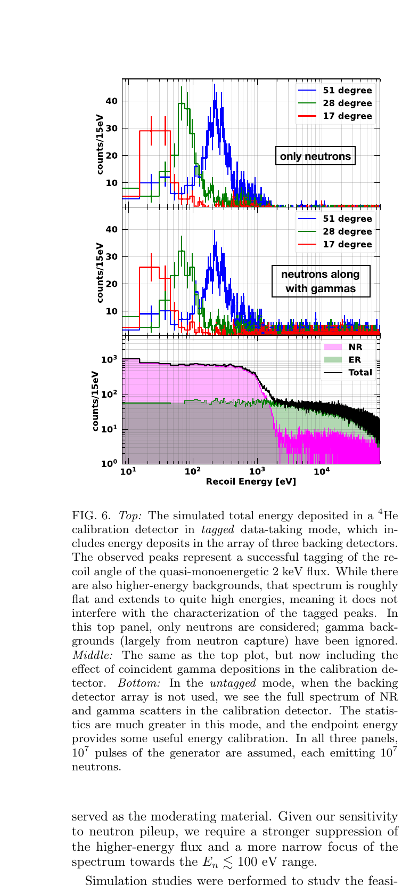

# 脉冲准单能 2 keV 中子源的低阈值探测器标定设计

> L. Chaplinsky 等，APS *Physical Review D* accepted paper，DOI `10.1103/fqgp-916r`；APS 页面标注 2026-10-06 accepted，Crossref 同日注册 published-online 元数据，但 APS harvest 尚无排版版全文。本地核读文本为同作品 arXiv:`2410.14722v1` 作者预印本（2024-10-15），不是 VOR。以下基于该 PDF、布局文本、4 个抽样渲染页与图表核查。

## 一句话结论

作者用 GEANT4 设计“14.1 MeV DT 脉冲源 → Pb/Al–AlF₃/Ti 逐级慢化 → Sc 反共振选出 2 keV → 复合屏蔽与角度后探测器”的标定链；模拟显示在 `10^7` 个脉冲、每脉冲 `10^7` 中子的预算下，可在 `⁴He` 中分辨低至约 `10 eV` 的带角度标签反冲峰，但装置、绝对通量、材料容差和本底尚未由整机实验闭合。

## 1. 源—慢化—滤波链

- 商用 DT 发生器给出约 `14.1 MeV` 脉冲中子；Pb 既慢化又利用 `(n,2n)` 增殖，把谱推向约 MeV。
- `Al–AlF₃` 借互补共振把谱压到约 `30 keV` 以下，Ti 衔接到 `O(10 keV)`，Sc 在 `2 keV` 处约有 `30 cm` 平均自由程，形成准单能窗口。
- 几何扫描定义 `1–3 keV` 出射中子占比为谱纯度，最优折中约 `50%`；采用 `25 cm` Pb、`40 cm` 长且 `50 cm` 宽的 Al–AlF₃、`7 cm` Ti，以及约 `1 kg`、直径 `3.5 cm`、长度 `30 cm` 的 Sc。
- 背景设计交替使用高密度混凝土、HDPE、含硼聚乙烯与 Pb；Sc/准直孔故意偏转 `10°` 以降低直通本底。角度后探测器模拟/原型指标为约 `27%` 的 2 keV 捕获效率和 `17 μs` 平均捕获时间。

## 2. 图 6：带标签反冲峰与 γ 本底

- **来源：** 同作品 arXiv 作者预印本 Fig. 6。
- **横轴：** `⁴He` 标定探测器反冲能量，单位 `eV`、对数刻度。
- **纵轴：** 每 `15 eV` 能箱计数；上、中央为线性刻度，下图为对数刻度。
- **上图：** 仅中子，三条颜色对应 `17°/28°/51°` 后探测器角度；峰位随散射角变化，证明角度标签能够把 2 keV 入射谱投影为离散核反冲能量。
- **中央图：** 加入俘获 γ 后峰仍存在但连续本底升高；γ 更主要损失峰内统计，而不是把峰整体平移。
- **下图：** 不用后探测器的非标签模式，核反冲 `NR` 与电子反冲 `ER` 叠加，只能依靠端点和统计谱形。
- **论证作用与限制：** 图直接支撑“模拟中可见标定峰”，但计数来自两阶段增权的 `10^14` 初级中子等效统计，不是实测谱；核数据、材料缝隙、脉冲堆积和慢探测器响应的不确定度没有完整传播。

## 3. 可迁移价值

该工作与激光驱动中子源不共享源时间结构、能谱或 EMP 环境，但慢化—滤波—屏蔽—符合标签的设计逻辑可用于低能核反冲标定。论文还提出用 `≤100 eV` 宽谱中子和约 `2 m` 飞行距离做 TOF：`10 eV` 和 `1 eV` 中子的飞行时间约为 `46 μs` 和 `145 μs`，这仍只是后续概念研究。

## 4. 证据边界

- **作者证据：** GEANT4 几何/核输运模拟、有限 MCNP 对照引述，以及部分材料/后探测器原型背景。
- **未完成：** 完整源、滤波器、屏蔽城堡、低阈探测器和后探测器的端到端建造与束流标定。
- **外推边界：** 论文称 `⁴He` 约 `25 eV` 峰对应 Ge 约 `1.3 eV`，这是质量运动学缩放，不等同于 Ge 探测器已达到该阈值或完成系统标定。
- **本地边界：** 未运行 GEANT4/MCNP、未复算本底与增权；本地只核验作者预印本及 APS/Crossref 正式状态。
