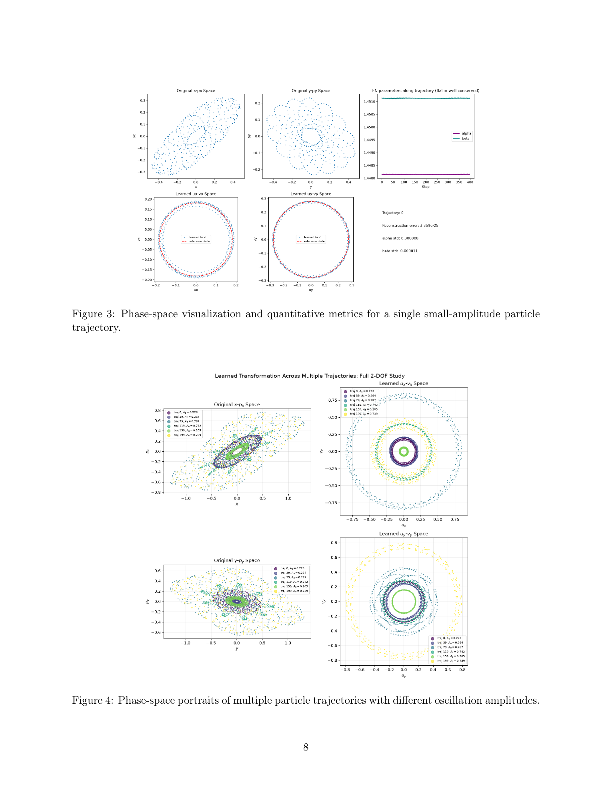

# 用辛神经网络学习加速器非线性映射的正规形

> Leo He、Yue Hao，arXiv:`2610.05635v1`（2026-10-05）。以下基于官方 arXiv PDF、布局文本、5 个抽样渲染页及图 2–4 核查；MinerU 公开 URL 任务失败，故使用本地全文回退。

## 一句话结论

作者让可逆 SympNet 学习四维非线性映射到近似作用量—角变量的坐标变换，再用网络预测振幅相关相移；在 McMillan 型玩具映射的小—中振幅轨道上，相移沿轨道的标准差约 `1–4×10^-5 rad`，但大振幅轨道仍显著畸变，完整映射只近似辛且尚未测试真实储存环晶格或长期速度优势。

## 1. 训练设置与结构

- 数据来自四维 McMillan 型映射：`200` 条轨道、每条 `400` 圈，初始振幅在每个横向平面均匀取自 `[0.05,0.70]`，随机种子 `1234`，`float64`。
- 编码器 `U^-1` 与解码器 `U` 为可逆 SympNet；潜空间采用两个二维旋转块，另一个网络 `F_N` 给出振幅相关的水平/垂直相移。
- 两阶段训练先拟合一步映射和相移稳定性，再提高作用量守恒损失权重。编码器/解码器本身严格辛，但因为 `F_N` 从完整状态而非纯作用量计算相移，合成映射只近似辛。

## 2. 图 3–4：从原始相空间到近圆轨道

- **来源：** arXiv PDF Fig. 3–4。
- **Fig. 3 坐标：** 上排是原始 `(x,p_x)`、`(y,p_y)` 与相移参数随圈数变化；下排是学习后的 `(u_x,v_x)`、`(u_y,v_y)`，红虚线为参考圆。
- **Fig. 3 趋势：** 小振幅轨道在潜空间接近圆，相移随 `400` 步近乎水平；图中近机器精度的重构误差主要证明网络可逆，不等同于正确恢复正规形。
- **Fig. 4 坐标：** 左列原始相空间、右列学习后相空间，颜色区分不同初始振幅；轴均为模型归一化坐标。
- **Fig. 4 趋势：** 小—中振幅轨道明显圆化；最大振幅轨道仍呈宽散、非凸结构。图支持“局部近似正规形”，也直接暴露了适用范围。
- **限制：** 没有物理单位、磁元件误差或真实束流观测；大振幅退化究竟是网络表示、训练覆盖还是动力学不可积，论文没有区分。

## 3. 证据边界

- **作者证据：** 单个可积/近可积 McMillan 型映射上的离线训练与相空间可视化。
- **未证明：** 真实磁格、多误差源、共振交叉、动态孔径边界、噪声测量、不同随机种子和跨晶格泛化。
- **性能边界：** 没有同精度的常规正规形算法、长期追踪器或 wall-clock/GPU 成本对照，不能从“网络代理”直接推出生产加速。
- **本地边界：** 未运行训练代码或验证辛条件；本地仅核查论文数据规模、图和作者报告的相移稳定度。
