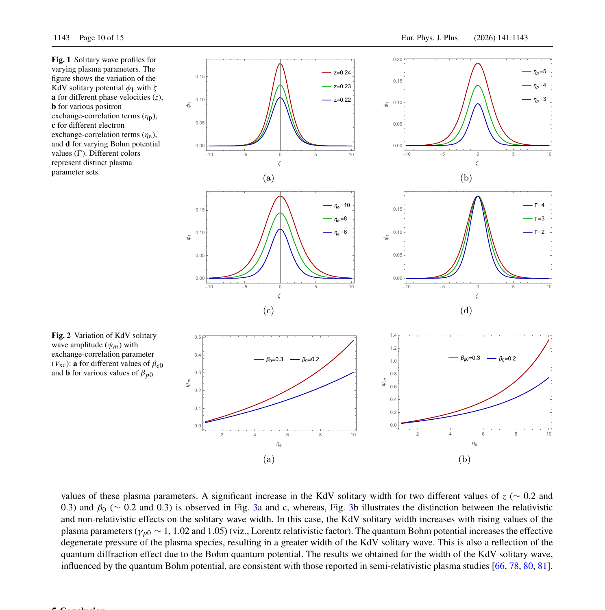

# 相对论量子对等离子体中的非线性孤波

> Asif Imran、Md Rasel Hossen、Sonia Akter Ema、Mubtasim Fuad、A. A. Mamun，*The European Physical Journal Plus* 141, 1143（2026），DOI `10.1140/epjp/s13360-026-08377-y`，正式 version of record。以下基于 Springer PDF、布局文本、4 个抽样渲染页和图 1–3 核查；MinerU 公开 URL 任务失败，故使用本地全文回退。

## 一句话结论

作者在相对论简并电子—正电子—静止离子流体中同时加入 Bohm 势与交换—关联势，并在弱非线性 KdV 近似下发现：交换—关联项同时改变孤波幅度和宽度，Bohm 项主要增宽孤波；但这只是参数化量子流体理论，不是对白矮星、激光固体密度等离子体或强场 QED 实验的定量预测。

## 1. 模型与问题

体系为无磁、无碰撞的简并电子—正电子等离子体，离子固定并只维持准中性。作者在 Lorentz 因子依赖的连续性、动量与 Poisson 方程中加入

$$
V_B\propto-\frac{\partial_x^2\sqrt{\gamma n}}{\sqrt{\gamma n}},\qquad
V_{xc}=-\mu(\gamma n)^{1/3}+\theta(\gamma n)^{2/3},
$$

再用约化摄动法导出 KdV 方程。参考密度为 `n_e0=10^30 cm^-3`、`n_p0=5×10^29 cm^-3`，对应作者估计的简并参数 `x_F≈1.2`；其余 Lorentz 因子、流速、相速和量子参数是在该参考态上的受控扫描，并未同某个具体天体或实验反演匹配。

## 2. 参数趋势

- 归一化相速 `z` 从 `0.22` 增至 `0.24` 时，峰值归一化电势约从 `0.10` 增至 `0.18`。
- 正电子交换—关联参数 `η_p=3→5` 时，峰值约从 `0.09` 增至 `0.19`；电子参数 `η_e=6→10` 时约从 `0.11` 增至 `0.18`。
- Bohm 参数 `Γ=2→4` 主要改变曲线宽度，峰值近似不变；作者据此把 Bohm 项归到色散系数，把交换—关联项同时归到非线性与色散系数。

## 3. 图 1–2：孤波剖面与幅度扫描

- **来源：** 正式 PDF Fig. 1–2。
- **Fig. 1 坐标：** 横轴为归一化共动坐标 `ζ`，纵轴为一阶归一化势 `φ₁`；四个子图分别改变相速 `z`、正电子/电子交换—关联参数 `η_p/η_e` 和 Bohm 参数 `Γ`。
- **Fig. 2 坐标：** 横轴为 `η_e` 或 `η_p`，纵轴为 KdV 孤波幅度 `ψ_m`；红/蓝曲线比较 `β_0=0.3/0.2`。
- **趋势与物理意义：** `η_e/η_p` 增大时幅度非线性上升；`Γ` 主要拉宽曲线。图组支持“相关项影响幅度、Bohm 项影响色散宽度”的内部模型结论。
- **限制：** 轴均为归一化量，没有映射到观测长度、电场或时间；参数不是独立的实验误差条，也没有数值误差、稳定性或模型间比较。

## 4. 证据边界

- **作者证据：** 解析推导加 KdV 解的数值参数扫描。
- **近似：** 弱非线性、长波、无磁、无碰撞、静止离子、单一简并状态；没有温度、组分、磁场、碰撞、辐射或对产生反馈。
- **未证明：** 大振幅孤波稳定性、白矮星中的可观测信号、激光产生对等离子体中的实验可达性，以及与动理学/PIC 或完整相对论量子流体计算的一致性。
- **本地边界：** 未复算系数或参数扫描；本地仅验证正式全文、公式、图与作者报告的趋势。
