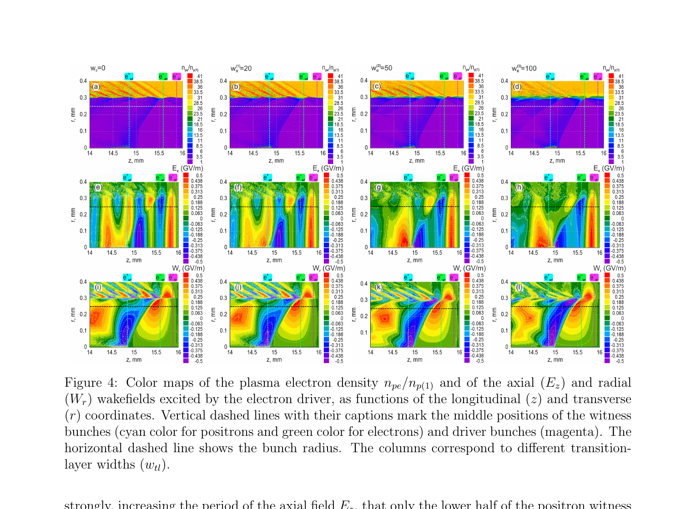

# 分层等离子体波导过渡层对尾场加速的影响

> Peter Markov、Kostyantyn Galaydych、Gennadiy Sotnikov，arXiv:`2610.06396v1`（2026-10-05）。以下基于官方 arXiv PDF、布局文本、6 个抽样渲染页和关键图核查；MinerU 公开 URL 任务失败，故使用本地全文回退。

## 一句话结论

二维轴对称（2.5D）PIC 表明：当高密度近壁管状等离子体与低密度轴上等离子体之间的平滑过渡层厚于管状等离子体皮肤深度时，轴向尾场周期被拉长，固定相位注入的正电子束失配；`100 μm` 过渡层可让其能量增益降低 `3.14×`，但重新优化管状密度或注入延时与轴上密度可补偿，结论尚未经过三维、实验或独立代码验证。

## 1. 基线与扫描

作者使用自研 SOM 2.5D PIC：波导长 `16 mm`、半径 `600 μm`，轴上等离子体半径 `300 μm`；轴上/管状密度分别为 `4.93×10^14` 与 `1.53×10^16 cm^-3`。驱动电子束和见证正/电子束均为 `5 GeV`，电荷分别为 `−2 nC` 与 `±0.2 nC`，束半径 `250 μm`。

过渡层厚度扫描为 `20/50/100 μm`；管状等离子体皮肤深度约 `42.961 μm`。固定原始参数时，正电子平均能量增益在 `50 μm` 和 `100 μm` 情况下分别降低 `1.23×` 和 `3.14×`，电子束变化约小两个数量级，因为电子见证束注入延时更短、相位失配弱。

## 2. 图 4：密度、轴向场与径向场

- **来源：** arXiv PDF Fig. 4。
- **坐标：** 横轴 `z`、纵轴 `r`，单位均为 `mm`；四列为过渡层厚度 `0/20/50/100 μm`。
- **第一行：** 电子密度 `n_pe/n_p(1)`，无量纲；显示厚过渡层内高密度管状等离子体向轴区平滑下降。
- **第二行：** 轴向场 `E_z`，单位 `GV/m`；厚度增大后相位被拉长，`100 μm` 时正电子束截面的上半部落入减速相位。
- **第三行：** 径向尾场 `W_r=E_r−βH_φ`，单位 `GV/m`；总体聚焦相位仍在，但正电子附近出现更强非线性结构。
- **虚线标记：** 青/绿/品红分别为正电子、电子见证束与驱动束中心，水平虚线为束半径。
- **论证作用与限制：** 图把能量下降定位为纵向相位失配而非简单径向失焦；它是单一时刻、单一密度过渡函数的模拟快照，不能单独证明制造公差鲁棒性。

## 3. 补偿方案

- **方案 I：** 优化管状等离子体密度。对 `20/50/100 μm`，最优值分别为 `1.49/1.88/6.41×10^16 cm^-3`。
- **方案 II：** 延迟正电子注入并降低轴上密度。对应延时为 `3.679/3.858/4.352 ps`，轴上密度为 `4.80/4.37/3.43×10^14 cm^-3`。
- 两种方案都在作者同一代码/同一几何内恢复更高正电子增益；尚无误差条、收敛阶或参数联合不确定度。

## 4. 证据边界

- **作者证据：** 冷等离子体、轴对称 2.5D PIC 参数扫描。
- **未证明：** 三维不对称、碰撞/电离演化、真实放电形成的密度测量、束流抖动、能散/发射度保持、波导壁材料与端部效应。
- **代码边界：** 未展示与另一成熟 PIC 代码的同输入交叉验证，也未给出粒子数/网格/步长收敛。
- **本地边界：** 未运行 SOM 或复算优化；本地仅核查作者 PDF、表格、场图和报告数值。
