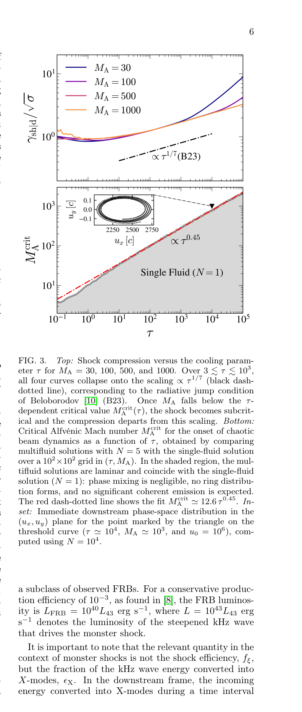

# 中子星磁层相对论磁化激波中的辐射反作用

> Arno Vanthieghem、Amir Levinson，arXiv:`2610.05386v1`（2026-10-04）。以下基于官方 arXiv PDF、布局文本、5 个抽样渲染页及图 1–11 核查；MinerU 公开 URL 任务失败，故使用本地全文回退。

## 一句话结论

作者把 Landau–Lifshitz 辐射反作用加入多流体激波模型，并用一维 Entity PIC 扫描冷却强度；得到相干 X 模前驱波的混沌阈值 `M_A^crit≈2+12.6τ^0.45`，强冷却使峰频率按 `τ^(2/7)` 上移而非必然熄灭。映射到 magnetar “monster shock” 后得到的 FRB 产额与频率仍是强模型依赖的天体外推，不是观测闭合。

## 1. 两个控制参数

多流体模型把对等离子体表示为 `2N` 条冷束，控制量为 Alfvén Mach 数 `M_A` 和每个回旋周期的无量纲冷却参数 `τ`。冷却增强时孤立激波结构振幅下降、相干性提高、波长缩短；只有形成局域环形速度分布并进入混沌束流区，才具备驱动同步加速器脉泽/X 模相干辐射的必要条件。

## 2. 图 3：冷却标度与相干辐射阈值

- **来源：** arXiv PDF Fig. 3。
- **上图坐标：** 横轴冷却参数 `τ`（对数），纵轴下游激波 Lorentz 因子归一化 `γ_sh|d/√σ`；颜色为 `M_A=30/100/500/1000`。
- **上图趋势：** 在约 `3≲τ≲10^3` 内，不同 `M_A` 曲线接近 `τ^(1/7)` 标度；进入亚临界区后偏离。
- **下图坐标：** 横轴 `τ`、纵轴临界 Alfvén Mach 数 `M_A^crit`，均为对数；灰区为层流/亚临界解。
- **下图趋势：** 多流体网格扫描给出 `M_A^crit≈12.6τ^0.45` 的主标度，作者在总拟合中加入低 `τ` 偏置得到约 `2+12.6τ^0.45`。超过阈值才出现显著相混合和环分布。
- **论证作用与限制：** 图把“冷却强”与“辐射是否存在”分离为二维条件；阈值来自一维、冷对等离子体和特定辐射力模型，不能直接当作实际 magnetar 的测量界线。

## 3. PIC 与天体外推

- 一维 PIC 覆盖约五个数量级冷却强度，支持峰频率随 `τ^(2/7)` 上移及接近阈值时谱变窄；X 模发射效率随参数非单调。
- 对 monster shock，作者估计耗散区内 `M_A/M_A^crit~10^3`，因此强冷却仍不熄灭前驱波；把 kHz 驱动波能量转成 X 模的效率估为 `10^-3–10^-2`。
- 论文还观察到中等冷却时前驱波可使上游减速，从而反过来改变 `τ`，说明弱耦合解析标度尚未完全自洽。

## 4. 证据边界

- **作者数值证据：** 广义稳态多流体模型与一维 Entity PIC；不是二维/三维磁层模拟，也不是 FRB 数据拟合。
- **关键开放项：** 波离开耗散区后的传播/逃逸、相干 X 模的微观产生机制、前驱波与上游的强非线性耦合、角分布和多维不稳定性。
- **物理范围：** 冷、对称电子—正电子等离子体；不能直接替代离子成分、对产生、磁层几何与辐射转移。
- **本地边界：** 未运行 Entity 或复算标度；本地只核查作者公式、图、模拟参数与结论限定。
