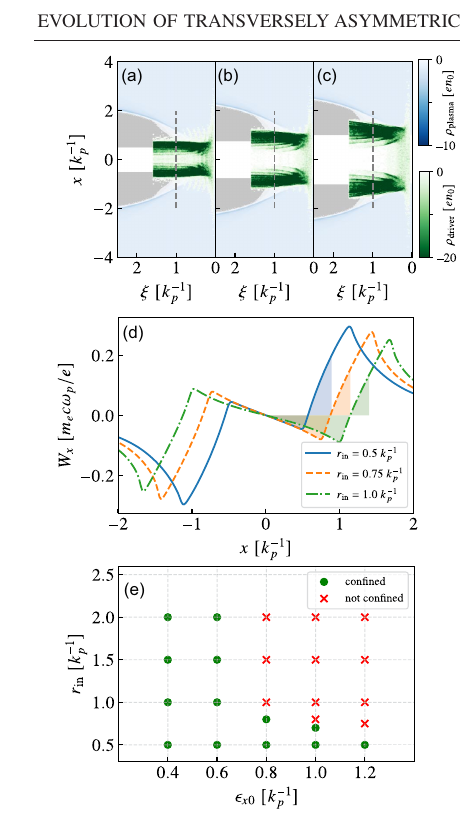

# 空心等离子体通道中横向非对称电子束的演化

> Siqin Ding、Shiyu Zhou、Fei Li、Jianfei Hua、Wei Lu，*Physical Review Accelerators and Beams* 29, 103601（2026），DOI `10.1103/13fz-y5wy`，正式 version of record。以下基于出版社 PDF、布局文本及关键页渲染核读。

## 一句话结论

三维准静态 PIC 表明，非对称电子驱动束在空心等离子体通道中会因“横向发射度与束宽不匹配导致四极场极性翻转”或“横向动能过大导致电子持续穿墙”而失去准稳态尾场；作者给出可用的参数窗，并显示只有准稳态区能把正电子投影发射度增长限制在初始跃升后饱和，但该结论尚无实验或独立代码闭合。

## 1. 模型与参数

- 使用 QuickPIC 的 fully 3D quasi-static PIC；背景密度 `n0 = 5×10^16 cm^-3`，对应 `k_p^-1 = 23.67 μm`。
- 基准空心通道内、外半径为 `r_in = 1 k_p^-1`、`r_out = 4.5 k_p^-1`；电子驱动束能量 `10 GeV`，横向尺寸约 `(0.4, 0.2) k_p^-1`，纵向长度 `1.5 k_p^-1`，峰值密度 `12 n0`。
- 计算盒为 `10×10×9 k_p^-3`，分辨率约 `0.0195×0.0195×0.0176 k_p^-3`。作者比较准稳态、四极极性翻转和持续穿墙三种演化区。

## 2. 图 4：稳定参数窗

- **来源：** 论文 Fig. 4；上排给出三个通道内半径下的束—等离子体分布，中图为横向势阱，下图为初始发射度—通道内半径扫描。
- **坐标与单位：** 分布图横轴为共动坐标 `ξ [k_p^-1]`、纵轴 `x [k_p^-1]`；势阱横轴 `x [k_p^-1]`、纵轴 `W_x [m_ecω_p/e]`；扫描横轴 `ε_x0 [k_p^-1]`、纵轴 `r_in [k_p^-1]`。
- **趋势：** 发射度越大，维持约束所允许的空心半径越小；`ε_x0=1.2 k_p^-1` 只在 `r_in≤0.5 k_p^-1` 约束，而 `ε_x0≤0.6 k_p^-1` 在扫描到 `r_in=2 k_p^-1` 时仍稳定。
- **论证作用：** 直接支持“横向动能必须小于离子势阱约束能力”；作者综合两种失稳条件给出代表性选择 `ε_x0/σ_x0 ≈ ε_y0/σ_y0 ≈ 2`、`r_in ≈ 2σ_x0 ≈ 4σ_y0`。
- **限制：** 绿色/红色边界来自同一组理想化 QuickPIC 扫描，不是普适锐利阈值；没有给出跨代码、网格收敛或通道制造误差统计。

## 3. 正电子输运

- 用相同的三高斯正电子诊断束比较三种尾场。准稳态区的投影发射度先增加约 `12%`，随后在长距离传播中饱和。
- 四极场翻转在约 `z≈20,000 k_p^-1` 后触发第二次相混合，最终发射度增长约为准稳态区的两倍；持续穿墙区则出现显著、连续的发射度增长。
- 正电子束约 `100 pC`、峰值密度 `150 n0`，作者明确把它作为未优化的诊断束；束流加载、匹配和效率并未优化。

## 4. 物理解释与可迁移性

一类失稳来自电子束头自由漂移后的横向不对称反转，从而翻转四极聚焦轴；另一类来自驱动电子克服离子势垒并进入通道壁，使返回通道的等离子体电子和聚焦结构持续改变。该工作对非对称驱动束、空心通道和正电子加速的参数初筛有价值，但不能直接给出实验容差、束流加载效率或最终对撞机束质。

## 5. 证据边界

- **作者证据：** 单代码 fully 3D quasi-static PIC、参数扫描和一个未优化正电子测试束。
- **附录检查：** 超高斯通道壁、纵向高斯束和 ADK 氦残气电离测试未改变作者主结论，但仍属于同一模拟框架。
- **未完成：** 无实验、独立 PIC 交叉验证、系统收敛、离子运动/真实通道粗糙度以及束流加载优化。
- **本地边界：** 本地未运行 QuickPIC，也未复算作者的稳定边界；仅核验正式全文与图表。
