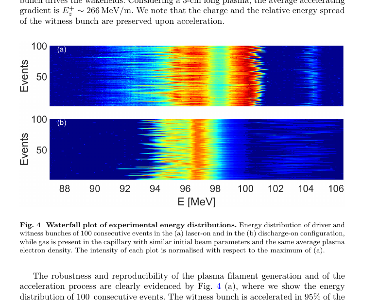

# 激光等离子体丝中的束驱尾场加速实验

> M. Galletti 等，APS accepted paper，DOI `10.1103/qjd9-p6dy`；本地全文为同作品 arXiv:`2602.22841v1` 作者预印本，不是 APS 排版 VOR。以下基于该全文、布局文本和关键页渲染核读。

## 一句话结论

SPARC LAB 用 `10 mJ`、`350 fs` 激光在 `3 cm` 氮气毛细管中生成等离子体丝，再以约 `97 MeV` 的双电子束驱动尾场；100 发统计中见证束平均增能约 `8 MeV`、95% 发次成功且能量抖动小于 `0.5%`，相较未额外稳定的放电源更可重复，但高重复频和更长级联仍只是外推。

## 1. 装置与束流

- Ti:sapphire 系统主机为 `80 mJ`、`30 fs`、`800 nm`、`10 Hz`；等离子体丝支路使用约 `10 mJ`、`350 fs` 脉冲，在长 `3 cm`、内径 `2 mm` 的氮气毛细管中传播。
- 丝状等离子体全宽约 `45 mm`，横向 RMS 半径约 `70 μm`，`3 cm` 平台平均电子密度约 `8×10^14 cm^-3`，密度抖动约 `6.8%`。
- 驱动/见证束能量约 `97 MeV`，电荷约 `500/50 pC`，RMS 时长约 `0.6/0.2 ps`，间隔 `2.7 ps`，半径约 `27/20 μm`，归一化发射度约 `2.9 μm`。

## 2. 直接加速结果

- 见证束平均增能约 `8 MeV`，最终能量 `104.5±0.4 MeV`；按 `3 cm` 等离子体长度折算平均加速梯度约 `266 MeV/m`。
- 驱动束最大损能约 `4 MeV`；作者报告加速前后见证束电荷和相对能散基本保持。
- 与没有附加稳定措施的放电等离子体对照相比，激光丝方案的成功率约 `95%`、RMS 能量抖动 `<0.5%`；放电对照约 `75%`、`1.3%`，能量增益相近。

## 3. 图 4：100 发能谱瀑布图

- **来源：** 作者预印本 Fig. 4。
- **横轴：** 电子能量 `E [MeV]`；纵轴：连续事件编号，共 100 发；每幅图按激光丝方案的最大强度归一化。
- **上图：** 激光丝开启，见证束在约 `104–105 MeV` 处形成较窄、连续的高能条带。
- **下图：** 放电等离子体对照，见证束加速成功发次更少、能量位置分散更大。
- **论证作用：** 这比单发“最好结果”更直接地支持重复性改进；正文据此得到 `95%` 成功率和 `<0.5%` 能量抖动。
- **限制：** 对照放电源没有采用额外稳定方案；图中强度是相对归一化，不能单独判断绝对电荷稳定性或六维束质。

## 4. 模拟与工程外推

- FBPIC 准三维模拟给出约 `260 MV/m` 加速场和 `150 MV/m` 减速场，与实验平均增益量级一致；但级段模拟只传播约 `5.4 mm`，不是完整 `3 cm` 端到端复现。
- 激光传播模拟覆盖约 `3 cm`，显示约 `2.5 mJ` 能量损失；作者估算毛细管壁热负荷 `<1 mJ/cm²`。
- 论文提出未来可扩展到数十 kHz、约 `60 cm` 和 GV/m 级，但当前实验实际是 `10 Hz`、`3 cm`、约 `266 MeV/m`，两者必须分开。

## 5. 证据边界

- **直接实验：** 毛细管密度诊断、输入/输出能谱、100 发统计和放电源对照。
- **模型辅助：** 局域尾场幅度、激光能损和壁热负荷来自 PIC/传播模拟及估算。
- **未完成：** 无数十 kHz 演示、长级联、完整 emittance/亮度/效率验收，也没有与已优化放电等离子体做等条件对照。
- **本地边界：** 未运行 FBPIC 或激光传播代码；本地全文是作者预印本而非 VOR。
