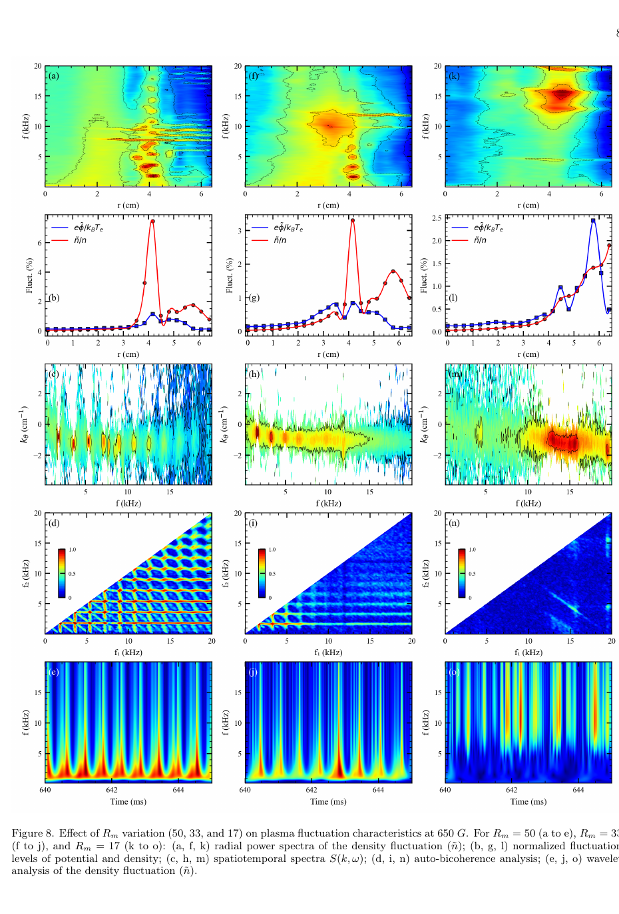

# 磁化等离子体中漂移—声学椭圆余弦波的实验观测

> Tanmay Karmakar 等，DOI `10.1103/mmzz-gq7q`，*Physical Review E* 正式元数据已发布；本地全文是同作品 arXiv:`2604.19927v1` 作者预印本，不是 APS 排版 VOR。以下基于该全文、布局文本和关键页渲染核读。

## 一句话结论

IMPED 线性磁化等离子体实验观察到约 `1.1 kHz` 的密度—电势尖峰列、谐波与双谱耦合，并用椭圆余弦函数拟合为漂移—离子声非线性波；增大磁场梯度增强相干结构，降低磁场比后转为宽带湍流，但“cnoidal wave”识别依赖拟合和定性 KdV/Hasegawa–Mima 解释，尚非唯一机理证明。

## 1. 诊断与基准工况

- 使用 Langmuir 探针、三探针和径向探针阵列；位置精度约 `0.2 mm`，典型记录 `1 MS/s`、持续 `1 s`。
- `R_m≈50–51`、主磁场 `550 G` 时，峰值密度约 `7×10^10 cm^-3`，电子温度约 `2.2 eV`，等离子体电势约 `7.5 V`。
- 主频约 `1.1 kHz`；估算 `E×B` 速度约 `1636 m/s`、声速约 `1500 m/s`，Doppler 修正后的电子漂移频率约 `950 Hz`。同时存在 `6–10 kHz` 漂移模。

## 2. 非线性波识别

- 密度波形用带高斯修正的椭圆余弦函数拟合，模数 `k≈0.85`；电势尖峰的拟合给出 `k≈0.99`。作者从参数估算周期约 `0.84 ms`（`1.2 kHz`），与实测 `1.1 kHz` 接近。
- 在结构形成位置，密度涨落可比邻近区域高约 `15` 倍；自双相干显示基频、谐波以及 `1.1 kHz` 与 `6–10 kHz` 模式的非线性耦合。
- 归一化密度涨落约 `4–10%`，最大 `E×B` 漂移速度约 `3272 m/s`，归一化密度/电势涨落比约 `4–8`。

## 3. 图 8：背景梯度改变相干结构

- **来源：** 作者预印本 Fig. 8；三列依次为 `650 G` 下 `R_m=50、33、17`。
- **坐标：** 顶排径向 `r [cm]`—频率 `f [kHz]` 功率谱；第二排给出归一化密度/电势涨落；第三排为 `k_θ [cm^-1]`—频率谱；第四排是频率—频率自双相干；底排是时间—频率小波谱。
- **趋势：** `R_m=50` 时 `~1–10 kHz` 相干谐波和耦合最清楚；降低到 `33` 后相干性减弱；`R_m=17` 时能量转到约 `12–15 kHz` 的宽带区域。
- **物理意义：** 背景密度梯度和 `E×B` 剪切控制可用自由能；梯度减弱后，规则的尖峰列让位于宽带涨落。
- **限制：** 色标和功率谱主要是相对量；三组工况同时改变多个背景量，不能只凭此图唯一归因于某个非线性项。

## 4. 参数趋势与可疑点

- 在 `R_m=50` 下把磁场由 `550 G` 提到 `650 G`，峰值密度约从 `2.6×10^10` 增到 `4.5×10^10 cm^-3`，径向电场约从 `100` 增到 `180 V/m`，峰值速度剪切从 `1818` 增到 `2769 s^-1`，主频由约 `1.1` 增到 `1.9 kHz`。
- 论文正文一处把工作压力写为 `10^-4 mbar`，而 Fig. 3 及相关图注给出 `2×10^-3 mbar`；这一内部不一致会影响碰撞性和尺度估算，需作者澄清。
- 550 G 工况的去相关时间约 `26 ms`，而 650 G、`R_m=17` 时约 `0.01 ms`，支持从相干波列到湍流的转变，但时间尺度定义仍依赖相关分析窗口。

## 5. 证据边界

- **直接实验：** 探针时间序列、径向剖面、功率谱、小波谱和双相干。
- **模型辅助：** cnoidal 身份由函数拟合、频率匹配和定性 KdV/Hasegawa–Mima 约化共同支持，没有从测得平衡量唯一推导出闭合非线性演化方程。
- **限制：** 关键拟合未系统给出误差条/模型选择对照；压力表述不一致；本地 PDF 不是 VOR。
- **本地边界：** 未重做谱分析、拟合或双相干；仅核验作者稿和 APS/DOI 出版状态。
