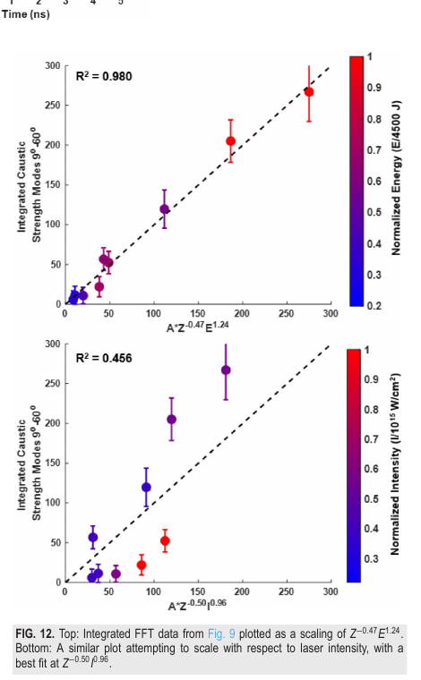

# 激光烧蚀固体中的丝状电磁结构：质子照相测量

> J. L. Peebles、P. V. Heuer、D. H. Barnak、Y. V. Zhang、J. R. Davies，*Physics of Plasmas* 33, 102703（2026），DOI `10.1063/5.0342431`，正式 version of record。以下基于出版社 PDF、布局文本及关键页渲染核读。

## 一句话结论

OMEGA EP 双视角质子照相在多种固体靶和驱动条件下观测到毫米级径向—轴向丝状焦散；几何对比、合成照相与参数标度更支持“膨胀驱动 Weibel 磁结构播种、随后静电场主导质子偏转”，且场能不足以成为 ICF 的主要能量汇，但电磁分解与生成机制仍是模型辅助推断。

## 1. 实验平台

- 采用最多两束 `351 nm`、约 `1 ns` 长脉冲照射 CH、Cu、Si、Mo、Ta、Au 固体靶；靶横向尺寸 `1–1.4 mm`、厚度 `20–200 μm`。
- 两个短脉冲质子源从不同视角成像；源激光约 `1053 nm`、`125–500 J`、`0.7 ps`、焦斑 `15–20 μm`。部分发次还记录 `4ω` 光学探针和后向散射。
- 常见焦散从靶附近沿径向和轴向延伸约 `2 mm`，部分结构超过 `4 mm`；最高约 `60 MeV` 的质子仍可见焦散，说明偏转场不只是低能质子的小扰动。

## 2. 图 12：材料 Z、能量与强度标度

- **来源：** 论文 Fig. 12，取 `1.0 mm` 线积分位置。
- **横轴：** 上图为组合量 `A·Z^-0.47·E^1.24`，其中颜色表示归一化激光能量；下图为 `A·Z^-0.50·I^0.96`，颜色表示归一化强度。
- **纵轴：** `90°–60°` 方位模的积分焦散强度；为图像处理后的相对量，不是绝对场强或能量。
- **趋势：** 材料平均 `Z` 与激光能量组合给出 `R²=0.980`，而用激光强度替代能量只有 `R²=0.456`；高 Z 和低总能量更有效地削弱丝状结构。
- **论证作用：** 支撑“整体膨胀能量和材料电离/输运性质比名义峰值强度更关键”。
- **限制：** 标度来自有限靶材、能量和视线位置，参数并非独立正交扫描；拟合不能单独证明 Weibel 机制。

## 3. 场结构判别

- 纯磁场合成照相可用约 `0.5–2 kA` 的丝状电流产生部分焦散，但需要特定电流方向，且容易生成实验中没有的大空洞。
- 用弯曲的电荷线分布产生的静电偏转，能同时更自然地重现实验正视和侧视图。作者据此认为磁场可能播种结构，而二级静电场主导质子偏转。
- CH 发次后向散射较强、Mo 较弱，但二者都出现丝状结构，因此 SRS 不像主驱动。金靶还出现与膨胀驱动 Weibel 几何相符的环状特征。

## 4. 对 ICF 与诊断的意义

从质子偏转反演出的场能只是焦耳量级的一小部分，作者据此排除其作为 ICF 激光能量的主要直接汇；但这些场仍可能改变 LPI、热电子输运和耦合。工程上可用高 Z 或降低总能量抑制结构，不过单纯降低名义强度未显示稳定标度。

## 5. 证据边界

- **直接实验：** 多靶材、双视角质子照相、部分光学/后向散射数据及其重复趋势。
- **模型辅助：** 电场/磁场分解、丝状电流/电荷几何、Weibel 种子和场能估计来自前向模型与几何排除，不是同时原位测得的 E/B 分量。
- **未完成：** 无自洽 PIC 从激光吸收到质子照相的端到端复现；数据按请求提供，系统误差与视线退化尚不足以给出唯一场构型。
- **本地边界：** 本地未运行质子追踪、PIC 或标度重拟合；只核验正式全文、图和作者给出的拟合。
