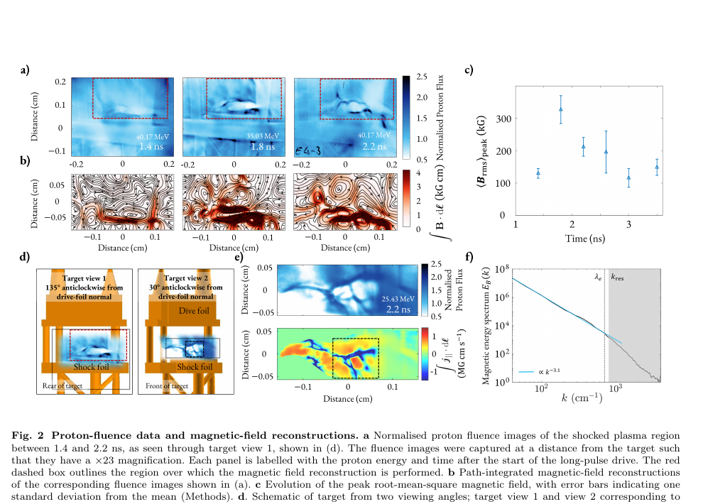

# 弱碰撞高 β 等离子体中微湍流抑制平行热传导的实验观测

> T. A. Vincent 等，arXiv:`2610.08530v1`（2026-10-06），官方预印本。以下基于 arXiv PDF、布局文本和关键页渲染核读。

## 一句话结论

Orion 激光实验同时看到随机磁结构、约 `1.1 keV` 的电子温度平台和经典 FLASH 模型的过快冷却；要复现实验需把有效平行热导压低到 Spitzer 的约 `5–7%`，与 whistler/热流不稳定性理论量级相容，但实验没有直接识别 whistler 模式，抑制因子仍是模型辅助反演。

## 1. 实验平台与等离子体状态

- 两束长脉冲各约 `0.3 kJ`、`1 ns`、`351 nm`、焦斑约 `0.23 mm`，驱动 PyC/Cl 靶形成激波等离子体；两束短脉冲各约 `0.3 kJ`、`1 ps`、`1054 nm`、焦斑约 `7.7 μm`，产生质子照相源。
- `2.2 ns` 时电子密度约 `(1.0±0.6)×10^20 cm^-3`；电子温度约 `1.1 keV`，并维持到约 `3.8 ns`。
- 代表性参数为电子平均自由程约 `40 μm`、电子回旋半径约 `4 μm`、温度梯度尺度约 `600 μm`、电子 β 约 `100`、Hall 参数约 `11`，处于弱碰撞、高 β、磁化电子条件。

## 2. 图 2：随机磁场的直接诊断

- **来源：** 论文 Fig. 2。
- **图 a/b：** 不同时刻的质子通量图及其路径积分磁场重建；空间坐标单位 `cm`，磁场积分单位 `kG·cm`。
- **图 c：** 峰值 RMS 磁场随时间演化，峰值约 `212±29 kG`；数值使用约 `0.028 cm` 的路径长度换算，因此带有视线长度假设。
- **图 e/f：** 第二视角展示重建区域及电流密度代理；磁能谱在可分辨区近似 `k^-3.1`，最小可靠尺度约 `40 μm`。
- **趋势与作用：** 随机磁结构在 `1.8–2.2 ns` 明显形成，并与强温度梯度时期重合，为热流驱动微不稳定性提供直接时空线索。
- **限制：** 质子照相测得的是路径积分偏转；重建依赖源尺寸、窗口和路径长度，且谱斜率本身不能唯一识别 whistler 模式。

## 3. 热导抑制的推断链

- 带 flux-limited Spitzer–Härm 热导的 FLASH 在约 `2.0 ns` 后冷却过快，不能维持实验的温度平台。
- 作者使用延迟开启的 Ryutov 型经验热导模型，约在 `t0=1.8 ns`、过渡宽度 `450 ps` 后降低热导，能更好复现实验温度。
- 由 Yerger 和 Ryutov 标度估算的有效平行热导分别约为 Spitzer 的 `0.05` 和 `0.09`；正文综合模型比较给出需要至少一个数量级抑制，最佳量级约 `0.05–0.07`。
- 估算的热流不稳定性增长时间约 `4×10^-11 s`，小于 Spitzer 磁扩散时间约 `2×10^-10 s`，说明微结构在实验时间内可形成。

## 4. 物理意义

结果提示：在 HEDP、实验室天体和磁化 ICF 中，即使横向热导已被磁化压低，平行热导也未必保持经典值；高 β、弱碰撞热流可激发微湍流并反向限制热流。这为辐射流体代码中的亚网格热输运模型提供实验约束，但不是通用的固定抑制系数。

## 5. 证据边界

- **直接实验：** X 射线谱/成像给出的温度和密度约束，质子照相给出的随机磁结构及其时间演化。
- **模型辅助：** 磁场绝对值、whistler/热流不稳定性归因、平行热导抑制因子和 FLASH 对照均依赖重建或经验输运模型。
- **作者明确限制：** 延迟 Ryutov 模型是经验实现，不是自洽的 kinetic–fluid 耦合；实验也未直接测得波的色散和传播方向。
- **本地边界：** 未运行 FLASH、质子反演或动力学模拟；仅核验官方预印本及图表。
