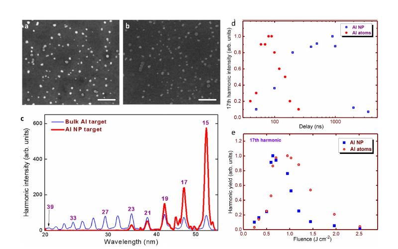

# 含离子和纳米颗粒的铝激光等离子体高次谐波

> R. A. Ganeev 等，*Physics of Plasmas* 33, 103302（2026），DOI `10.1063/5.0350047`，正式 version of record。以下基于出版社 PDF、布局文本和关键页渲染核读。

## 一句话结论

体铝靶在约 `1 J/cm²`、`85 ns` 延迟时把谐波平台延伸到第 39 阶；纳米颗粒靶在约 `0.7 J/cm²`、`900 ns` 时把第 15 阶增强约 6 倍，但截止降至第 23 阶，显示局域场增强与过高自由电子密度造成的相位失配之间存在权衡。

## 1. 实验与参数

- `1064 nm、20 ns、3 mJ` 或 `800 nm、350 ps` 脉冲烧蚀铝靶，`800 nm、65 fs、1.2 mJ` 驱动脉冲在靶面上方约 `0.3 mm` 穿过羽流，等离子体内强度约 `3×10^14 W/cm²`。
- 通过 TEM、羽流成像和 XUV 光谱比较块材与纳米颗粒靶；高密度烧蚀组分主要在 `75–150 ns` 到达相互作用区。
- 双色情形在真空内加入 `0.3 mm` BBO 产生二次谐波；把 `0.5 mm` BBO 放到真空外会恶化时空重合并压低部分谐波。

## 2. 图 4：颗粒形态改变强度与截止

- **来源：** 论文 Fig. 4。
- **坐标：** 光谱横轴为波长 `nm`，纵轴为任意单位的谐波强度；扫描图横轴分别为泵浦—驱动延迟 `ns` 和加热通量 `J/cm²`，纵轴为第 17 阶相对产额。
- **趋势：** 块材蓝色谱延伸到第 39 阶；纳米颗粒红色谱在较低阶更强，但约第 23 阶截止。纳米颗粒的最优延迟更长、最优烧蚀通量更低。
- **论证作用：** 同时展示“低阶增益”和“高阶截止损失”，支持纳米结构局域增强不能替代羽流密度与相位匹配优化。
- **限制：** 强度是相对量，块材与纳米靶的羽流组成和自由电子密度没有在每个延迟点同步绝对测量。

## 3. 主要结果

- 块材铝的最优条件约为 `1 J/cm²、85 ns`；纳米颗粒靶约为 `0.7 J/cm²、900 ns`，后者第 15 阶产额约提高 6 倍。
- 把等离子体长度增至约 `5 mm` 可增强低阶谐波，但高阶受自由电子色散和有限相干长度限制。
- 真空内薄 BBO 的双色情形产生奇、偶阶谐波；较厚且置于真空外的晶体因群延迟和空间重合变差而削弱部分序列。

## 4. 证据边界

- **直接实验：** XUV 光谱、延迟/通量扫描、TEM 与羽流成像。
- **模型辅助：** 局域场或等离激元增强、自由电子相位失配和不同组分到达时间是与趋势相符的解释，并非成分分辨的直接测量。
- **未完成：** 未做飞行时间质谱或时间分辨 XUV 成分诊断，不能唯一归因某种离子或纳米颗粒组分；数据按请求提供。
- **本地边界：** 本地没有重做光谱标定、相位匹配计算或实验，只核验正式全文和图。
