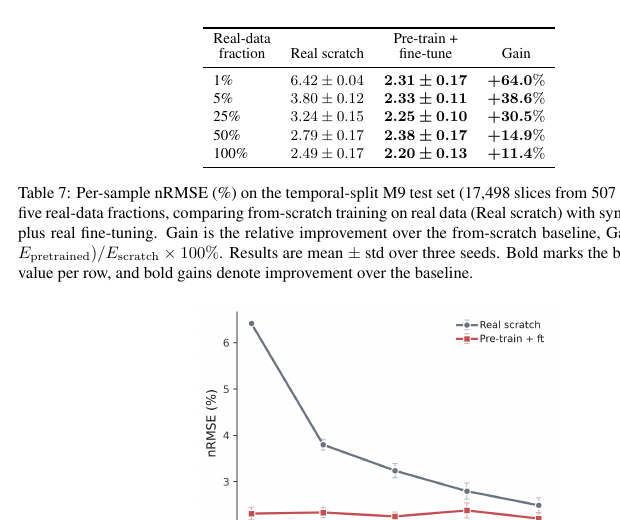

# 有限实验数据下的托卡马克平衡重建：物理合成预训练

> L. He 等，arXiv:`2610.09674v1`（2026-10-07），预印本。以下基于官方 arXiv PDF、布局文本和关键页渲染核读；尚无正式期刊 version of record。

## 一句话结论

用 FreeGSNKE 和真实 EFIT 统计构造的合成平衡预训练，可在 MAST 时间外推和形状分布外测试中显著降低少样本误差；收益在随机同分布数据充足时会缩小甚至转为负迁移，因此证据支持“面向 OOD/小数据的初始化”，不等同于在线控制系统验证。

## 1. 数据与方法

- 从 MAST M5–M9 共 `11,573` 次原始放电中过滤得到 `7,286` 次、`213,924` 个时间片，并为其生成配对合成样本。
- FreeGSNKE 前向建模结合 Lao85 参数扰动和真实 EFIT 统计的 PCA；网络输入为 `68` 个诊断量加时间，共 `69` 个特征。
- 比较从头训练与合成预训练后微调，在随机同分布、等离子体形状 OOD 和时间 OOD 三种划分中测试。

## 2. 图 15：时间外推中的样本效率

- **来源：** 论文 Fig. 15。
- **坐标：** 横轴为真实训练数据占比 `%`，纵轴为归一化均方根误差 `nRMSE [%]`；曲线比较 scratch 与 synthetic pretrain。
- **趋势：** 在只用 `1%` M5–M8 数据预测 M9 时，nRMSE 从约 `6.42%` 降到 `2.31%`；`5%` 时从 `3.80%` 降到 `2.33%`，时间 OOD 各比例均保留收益。
- **论证作用：** 直接支持合成预训练改善跨时间阶段和少样本泛化，而不仅是随机划分上的拟合。
- **限制：** 目标标签主要来自 EFIT，OOD 仍属于同一装置；误差并非对磁通的独立绝对测量。

## 3. 主要结果

- 形状 OOD、`1%` 真实数据时，nRMSE 由 `5.383%` 降到 `2.285%`，LCFS 距离由 `0.1372 m` 降到 `0.0317 m`。
- Temporal OOD、`1%` 数据时误差下降约 `64%`，`5%` 时约 `38.6%`。随机同分布中数据达到约 `25%` 后，预训练收益减弱且部分指标出现中性或负迁移。
- RTX 5090 上报告单时间片推理约 `0.036–0.039 ms`；重建电流与 EFIT/罗氏线圈电流相关系数约 `0.995/0.99`。

## 4. 证据边界

- **离线计算：** 结果来自同一装置历史数据、FreeGSNKE 合成样本与离线测试，不是实时 PCS 闭环实验。
- **标签限制：** 与 EFIT 的一致性不能视为独立真值；罗氏线圈只约束总电流，不唯一验证二维平衡。
- **未完成：** 缺少跨装置、硬件在环、故障诊断、不确定性量化和实时控制链路；单次 GPU 推理时间也不包含采集、预处理和通信。
- **本地边界：** 本地未复训模型或复现数据切分，只核验预印本、表格和图。
