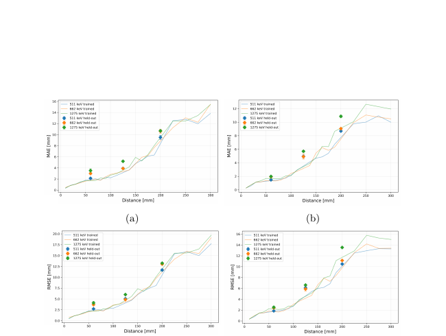

# 垂直双 SiPM 读出的全向辐射探测器与机器学习定位

> N. Kozuljevic 等，arXiv:`2610.08195v1`（2026-10-06），预印本。以下基于官方 arXiv PDF、布局文本和关键页渲染核读；全部性能来自 Geant4 与机器学习，未制作物理样机。

## 一句话结论

`4×4×4` 个 GAGG 小立方体配合两组垂直 SiPM 读出，在 Geant4 数据上能保持近全向效率并用 XGBoost 回归源距；插值距离误差通常为毫米到厘米量级，但同模拟域训练/测试不能替代真实标定、散射背景和激光伽马场验证。

## 1. 探测器与模拟

- 敏感体由 64 个 `3 mm` GAGG 立方体构成，节距 `3.2 mm`，总敏感体积约 `2 cm³`；两组 `4×4` SiPM 从互相垂直的方向读出。
- Geant4 模拟 `511、662、1275 keV` 单能 γ 源，从不同面和顶点、`10–300 mm` 的 22 个距离照射；能量分辨展宽采用实验经验参数。
- XGBoost 使用体素能量、计数率和对数计数率等特征，数据按 `60/20/20%` 分为训练、验证和测试。

## 2. 图 9：未见距离的插值定位

- **来源：** 论文 Fig. 9。
- **坐标：** 横轴为源距 `mm`，纵轴为平均绝对误差 MAE 和均方根误差 RMSE，单位均为 `mm`；曲线为训练距离，标记点为留出的 `60、125、200 mm`。
- **趋势：** 误差随距离和光子能量总体增大；留出距离仍落在邻近训练趋势上，约从数毫米增长到 `200 mm` 处十余毫米 RMSE。
- **论证作用：** 表明模型不是只记住离散距离点，具有同模拟分布内的插值能力。
- **限制：** 留出点仍由同一 Geant4、同一几何与同一展宽模型生成，不能检验真实域偏移。

## 3. 性能结果

- 不同面/顶点方向的效率差异低于约 `1%`；`511 keV、10 mm` 时绝对效率最高约 `2%`，距离超过 `100 mm` 后低于约 `0.1%`。
- 全测试集平均 MAE/RMSE 分别约为：`511 keV` 的 `4.5/7.4 mm`、`662 keV` 的 `4.7/7.8 mm`、`1275 keV` 的 `5.1/8.4 mm`；相应 `R²` 约 `0.9921、0.9911、0.9896`。
- 留出的 `60、125、200 mm` 距离中，MAE 约低于 `4、6、11 mm`，最远点 RMSE 可到约 `13.5 mm`。

## 4. 证据边界

- **设计/模拟：** 几何、效率、定位数据和模型测试全部来自 Geant4；经验能量分辨并不等于原型实测响应。
- **未完成：** 无样机、暗计数/串扰/封装、环境本底、多重散射、宽谱和脉冲堆积验证，也没有 sim-to-real 校准。
- **应用限制：** 单能静态点源结果不能直接外推到激光驱动宽谱、强瞬态、EMP 环境或绝对剂量测量。
- **本地边界：** 本地未运行 Geant4 或 XGBoost，只核验预印本结果和图。
