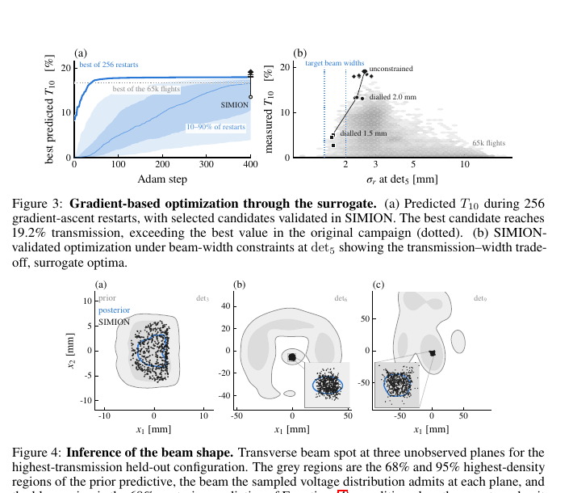

# 面向强损失离子束输运的可微代理模型

> M. H. Muñoz-Arias 等，arXiv:`2610.08877v1`（2026-10-06），预印本。以下基于官方 arXiv PDF、布局文本和关键页渲染核读；结果是 SIMION 数字束线上的模拟与优化，不是实验束流调谐。

## 一句话结论

离散存活 hazard 与条件 normalizing flow 联合代理可对 22 个电压控制的强损失离子束线进行毫秒级可微优化，并在 SIMION 回代中把透过率提高到 `19.2%`；性能仍取决于同一场图和源分布，真正的 sim-to-experiment 是未解决问题。

## 1. 数据与模型

- SIMION 束线含 22 个电压控制量、10 个虚拟诊断面和 `1 mm` 场网格；生成约 `65,000` 组电压，每组追踪 `10^4` 个离子及六维相空间。
- 存活概率由离散时间 hazard/GRU 建模；存活粒子的条件相空间分布由有理二次样条 normalizing flow 建模。
- 训练使用约 `60%` 配置；代理同时输出每个诊断面的存活与相空间，可对控制电压直接反向传播。

## 2. 图 3–4：梯度优化及未观测面分布

- **来源：** 论文 Figs. 3–4。
- **坐标：** 优化图横轴为 Adam 迭代步，纵轴包括第 10 面透过率 `T₁₀ [%]` 和目标束宽；分布图横纵轴为横向位置 `x₁、x₂ [mm]`，比较先验、代理后验与 SIMION。
- **趋势：** 多初值优化快速提升预测透过率并保持束宽约束；在未作为观测条件的中间平面，代理仍重现主要位置分布，但孔径后尾部误差增大。
- **论证作用：** 把“可微目标优化”和“沿线分布预测”连接起来，并用 SIMION 回代检查最优点。
- **限制：** 回代仍是同一模拟器，图中一致性不是与真实束流诊断的独立验证。

## 3. 性能与优化

- 各诊断面存活概率 `R²>0.94`，末端传输分类 AUC 约 `0.972(1)`；越靠后且损失越强，存活率相对误差可增至约三分之一。
- SIMION 每组 `10^4` 离子约需 `10 s`，代理推理为毫秒量级；256 个并行重启的一步梯度更新约 `4 ms`。
- 代理给出的最优配置经 SIMION 回代后透过率为 `19.2%`，高于黑盒搜索最好约 `16.7%`，同时满足束宽约束。

## 4. 证据边界

- **模拟验证：** 泛化和最优点均对 SIMION 数据验证；没有真实电极电压、场测量或束流诊断闭环。
- **风险：** 场图误差、机械失准、源漂移、空间电荷与探测器响应都可能导致域偏移；后段强损失处的相对误差已提示这一敏感性。
- **未完成：** 尚未成为实验数字孪生，也没有在线安全约束和不确定性校准。
- **本地边界：** 本地未运行 SIMION、训练网络或复做优化，只核验预印本正文和图。
