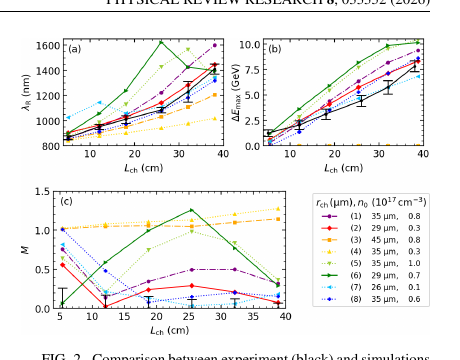

# 10 GeV 级激光等离子体加速器中的激光与电子束演化

> S. Tang 等，*Physical Review Research* 8, 033352（2026），DOI `10.1103/qqcv-f29q`，CC BY 正式 version of record；对应预印本 arXiv:`2604.25823` 已于 2026-06-06 入库，本次合并升级而不重复计数。以下基于 APS VOR、布局文本和关键页渲染核读。

## 一句话结论

BELLA 实验沿最长 `40 cm` 通道同步测量电子最高能量和驱动激光红移，再用 INF&RNO 模拟联合约束通道参数；高密通道得到 `10.2 GeV` 实测电子束，外推的 `15–20 GeV` 方案则仍是模型预测。

## 1. 实验与模拟

- Ti:sapphire 驱动脉冲峰值强度约 `1.2×10^19 W/cm²`；通道成形激光低、高强度分别约 `3.2×10^14` 与 `1.1×10^15 W/cm²`。
- 扫描通道长度并同步记录电子能谱和透射激光光谱；激光红移提供能量沉积约束，电子最高能量提供加速梯度约束。
- 使用准静态 PIC 代码 INF&RNO 比较不同轴上密度 `n₀` 与通道半径 `r_ch`，并把实验数据映射到联合失配度量。

## 2. 图 2：双观测量解除通道参数退化

- **来源：** 论文 Fig. 2。
- **坐标：** 横轴为通道长度 `cm`；上图纵轴为红移光谱特征波长 `nm`，中图为电子最高能量 `GeV`，组合图以无量纲失配度量 `M` 比较模拟与实验。黑色为实验，彩色为不同通道参数模拟。
- **趋势：** 低密通道中，电子最高能量随长度由约 `2.07` 增至 `7.81 GeV`；激光特征波长到 `40 cm` 红移至约 `1410 nm`。只拟合单一观测量会保留多个近似解，联合后最佳区间收窄。
- **论证作用：** 证明同时使用束流和激光诊断能比单一能谱更有效地反演通道结构。
- **限制：** 反演仍依赖准静态 PIC、下坡注入模型和诊断定义；不是对通道密度剖面的直接全程测量。

## 3. 主要结果

- 低强度通道的联合约束给出约 `r_ch=29 μm、n₀=3×10^16 cm^-3`；低密序列平均梯度约 `18 GV/m`。
- 高强度通道在 `40 cm` 得到 `10.2 GeV` 实测最高能量，模拟约 `10.8 GeV`；推断参数约 `r_ch=35 μm、n₀=6×10^16 cm^-3`。
- `65 cm` 通道模拟分别给出约 `10.1/15.2 GeV`；线性匹配、`24 J、80 fs` 条件下的 `20.2 GeV`（`70 cm`）是优化模拟，不是本次实验结果。

## 4. 证据边界

- **直接实验：** 随通道长度变化的电子能谱和透射激光光谱，以及高密通道 `10.2 GeV` 结果。
- **模型辅助：** 通道参数、局域梯度和未来 `15–20 GeV` 性能来自 INF&RNO 与联合反演；密度下坡对注入和峰值能量很重要。
- **未完成：** 未给出下一代方案的实验验收，也不能仅凭最高能量判断电荷、能散、发射度和总效率。
- **本地边界：** 本地未运行 INF&RNO 或重做反演；本次只把原 arXiv 台账升级为正式 VOR 并核验全文。
