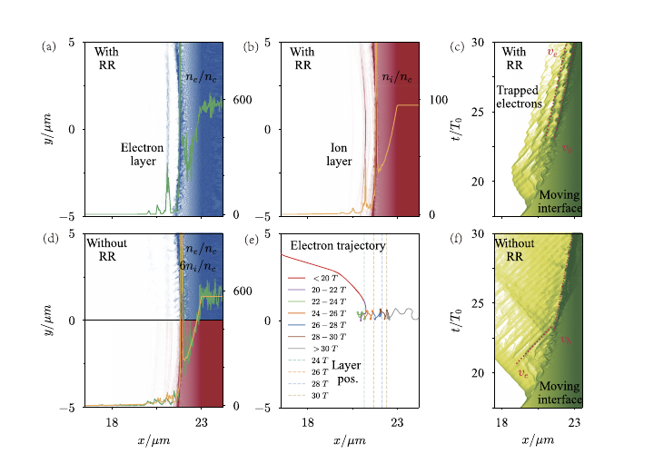

# 超强激光—等离子体相互作用中的新型辐射俘获机制

> Min Zhou 等，*Matter and Radiation at Extremes* 11, 065201（2026），DOI `10.1063/5.0341085`，CC BY 正式 version of record。以下基于出版社 PDF、布局文本和关键页渲染核读。

## 一句话结论

KLAPS 模拟显示，在 `5×10^23 W/cm²` 激光照射固体碳靶时，辐射反作用可把电子漂移速度压到与孔钻速度相近，从而形成随激光前沿传播的高密电子层；这是二维经典辐射反作用、补充量子/三维模拟支持的机制预测，尚无实验验证。

## 1. 模型设置

- 主结果使用二维 PIC 和经典 Landau–Lifshitz 辐射反作用；附录补充量子辐射反作用与三维计算。
- 激光波长 `1 μm`、峰值强度 `5×10^23 W/cm²`、焦斑半径 `10 μm`；正文设置给出 `50 fs` FWHM。靶为完全电离 `C6+`，电子密度 `570 n_c`，前沿预等离子体标长 `1 μm`。
- 网格尺度约 `1/64 μm`，每格 36 个电子和 16 个离子宏粒子。

## 2. 图 2：辐射反作用建立共速高密层

- **来源：** 论文 Fig. 2。
- **坐标与归一化：** 空间坐标为 `x、y [μm]`，时间以激光周期 `T₀` 表示；电子/离子密度按临界密度 `n_c` 归一化。
- **趋势：** 加入辐射反作用后，前沿形成窄且持续的电子—离子高密层；关闭辐射反作用时，电子更快穿过离子前沿，结构明显稀释。
- **物理意义：** 辐射损失把电子速度降至孔钻界面速度附近，使电子受到激光压力和电荷分离场共同俘获。
- **限制：** 图像是单代码模拟场快照，不是实验密度诊断；数值宏粒子、碰撞、电离和靶面条件会影响定量峰值。

## 3. 定量结果与预测信号

- 有辐射反作用时电子峰值约 `270.2 n_c`、离子峰值约 `56.18 n_c`；在给定窗口中电子总电荷约 `698.15 pC`。关闭辐射反作用后相应峰值不超过约 `50 n_c` 和 `10 n_c`。
- 电子层速度约 `0.207c`，与估算孔钻速度 `0.208c` 接近；无辐射反作用时电子约 `0.909c`，明显快于约 `0.181c` 的界面。
- 三维模拟保留了高密层；光子角分布在层形成阶段给出约 `128°` 和 `234°` 的双峰，可作为未来实验诊断线索。透射率模型估计约 `0.93`。

## 4. 证据边界

- **模拟证据：** 二维经典辐射反作用是主证据，量子辐射反作用和三维模拟用于稳健性检查。
- **模型辅助：** 速度匹配、透射率和角分布都是模拟/解析推导；论文不同段落对脉冲持续时间还采用了不同的有效定义，不能脱离定义直接比较寿命。
- **未完成：** 无实验、无跨代码基准，也未覆盖真实靶粗糙度、预等离子体和诊断响应；不能把预测角峰当作已观测伽马源。
- **本地边界：** 本地未运行 KLAPS 或独立辐射反作用计算，只核验正式全文和图。
